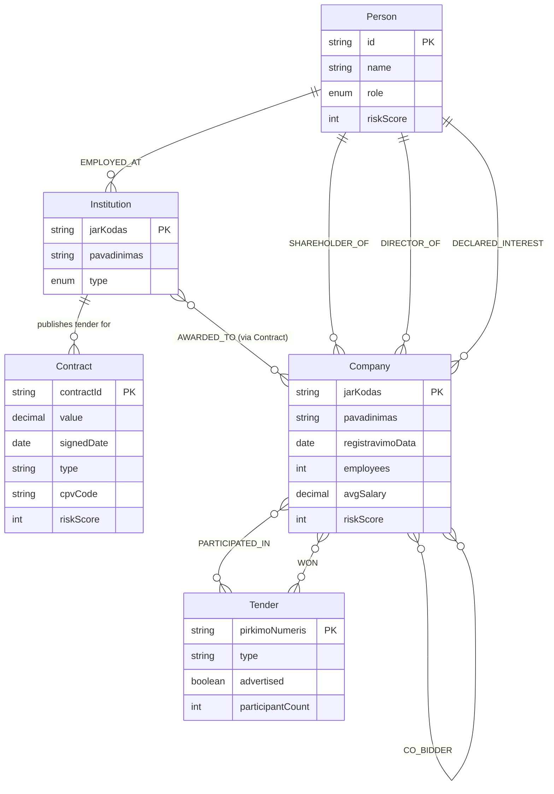
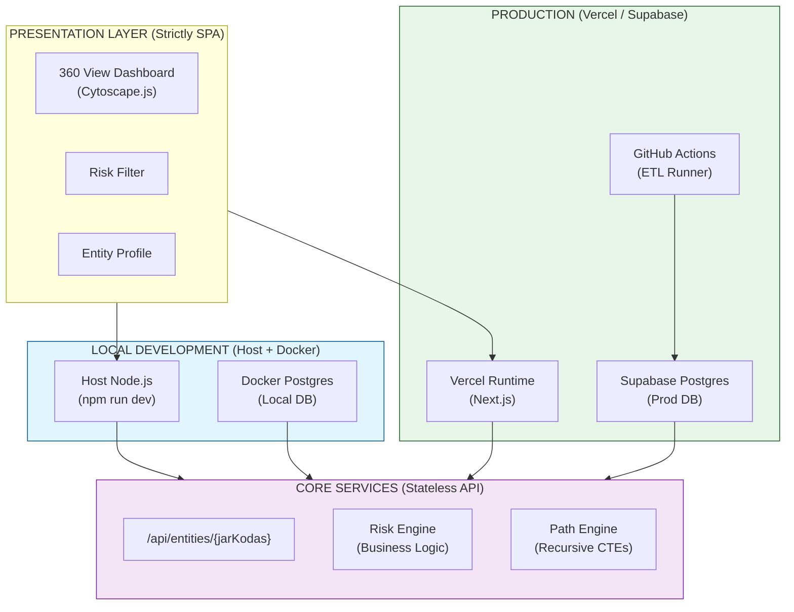
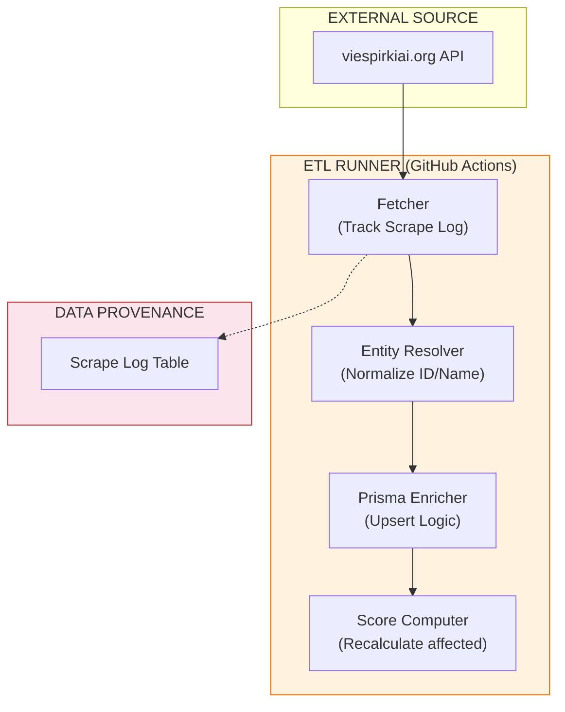
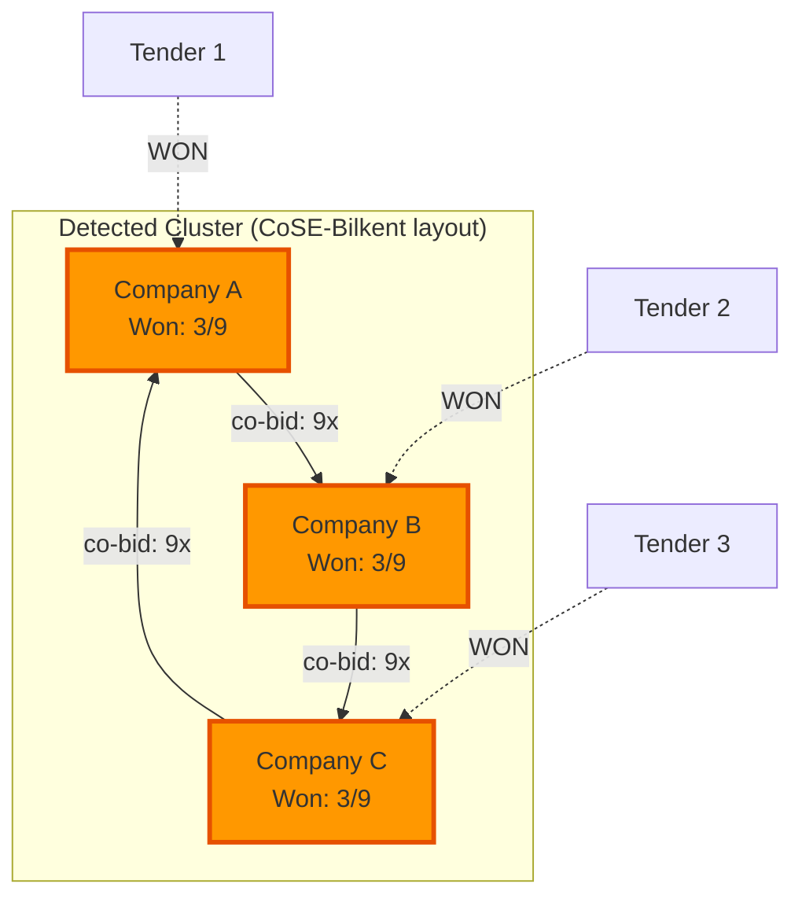
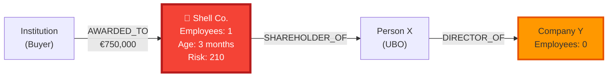
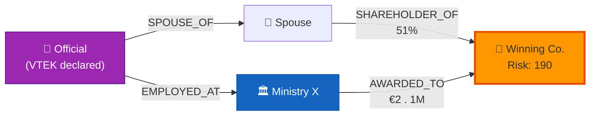
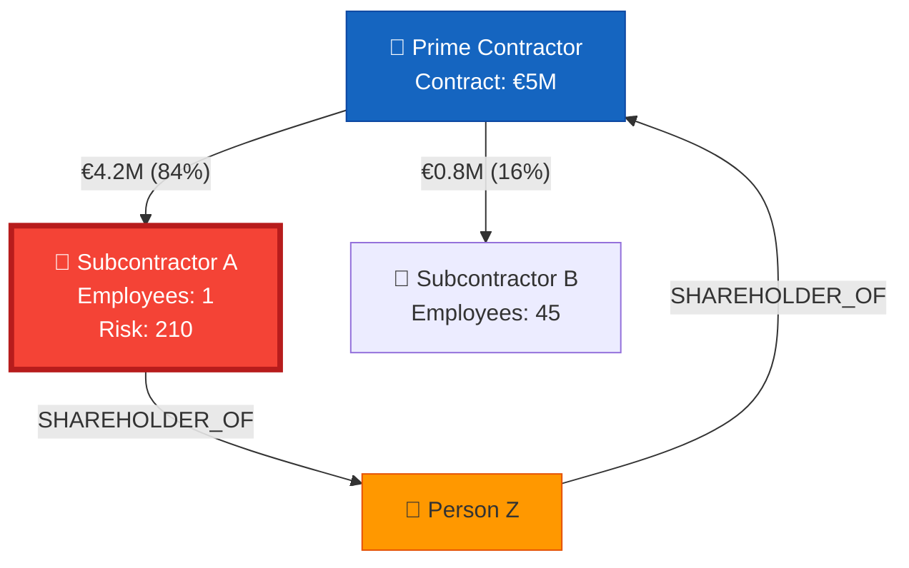

# Risk Intelligence System — System and Architecture Design Document

**Version:** 0.1-DRAFT  
**Date:** 2026-04-10  
**Author:** [Author]  
**Status:** Draft

---

## Table of Contents

1. [Executive Summary](#1-executive-summary)
2. [Data Sources and API Contract](#2-data-sources-and-api-contract)
3. [System Goals and Non-Goals](#3-system-goals-and-non-goals)
4. [Use Cases](#4-use-cases)
5. [Risk Scoring Model](#5-risk-scoring-model)
6. [Graph Data Model](#6-graph-data-model)
7. [System Architecture](#7-system-architecture)
8. [Technology Stack](#8-technology-stack)
9. [Data Ingestion Pipeline](#9-data-ingestion-pipeline)
10. [Cytoscape.js Visualization Layer](#10-cytoscapejs-visualization-layer)
11. [API Design](#11-api-design)
12. [Storage Design](#12-storage-design)
13. [Security and Legal Considerations](#13-security-and-legal-considerations)
14. [Open Questions and Risks](#14-open-questions-and-risks)
15. [Use Case Implementation Details](#15-use-case-implementation-details)
16. [Implementation Plan](#16-implementation-plan)
17. [Contradictions Resolved](#17-contradictions-resolved)

---

## 1. Executive Summary

This document describes the architecture of a **Risk Intelligence system** that ingests Lithuanian public procurement
data from [viespirkiai.org](https://viespirkiai.org), models entities and relationships as a graph, assigns risk scores,
and visualizes suspicious patterns using **Cytoscape.js**.

The system targets three core fraud typologies:

- **Bid rigging / cartel detection** — identifying artificial competition among suppliers
- **Shell company / money laundering detection** — identifying mismatches between contract value and company substance
- **PEP exposure / conflict of interest** — linking procurement decision-makers to winning suppliers

The primary data foundation is viespirkiai.org, which acts as an aggregator of ~15 Lithuanian government data sources
under open CC BY 4.0 licenses. It exposes per-contract and per-entity JSON APIs directly usable for graph construction.

---

## 2. Data Sources and API Contract

### 2.1 viespirkiai.org API

Two core endpoints power the graph construction:

**Contract endpoint:**

```
GET https://viespirkiai.org/sutartis/{CONTRACT_ID}.json
```

Key fields observed in production:

```json
{
  "sutartiesUnikalusID": "2007700250",
  "perkanciosiosOrganizacijosKodas": "188704927",
  "tiekejoKodas": "803",
  "tiekejasPatikslinimas": "MGGP Aero Sp. z o.o.",
  "tiekejasSalis": "Lenkija",
  "verte": 32670,
  "tipas": "MVP",
  "sudarymoData": "2025-06-19",
  "galiojimoData": "2026-12-31",
  "bvpzKodas": "79400000-8",
  "papildomiTiekejai": [],
  "sabisSutartys": [
    ...
  ],
  "cvpisPirkimas": {
    ...
  },
  "dokumentai": [
    ...
  ]
}
```

**Legal entity (company) endpoint:**

```
GET https://viespirkiai.org/asmuo/{JAR_CODE}.json
```

Key fields observed in production:

```json
{
  "jar": {
    "jarKodas": 110053842,
    "pavadinimas": "AB Lietuvos geležinkeliai",
    "registravimoData": "1991-12-24",
    "statusasNuo": "2021-12-16"
  },
  "sodra": {
    "draustieji": 122,
    "vidutinisAtlyginimas": 5023.51,
    "imokuSuma": 141131.28,
    "duomenys": [
      ...
    ]
  }
}
```

Full entity profiles also include: VMI tax data, Registrų centras shareholders, LITEKO court records, VTEK interest
declarations, Regitra vehicle ownership, Darbo inspekcija violations.

### 2.2 Upstream Government Sources

| Source                             | Data Provided                        | Risk Relevance                  |
|------------------------------------|--------------------------------------|---------------------------------|
| VPT / CVP IS (old + new)           | Procurement tender records           | Tender history, winner patterns |
| VPT / Sutarčių duomenys            | Contract amounts, types              | Shell co detection              |
| VPT / Neskelbiamos derybos         | Non-advertised negotiations          | High corruption signal          |
| VPT / Nepatikimi tiekėjai          | Blacklisted suppliers                | Direct risk indicator           |
| Registrų centras / JADIS           | Shareholders, UBO, capital           | AML beneficial owner chains     |
| Atvira SODRA                       | Employees, avg salary, contributions | Substance vs revenue check      |
| VMI                                | Tax paid                             | Revenue vs tax mismatch         |
| VTEK / Privačių interesų registras | Officials' interest declarations     | PEP conflict of interest        |
| LITEKO                             | Court rulings, bankruptcies          | Legal exposure history          |
| CPVA / esinvesticijos.lt           | EU fund projects                     | Double-dipping, EU fraud        |
| TED (EU)                           | Cross-border tenders                 | Transnational bid rigging       |
| DOMREG (KTU)                       | Domain owners                        | Linked digital assets           |
| Konkurencijos taryba / KOTIS       | State aid                            | Subsidized entity gaming        |

### 2.3 Data Access Notes

- All data is publicly available; viespirkiai.org operates under CC BY 4.0.
- No authentication required for the JSON API.
- Data exports are available on request (contact form on the site).
- An **MCP (Model Context Protocol)** endpoint is exposed — relevant if AI-assisted reasoning is integrated later.
- Rate limiting behavior is unknown; assume polite crawling (1–2 req/sec) until confirmed.
- Data disclaimer: viespirkiai.org explicitly states data may be outdated or incorrect. All risk scores must treat it as
  probabilistic, not authoritative.

---

## 3. System Goals and Non-Goals

### Goals

- Ingest public procurement and entity data into a graph database.
- Compute risk scores per entity and per relationship.
- Detect and surface suspicious structural patterns (clusters, rotational wins, shell nodes, PEP paths).
- Visualize the graph interactively via Cytoscape.js with filtering by risk threshold.
- Provide an API for programmatic access to risk scores and graph data.

### Non-Goals

- This is **not a legal determination system**. It produces risk signals, not verdicts.
- It does **not process non-public data** (no court access, no SODRA raw data — only what viespirkiai.org already
  exposes).
- It does **not perform real-time streaming** ingestion in v1. Batch ingestion is sufficient.
- It does **not replace** AML compliance systems like those built on FICO Blaze Advisor — it is a **risk signal
  feeder**, not a decisioning engine.

---

## 4. Use Cases

### UC-01: Bid Rigging / Cartel Detection

**Trigger:** Analyst investigates a tender category or a contracting authority.

**Detection logic:**

- Find all tenders where ≥3 of the same companies appear as participants.
- Identify rotational win patterns: companies A, B, C bid together repeatedly; each wins roughly 1/N of tenders.
- Identify spoiler bids: losing companies consistently submit bids 20–40% above the winner — suggesting they are
  providing cover quotes.

**Graph shape in Cytoscape.js:**

- Nodes: Companies (sized by total contract value won)
- Edges: Co-participation in the same tender (weighted by frequency)
- Layout: CoSE or force-directed — dense clusters of co-participants become visually obvious.
- Highlight: Edges where both nodes won alternately (rotational signal).

**Risk score contribution:** +60 per detected cluster member, +40 if win rotation is confirmed.

**Data needed:** CVP IS tender participants list (currently partially exposed via viespirkiai.org procurement data).

**Limitation:** Requires historical depth (≥3 years) to rule out coincidence. Tender participant lists are not always
complete in the current API — may require direct VPT data export.

---

### UC-02: Shell Company / Fronting Detection

**Trigger:** Contract value is disproportionate to company substance.

**Detection logic:**

- Compare contract `verte` (value) with SODRA `draustieji` (insured employees) and `imokuSuma` (monthly social
  contributions).
- Flag: `contract_value > 500,000 EUR` AND `employees < 5`.
- Flag: Company registration date within 6 months before contract signing date.
- Flag: Company has no prior contract history but wins a large direct negotiation (`tipas = "MVP"` or neskelbiamos
  derybos).

**Graph shape in Cytoscape.js:**

- Nodes: Company (color = risk level; size = contract value)
- Node label shows: employees, registration age, win method
- Edge to: Contracting authority, shareholders, linked entities via JADIS

**Risk score contribution:**

- `employees < 2`: +50
- `company age < 6 months at contract date`: +80
- `non-advertised negotiation`: +80
- `blacklisted supplier`: +100

**Data available:** All required fields are present in the current `/asmuo/{JAR}.json` endpoint (SODRA section + JAR
registration date + VPT contract type).

---

### UC-03: PEP / Conflict of Interest Detection

**Trigger:** A public official or procurement committee member has a financial relationship with a winning supplier.

**Detection logic:**

- Load VTEK interest declarations for officials linked to a contracting authority.
- Traverse declared interests: Official → Spouse → Relatives → Companies → Shareholders.
- If a company at any hop depth ≤ 3 has an active contract with the official's institution → conflict signal.

**Graph shape in Cytoscape.js:**

- Start node: Public official (Person type)
- Expand: interest declaration links (VTEK data)
- Target: Contract nodes awarded by the official's institution
- Highlight: Shortest path between official and supplier

**Risk score contribution:**

- Direct ownership of winning company: +100
- Spouse-owned company wins: +90
- Relative (1st degree) ownership: +70
- Common director/shareholder of winning company: +60

**Limitation:** VTEK declarations are self-reported and may be incomplete. System flags missing declarations as a risk
signal itself.

---

### UC-04: Subcontractor Money Laundering Path

**Trigger:** A prime contractor wins a large contract, then transfers most of the value to subcontractors.

**Detection logic:**

- If subcontractor data is available via SABIS (`sabisSutartys` field in contract JSON): map the money flow graph.
- Flag: Prime contractor receives X EUR; subcontractor receives > 80% of X within 30 days.
- Flag: Subcontractor shareholders overlap with prime contractor shareholders (circular ownership).

**Graph shape in Cytoscape.js:**

- Directed graph: money flow as directed edges with amount labels
- Color gradient: amount density (red = high value flow)
- Identify cycles: if money flows back to a node connected to the original contractor

**Risk score contribution:**

- > 80% value passed to single subcontractor: +70
- Circular shareholder structure: +90
- Subcontractor on blacklist: +100

**Data limitation:** Subcontractor relationships are only partially available via SABIS data in viespirkiai.org. This
use case may require direct CVP IS integration or manual enrichment.

---

### UC-05: EU Fund Double-Dipping Detection

**Trigger:** A company receives both a public procurement contract and EU fund project support for the same activity.

**Detection logic:**

- Cross-reference `cpvaProjektuSutartys` field in contract JSON with CPVA project data.
- Flag: Same company, same CPV code, overlapping date ranges, both funded.
- Flag: Company appears in both national VPT contracts and TED (EU-level) contracts simultaneously for the same
  deliverable.

**Risk score contribution:**

- Duplicate-funded activity detected: +80

---

## 5. Risk Scoring Model (The Inference Engine)

### 5.1 Design Philosophy: Calculation on Write (CoW)
To prevent stale risk scores, the system implements the **Calculation on Write (CoW)** principle. Whenever a metadata field is updated (e.g., `employees` or `flags`), the `riskScore` is recalculated for that node and its immediately connected edges during the ETL process.

### 5.2 Scoring Rules & Multipliers
Scores utilize logarithmic-weighted scaling to prevent "Flag Fatigue."

| Signal Type | Base Weight | Scaling Multiplier | Rationale |
|---|---|---|---|
| **Critical** (Blacklist, Direct Conflict) | 100 | x2.0 | Immediate high-priority alert |
| **High** (Shell Co, Win Rotation) | 80 | x1.5 | Strong behavioral signal |
| **Moderate** (Low Emp, No Tax) | 50 | x1.0 | Statistical anomaly |

### 5.3 Composite Scoring Formula
```
NodeRiskScore = sum(SignalWeights * Multipliers)
EdgeRiskScore = sum(EdgeSignals * Multipliers)

-- Visual Highlight Formula (Logarithmic dampen)
DisplayScore = log2(NodeRiskScore + 1) * 10
```

Threshold recommendations (configurable):
- **DisplayScore >= 100:** Yellow (Review required)
- **DisplayScore >= 150:** Orange (Alert triggered)
- **DisplayScore >= 200:** Red (Critical/Escalate)

---

## 6. Graph Data Model

### 6.1 Node Types

```
Node: Company
  - jarKodas: string (primary key)
  - pavadinimas: string
  - registravimoData: date
  - statusasNuo: date
  - employees: int          (SODRA draustieji)
  - avgSalary: decimal      (SODRA vidutinisAtlyginimas)
  - monthlyContributions: decimal
  - riskScore: int
  - flags: string[]

Node: Person
  - id: string
  - name: string
  - role: enum [OFFICIAL, SHAREHOLDER, DIRECTOR, UBO]
  - institutionCode: string
  - riskScore: int

Node: Contract
  - contractId: string      (sutartiesUnikalusID)
  - value: decimal          (verte)
  - signedDate: date
  - type: string            (tipas: MVP | etc.)
  - cpvCode: string
  - procurementId: string
  - riskScore: int

Node: Institution
  - jarKodas: string
  - pavadinimas: string
  - type: enum [MINISTRY, MUNICIPALITY, SOE, AGENCY]

Node: Tender
  - pirkimoNumeris: string
  - type: string
  - advertised: boolean
  - participantCount: int
```

### 6.2 Edge Types

```
Edge: AWARDED_TO          (Institution → Company, via Contract)
Edge: PARTICIPATED_IN     (Company → Tender)
Edge: WON                 (Company → Tender)
Edge: SHAREHOLDER_OF      (Person → Company, weight = share %)
Edge: DIRECTOR_OF         (Person → Company)
Edge: DECLARED_INTEREST   (Person → Company, via VTEK)
Edge: SUBCONTRACTED_TO    (Company → Company, value = amount)
Edge: CO_BIDDER           (Company → Company, tender = reference, weight = frequency)
Edge: EMPLOYED_AT         (Person → Institution)
```

### 6.3 Graph Data Model Diagram



---

## 7. System Architecture & Environment Parity

The system follows a **Host-First Development Model**. To maximize debugging visibility and minimize abstraction overhead, Node.js runs directly on the developer's host machine.



### 7.1 Operational Strategy
- **Local Dev:** `docker-compose.yml` is used **exclusively** for the PostgreSQL database. Node.js is executed on the host. No Dockerfile is required for the application during development.
- **Single Package Management:** The project uses a single root `package.json`. No monorepo/workspace overhead.

---

## 8. Technology Stack

| Layer | Technology | Rationale |
|---|---|---|
| Frontend framework | Next.js 16 (App Router) + React 19 | Client-side logic ONLY. Portable to S3 + Node if required. |
| Hosting | Vercel (Production) | Managed hosting for Next.js endpoints and static assets. |
| Database | Supabase (PostgreSQL) | Managed storage with standard Postgres compatibility. |
| ORM | Prisma or Drizzle | Type-safe access via single root configuration. |
| Ingestion | Node.js + GitHub Actions | Stateful ETL runner executing on host/runner Node.js. |
| Testing (Unit) | Jest | Used for logic, services, and non-GUI code only. |
| Testing (E2E/GUI) | Cypress | Primary tool for UI, interactivity, and integration testing. |

---

## 8.1 Repository Structure (Single-Root Decoupled)

The following tree defines the mandatory structure to maintain logical separation while using a single `package.json`.

```text
risk-intelligence/
├── .github/
│   └── workflows/
│       └── etl-scraper.yml      # Nightly ETL Runner
├── cypress/                     # E2E & GUI Testing (Specs, Screenshots, Videos)
├── prisma/                      # Database Schema & Migrations
├── public/                      # Static Assets
├── src/
│   ├── app/                     # App Router (Next.js Entry)
│   │   ├── api/                 # Stateless API Route Handlers
│   │   │   ├── entities/        # [GET] 360 View / Network
│   │   │   └── risk/            # [GET] Risk explanations
│   │   ├── layout.tsx           # Global Shell & Theme Provider
│   │   ├── page.tsx             # Main Dashboard Entry (SPA)
│   │   └── globals.css          # Global Styles
│   ├── components/              # Modular Client UI Components
│   │   ├── graph/               # Cytoscape.js Logic
│   │   └── entity/              # Profile & List components
│   ├── lib/                     # Business Logic (Risk Rules, DB Client)
│   ├── types/                   # Shared TypeScript Interfaces
│   └── services/                # API Client Wrappers
├── docker-compose.yml           # Local Postgres ONLY
├── package.json                 # SINGLE ROOT PACKAGE
├── tsconfig.json
└── ARCHITECTURE.md
```

### 8.1.1 Logical Separation Rules
- **Physical Monolith, Mental Decoupling:** All UI code in `src/app` must remain agnostic of the backend implementation. It communicates with `/api/*` solely via standard `fetch` calls.
- **API Statelessness:** API Route Handlers must not rely on Vercel-specific state. They should be pure Node.js functions that can be easily ported to an Express or Fastify server.

---

## 9. Data Ingestion Pipeline (The ETL State Machine)

To address the "803" foreign entity ambiguity and natural person surname variation, the pipeline implements a **Deterministic Entity Resolver**.



### 9.1 Deterministic Entity Resolution Logic
1. **Foreign Entities (803):** Instead of a name join, a **Synthetic UID** is generated: `H(country + normalized_name)`. This prevents "803" collisions.
2. **Lithuanian Surnames:** The system uses **Soundex/Metaphone** normalization for natural persons in VTEK declarations to link potential relatives across gendered surname variations (e.g., *Bingelis* ↔ *Bingelienė*).

### 9.2 Stateful Ingestion & Data Provenance
The `scrape_log` table tracks every `(entity_type, entity_id, status, last_fetched)`. This allows the ETL runner to:
- Recover from 429 Rate Limits.
- Identify "Data Gaps" (nodes referenced in contracts but missing `/asmuo` profiles).
- Force re-calculating risk scores for entities with stale metadata.

### 9.2 Phase 2 — Incremental Sync

```yaml
# GitHub Action schedule: nightly (02:00 EET)
# 1. Fetch new contract IDs from VPT feed
# 2. GET /sutartis/{id}.json -> Extract Buyer and Supplier JARs
# 3. GET /asmuo/{jar}.json -> Fetch metadata for Buyer and Supplier
# 4. Prisma Upsert: Contract and Company nodes
# 5. Risk Scorer: Recompute risk for the network subgraph
jobs:
  ingest:
    runs-on: ubuntu-latest
    steps:
      - uses: actions/checkout@v4
      - run: npm install
      - run: npm run ingest
        env:
          DATABASE_URL: ${{ secrets.DATABASE_URL }}
```

### 9.3 Rate Limiting Strategy

- 1 request/second to viespirkiai.org (conservative; adjust after testing).
- Exponential backoff on 429/503.
- Cache entity profiles for 7 days (they change infrequently).
- Cache contract records indefinitely (immutable once signed).

### 9.4 Data Quality Handling

- `tiekejoKodas: "803"` maps to a foreign company placeholder — resolve via `tiekejasPatikslinimas` name field.
- Missing SODRA data means the company has no Lithuanian employees — **treat as elevated risk signal**, not missing
  data.
- `faktineIvykdimoData: null` means contract not yet completed — flag as open/active.

---

## 10. Cytoscape.js Visualization Layer

### 10.1 Layouts

| Use Case                 | Recommended Layout             | Reason                                |
|--------------------------|--------------------------------|---------------------------------------|
| Cartel cluster detection | CoSE-Bilkent                   | Reveals tight clusters naturally      |
| PEP path traversal       | Breadth-First from Person node | Shows hop distance to winning company |
| Subcontractor money flow | Dagre (DAG layout)             | Directed flow is readable top-down    |
| General overview         | Concentric (by risk score)     | Highest risk at center                |

### 10.2 Visual Encoding

```
Node size        → total contract value (log scale)
Node color       → risk score: grey (0–49) / green (50–99) / yellow (100–149) / orange (150–199) / red (≥200)
Node shape       → type: ellipse=Company, rectangle=Institution, diamond=Person, triangle=Contract
Edge width       → co-bid frequency or subcontract value
Edge color       → edge risk score gradient
Edge style       → dashed = inferred/indirect relationship; solid = direct/documented
```

### 10.3 Interaction Design

- **Click node** → side panel shows entity detail, risk score breakdown, source links.
- **Double-click** → expand node (load and render 1-hop neighbors from API).
- **Risk threshold slider** → hide nodes below threshold (server-side filter or client-side `cy.filter()`).
- **Path finder** → "Find path between A and B" using Cytoscape's built-in BFS or Dijkstra.
- **Alert overlay** → pulsing animation on nodes that triggered alerts in the last 24h.

### 10.4 Performance Considerations

- Render max 2,000 nodes at once in Cytoscape (browser memory limit for interactive graph).
- For larger traversals, use server-side subgraph extraction and return only the relevant neighbourhood.
- Use WebGL renderer (`cytoscape-three.js` or `cytoscape-canvas`) if node count regularly exceeds 1,000.
- Virtualize the node list in the side panel — don't render 50,000 rows in the DOM.

---

## 11. API Design

### Core endpoints

```
GET  /api/entities/{jarKodas}
     → 360 View: Entity profile + risk score breakdown + direct relationship counts

GET  /api/entities/{jarKodas}/network?depth=1&minRisk=100
     → Lazy Loading: Subgraph (nodes + edges) for immediate neighbors
     → Returns Cytoscape.js-compatible JSON

GET  /api/search?q={term}&type={company|person|contract}
     → Supabase-backed FTS search

GET  /api/alerts?since={iso_date}&minRisk=150
     → Recent alerts

POST /api/graph/path
     body: { from: jarKodas, to: jarKodas, maxDepth: 5 }
     → Shortest risk path using Recursive CTEs
```

### Graph response format (Cytoscape.js-compatible)

```json
{
  "elements": {
    "nodes": [
      {
        "data": {
          "id": "110053842",
          "label": "AB Lietuvos geležinkeliai",
          "type": "Company",
          "riskScore": 45,
          "employees": 122,
          "totalContractValue": 5200000
        }
      }
    ],
    "edges": [
      {
        "data": {
          "id": "e1",
          "source": "188704927",
          "target": "110053842",
          "type": "AWARDED_TO",
          "contractId": "2007700250",
          "value": 32670,
          "edgeRiskScore": 0
        }
      }
    ]
  },
  "meta": {
    "totalNodes": 1,
    "totalEdges": 1,
    "queryDepth": 1,
    "generatedAt": "2026-04-10T12:00:00Z"
  }
}
```

---

## 12. Storage Design

### 12.1 Key Tables (PostgreSQL / Prisma)

```prisma
// Prisma Schema fragment
model Company {
  jarKodas        String    @id
  pavadinimas     String
  riskScore       Int       @default(0)
  employees       Int?
  avgSalary       Decimal?
  contractsAsBuyer Contract[] @relation("Buyer")
  contractsAsSupplier Contract[] @relation("Supplier")
}

model Contract {
  contractId String @id
  value      Decimal
  buyer      Company @relation("Buyer", fields: [buyerJar], references: [jarKodas])
  buyerJar   String
  supplier   Company @relation("Supplier", fields: [supplierJar], references: [jarKodas])
  supplierJar String
}
```

### 12.2 Pathfinding via Recursive CTE

Instead of Cypher, multi-hop traversals use PostgreSQL Recursive CTEs. This is efficient for depths up to 5–10 levels.

```sql
-- Find paths from Company A to Company B through shareholder links
WITH RECURSIVE path_finder AS (
  -- Base case: direct shareholders
  SELECT 
    source_id, 
    target_id, 
    1 as depth,
    ARRAY[source_id, target_id] as path
  FROM shareholders
  WHERE source_id = 'START_JAR'

  UNION ALL

  -- Recursive step
  SELECT 
    s.source_id, 
    s.target_id, 
    pf.depth + 1,
    pf.path || s.target_id
  FROM shareholders s
  JOIN path_finder pf ON s.source_id = pf.target_id
  WHERE pf.depth < 5 AND NOT s.target_id = ANY(pf.path)
)
SELECT * FROM path_finder WHERE target_id = 'END_JAR';
```

---

## 13. Security and Legal Considerations

### Legal

- All data originates from public Lithuanian government registries under CC BY 4.0. Use is permitted.
- viespirkiai.org explicitly disclaims accuracy — **never present scores as legal findings**.
- GDPR applies to Person nodes containing natural person data. If the system stores VTEK declarations or shareholder
  data that identifies individuals:
    - Store only data already publicly disclosed by VTEK/JADIS (no new collection).
    - Provide a data correction/removal contact mechanism (same obligation as viespirkiai.org).
    - Do not expose Person node full names via public unauthenticated API endpoints.

### Security

- The backend API should require authentication (JWT) before serving graph data.
- No raw government data should be re-exposed without transformation (no API that just proxies viespirkiai.org).
- Risk score explanations containing personal data (PEP paths) must be access-controlled.
- Implement query depth limits (max depth=4) to prevent traversal-based DoS on the graph engine.

---

## 14. Open Questions and Risks

| # | Question                                                               | Risk if Unresolved                                                               | Owner                       |
|---|------------------------------------------------------------------------|----------------------------------------------------------------------------------|-----------------------------|
| 1 | Can we get bulk data export from viespirkiai.org?                      | Phase 1 seeding relies on scraping ~millions of IDs without a seed list          | Contact viespirkiai.org     |
| 2 | Are tender participant lists (co-bidders) available via API?           | UC-01 (cartel detection) is blocked without participant data                     | Verify VPT CVP IS data      |
| 3 | Is VTEK interest declaration data machine-readable in the /asmuo JSON? | UC-03 (PEP) needs structured VTEK data                                           | Test against sample JARs    |
| 4 | Does PostgreSQL handle 500k+ relationship traversals efficiently? | May need to optimize Recursive CTEs or use caching | Benchmark at 100k nodes |

| 5 | Rate limit policy of viespirkiai.org                                   | Pipeline could get blocked without a known limit                                 | Contact or empirically test |
| 6 | Subcontractor data completeness in SABIS                               | UC-04 (AML path) is only partially implementable                                 | Assess SABIS coverage       |
| 7 | GDPR DPA notification                                                  | If storing PEP natural person data, may require registering as a data controller | Legal review                |

---

## Appendix A: Risk Score Reference Card

| Score Range | Interpretation                         | Display          |
|-------------|----------------------------------------|------------------|
| 0–49        | No significant signals                 | Grey node        |
| 50–99       | Minor anomalies                        | Green node       |
| 100–149     | Moderate risk — warrants manual review | Yellow node      |
| 150–199     | High risk — alert generated            | Orange node      |
| 200+        | Critical — escalate                    | Red pulsing node |

---

## Appendix B: Data Field Mapping

| viespirkiai.org Field             | Internal Field          | Used In                                 |
|-----------------------------------|-------------------------|-----------------------------------------|
| `sutartiesUnikalusID`             | `contract_id`           | Contract node PK                        |
| `perkanciosiosOrganizacijosKodas` | `buyer_jar`             | Institution node                        |
| `tiekejoKodas`                    | `supplier_jar`          | Company node (caution: "803" = foreign) |
| `tiekejasPatikslinimas`           | `supplier_name_raw`     | Foreign company name                    |
| `tiekejasSalis`                   | `supplier_country`      | Risk signal if non-LT                   |
| `verte`                           | `contract_value`        | Shell detection                         |
| `tipas`                           | `contract_type`         | MVP = non-advertised signal             |
| `sudarymoData`                    | `signed_date`           | Company age check                       |
| `sodra.draustieji`                | `employees`             | Shell detection                         |
| `sodra.imokuSuma`                 | `monthly_contributions` | Substance check                         |
| `jar.registravimoData`            | `company_registered`    | Age at contract date                    |
| `jar.statusasNuo`                 | `status_change_date`    | Dormancy detection                      |
| `papildomiTiekejai`               | `co_suppliers`          | AML subcontract path                    |
| `sabisSutartys`                   | `sabis_contracts`       | SABIS money flow                        |
| `cpvaProjektuSutartys`            | `eu_projects`           | Double-dipping check                    |

---

## 15. Use Case Implementation Details

This section provides concrete implementation guidance for each use case, including graph construction logic, detection
algorithms, and Cytoscape.js rendering specifics.

### 15.1 UC-1: Cartel & Bid Rigging Detection

**Goal:** Identify clusters of companies that frequently compete in the same tenders but rotate winning outcomes.

**Graph Construction:**

1. Extract all `Tender` nodes from procurement data (`cvpisPirkimas` in the contract JSON).
2. Extract all `Company` nodes that participated as bidders.
3. Generate `PARTICIPATED_IN` edges (Company → Tender) for every bid.
4. Generate `WON` edges (Company → Tender) for the winning company.
5. Generate `CO_BIDDER` edges (Company ↔ Company) for every pair of companies that appear in the same tender. Increment
   `weight` for each co-occurrence.

**Detection Algorithm:**

```
Input: CO_BIDDER subgraph

1. Filter CO_BIDDER edges where weight ≥ 3 (co-appeared in ≥3 tenders).
2. Run connected component analysis on the filtered subgraph.
3. For each connected component with ≥3 companies:
   a. Compute win distribution: wins_per_company / total_tenders_in_cluster.
   b. If normalized win distribution is roughly uniform (stddev of win_ratio < 0.15,
      where win_ratio = wins_per_company / total_tenders; threshold based on
      expectation that random allocation yields stddev ≈ 0.1 for N=3):
      → FLAG as rotational win pattern (cartel signal).
   c. Compute spoiler bid ratio:
      For each losing bid, if bid_amount > winner_amount * 1.20:
      → FLAG as cover quote.
4. Assign risk scores:
   - Cluster membership: +60
   - Confirmed win rotation: +40
   - Spoiler bid pattern: +30
```

**Cytoscape.js Rendering:**



- **Layout:** CoSE-Bilkent — dense clusters of co-participants become visually obvious.
- **Edge width** scales with `CO_BIDDER.weight` (co-bid frequency).
- **Node border** turns orange/red when the cluster has a rotational win flag.
- **Tooltip** on cluster edge: "Co-appeared in N tenders; win rotation stddev = X".

---

### 15.2 UC-2: Shell Company ("Feniksai") Identification

**Goal:** Spot entities with high-value contracts but suspiciously low operational capacity.

**Graph Construction:**

1. For each `Company` node, set `size` proportional to `totalContractValue` (sum of all `contract.verte`).
2. Read `employeeCount` from SODRA metadata (`sodra.draustieji` in `/asmuo/{jar}.json`).
3. Read `monthlyContributions` from SODRA (`sodra.imokuSuma`).
4. Compute `companyAgeAtContract` = `contract.sudarymoData` − `jar.registravimoData`.

**Detection Algorithm:**

```
Input: Company nodes with contract + SODRA data

For each Company node:
  1. Compute totalContractValue = SUM(contract.verte) for all linked contracts.
  2. Retrieve employees = sodra.draustieji (default 0 if missing).
  3. Retrieve companyAge = contract.sudarymoData - jar.registravimoData.

  Flag conditions (additive scoring):
    IF employees < 2                          → +50 (critical: near-zero workforce)
    IF employees < 5 AND totalContractValue > 500,000 → +30 (disproportionate)
    IF companyAge < 6 months at contract date → +80 (freshly registered)
    IF contract.tipas = "MVP" (non-advertised) → +80 (no competitive process)
    IF blacklisted = true (VPT list)          → +100 (known bad actor)
    IF sodra data missing entirely            → +40 (no LT employees at all)

  Visual flags:
    IF riskScore ≥ 150 → red border stroke on node
    IF employees < 2 AND totalContractValue > 100,000 → pulsing animation
```

**Cytoscape.js Rendering:**



- **Node size** = `totalContractValue` (log scale) — shell companies appear as large nodes.
- **Node label** shows: employee count, registration age, win method.
- **Red border stroke** when: high node degree (many contracts) + large node size (high value) + critical metadata flag
  (`employees < 2`).
- **Side panel** on click: full risk breakdown table showing each signal and its score contribution.

---

### 15.3 UC-3: PEP & Conflict of Interest (VTEK)

**Goal:** Visualize the distance between decision-makers and contract winners.

**Graph Construction:**

1. Load `Person` nodes from VTEK interest declarations (linked to Institution via `EMPLOYED_AT`).
2. Load `Person` nodes from company board member / shareholder data (JADIS).
3. Create `DECLARED_INTEREST` edges (Person → Company) from VTEK data.
4. Create `SHAREHOLDER_OF` and `DIRECTOR_OF` edges from JADIS.
5. Create `EMPLOYED_AT` edges (Person → Institution) for officials.
6. Create family relationship edges where available from VTEK: `SPOUSE_OF`, `RELATIVE_OF`.

**Detection Algorithm:**

```
Input: Person node (official at Institution I) + Company node (contract winner C)

1. Build weighted graph:
   - Edge weight = inverse of relationship strength
     (direct ownership = 1, spouse = 2, relative = 3, shared director = 4)

2. Run Dijkstra shortest-path from Person P (official) to Company C (winner):
   - Path: P → [SPOUSE_OF] → Person S → [SHAREHOLDER_OF] → Company C
   - pathLength = sum(edge_weights)

3. If pathLength ≤ 3 AND Company C has active contract with Institution I:
   → CONFLICT OF INTEREST signal

4. Risk scoring by path:
   - Direct ownership of winner:    +100 (pathLength = 1)
   - Spouse owns winner:            +90  (pathLength = 2)
   - 1st degree relative owns:      +70  (pathLength = 3)
   - Common director/shareholder:   +60  (pathLength = 2, different edge type)
   - Missing VTEK declaration:      +40  (absence of expected data)

5. If no path found within maxDepth=4 → no conflict signal.
```

**Cytoscape.js Rendering:**



- **Layout:** Breadth-First from the Person (official) node — shows hop distance clearly.
- **Shortest path highlight:** The path from official to winning company is rendered with thick, colored edges.
- **Path finder UI:** "Find path between A and B" using Cytoscape.js `aStar()` or `dijkstra()` extension.
- **Edge labels** show relationship type and weight (e.g., "SHAREHOLDER_OF 51%").

---

### 15.4 UC-4: Subcontracting & ML Paths

**Goal:** Trace funds from a primary contractor to suspicious sub-entities.

**Graph Construction:**

1. Parse `sabisSutartys` field from the contract JSON to extract subcontractor relationships.
2. Create directed `SUBCONTRACTED_TO` edges (PrimeContractor → Subcontractor) with `value` attribute.
3. Cross-reference subcontractor shareholders (JADIS) with prime contractor shareholders to detect circular ownership.
4. If `papildomiTiekejai` (additional suppliers) field is populated, create additional `CO_SUPPLIER` edges.

**Detection Algorithm:**

```
Input: Contract C with prime contractor P and subcontractor data

1. Build directed money-flow graph:
   P --[value_1]--> Sub1
   P --[value_2]--> Sub2
   Sub1 --[value_3]--> Sub1a  (if nested subcontracting exists)

2. Compute subcontract ratio for each subcontractor:
   subcontractRatio = subcontract_value / prime_contract_value

3. Flag conditions:
   IF subcontractRatio > 0.80 for any single subcontractor  → +70
   IF subcontractor shareholders ∩ prime shareholders ≠ ∅ → +90 (circular ownership)
   IF subcontractor is on VPT blacklist                → +100
   IF subcontractor has employees < 2                  → +50 (shell sub)

4. Cycle detection:
   Run DFS on the directed subcontract graph.
   IF cycle found (money flows back to a node connected to P) → +90

5. Aggregate path risk:
   graphPathScore = sum(edgeRiskScores along path) / path_length
```

**Cytoscape.js Rendering:**



- **Layout:** Dagre (DAG) — directed flow is readable top-down.
- **Edge width** scales with subcontract `value`.
- **Edge color gradient:** green (low value) → red (high value, >80% pass-through).
- **Cycle highlight:** If circular ownership or money cycle detected, edges forming the cycle are rendered in dashed red
  with animation.
- **Edge labels** show absolute amount and percentage of prime contract value.

---

## 16. Implementation Plan (POC-First Strategy)

### Phase 1 — Foundation & Local Sandbox
> **Goal:** Establish a functional local environment with a "seed" database.
- [x] Set up local PostgreSQL via `docker-compose.yml` (DB only).
- [x] Initialize Prisma with the core schema (Company, Contract, Person).
- [x] Implement `npm run db:setup`: Script to initialize schema and run basic health checks.
- [x] Implement `Fetcher` POC: Successfully ingest and parse the two known `viespirkiai` sample endpoints.

### Phase 2 — Data Synthesis Engine
> **Goal:** Expand the 2-node graph into a meaningful network for risk analysis.
- [x] **Build Synthesizer:** Create a Node.js utility to generate ~1,000 synthetic Companies and ~5,000 Contracts.
- [x] **Relational Logic:** Ensure synthesized data follows real-world distributions (e.g., Pareto distribution for contract values).
- [x] **Identity Normalization:** Implement the `Entity Resolver` logic locally to handle synthetic name variations.
- [x] **Seed Local DB:** Create a rich local dataset for testing the "360 View."

### Phase 3 — Risk Scoring & Pathfinding POC
> **Goal:** Implement the business logic (Inference Engine) on the synthesized data.
- [x] Implement the **Calculation on Write (CoW)** risk scorer locally.
- [x] Write and optimize the **Recursive CTEs** for multi-hop pathfinding.
- [x] Verify UC-1 (Cartel) and UC-2 (Shell) detection logic against synthesized anomalies.
- [x] Implement the `DisplayScore` (Logarithmic) calculation.

### Phase 4 — UI & Visualization POC (The "GUI")
> **Goal:** Build the interactive dashboard against the local Node.js API.
- [x] Build the Next.js App Router shell (Strictly SPA mode).
- [x] Implement the `360 View` Entity Profile page.
- [x] Integrate Cytoscape.js for the **Lazy Loading Network** view.
- [x] Implement the "View Network" expansion logic using local API handlers.
- [x] **E2E/GUI Testing:** Implement Cypress test suite for critical user flows (Search -> Profile -> Graph).

### Phase 5 — Cloud Transition (Deferred)
> **Goal:** Move the verified POC to production-grade infrastructure.
- [ ] Migrate local PostgreSQL schema to Supabase.
- [ ] Configure Vercel for serverless deployment of the Next.js API/Frontend.
- [ ] Port the Fetcher/Synthesizer logic into a stateful GitHub Action ETL runner.
- [ ] Implement production-grade rate limiting and monitoring.

### Phase 6 — Advanced Detection & Hardening

> **Goal:** Mature the detection algorithms and harden for real-world use.

- [ ] Verify tender participant list availability in CVP IS data (Open Question #2)
- [ ] Verify VTEK machine-readable data in `/asmuo` JSON (Open Question #3)
- [ ] Assess SABIS subcontractor data completeness (Open Question #6)
- [ ] Implement WebGL renderer fallback for graphs exceeding 1,000 nodes
- [ ] Add TED (EU) cross-border tender data for transnational bid rigging detection
- [ ] Add CPVA/esinvesticijos.lt integration for EU fund double-dipping
- [ ] Legal review: GDPR DPA notification if storing PEP natural person data (Open Question #7)
- [ ] Performance test: relationship traversals at 500k+ nodes, optimize Recursive CTEs

---

## 17. Contradictions Resolved

This section documents contradictions found during the review of the original v0.1-DRAFT and how they were resolved.

| # | Location | Contradiction | Resolution |
|---|---|---|---|
| 1 | Section 10.2 vs Appendix A | Section 10.2 mapped `green` to `<100` (a single band), while Appendix A correctly splits into `Grey (0–49)` and `Green (50–99)` — two distinct severity bands. | Aligned Section 10.2 with Appendix A: grey (0–49) / green (50–99) / yellow (100–149) / orange (150–199) / red (≥200). |
| 2 | Section 12.2 vs Section 6.2 | The SQL example in 12.2 had inconsistent edge naming compared to Section 6.2. | Fixed SQL example to match the `Institution → Company` edge definition. |
| 3 | Section 8 vs Codebase | Document listed `TailwindCSS + shadcn/ui` for UI. The actual codebase uses `MUI v5 + Emotion` for the component library. | Updated Section 8 technology stack to reflect the actual project: Next.js 16, MUI v5, Next.js API Route Handlers. |
| 4 | Section 7 Architecture | Next.js with App Router is typically a full-stack framework (SSR + API routes), but this system strictly enforces a Decoupled SPA model. | Replaced ASCII diagram and updated Tech Stack to enforce SPA + decoupled API, suitable for static export. |
