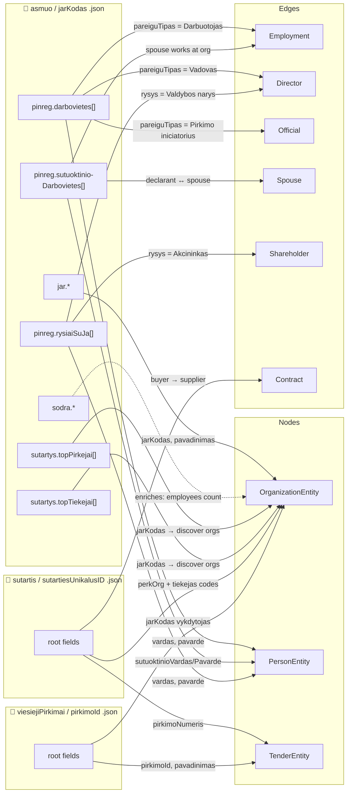
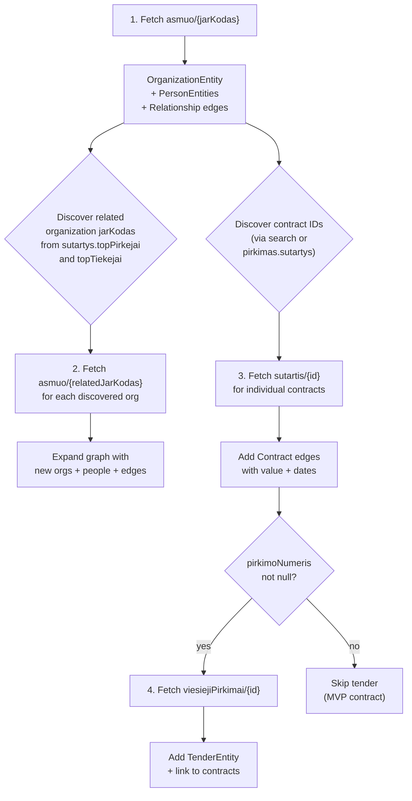
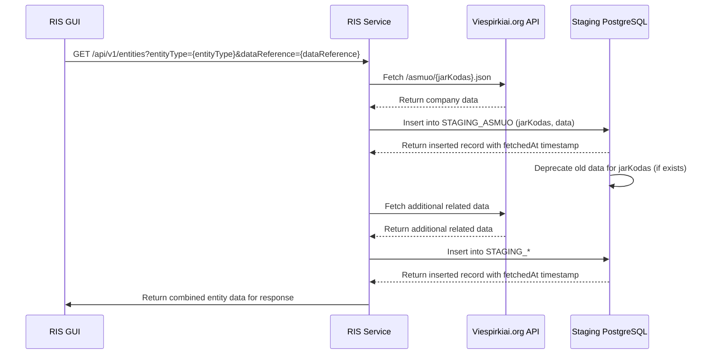
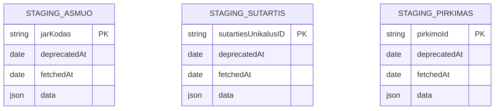

# Risk Intelligence System — System and Architecture Design Document

## Table of Contents

## Executive Summary

This document describes the architecture of a **Risk Intelligence system** (RIS) that provides relationship diagrams
between public companies, public company employees including their family members and public procurement contracts in
Lithuania.

As the main source of data, RIS will use [viespirkiai.org](https://viespirkiai.org).

**Graph-First UX Paradigm:** The system features a graph-first user experience, employing Node-Link Diagrams to
visualize a "Biological Interaction Network." This approach treats the procurement ecosystem as an organic entity,
allowing investigators to intuitively spot structural anomalies (dense "inflamed" clusters). The front page immediately
immerses the user in the graph canvas, beginning with the critical anchor node "
geležinkeliai" (https://viespirkiai.org/asmuo/110053842.json) and its relationships, inviting exploration.

**360 Degree Entity View:** Clicking on any node (company, person, contract) opens a comprehensive profile view.
This includes all relevant metadata, risk scores (in the future), and a mini graph of immediate relationships.
In the database data is stored in two tables: `entities` (companies, people) and `relationships` (contracts, ownership
links, other link types). The graph visualization is a dynamic projection of this underlying relational data.

## Main Use Cases

- Graph browser using **Cytoscape.js** to visualize relationships between companies, individuals as nodes and contracts
  as edges. Interactive filtering by contract timeframe and value.

- Nepotism detection — graph browser that helps visually identify if a company has a relationship with an employee
  family members of the contracting authority.

## Main Functionality

- **viespirkiai data** - Data scraping from viespirkiai.org (and other public sources in the future) for graph
  construction.

- Graph visualization using **Cytoscape.js** with interactive filters (year, contract value) and node/edge details on
  click.

The system targets three core fraud typologies:

## Future Use Cases (Beyond v1)

- **Bid rigging / cartel detection** — identifying artificial competition among suppliers
- **Shell company / money laundering detection** — identifying mismatches between contract value and company substance
- **PEP exposure / conflict of interest** — linking procurement decision-makers to winning suppliers
- **Subcontractor laundering paths** — tracing money flows from prime contractors to subcontractors
- **EU fund double-dipping** — cross-referencing procurement contracts with EU fund projects for the same activity

---

## Technology Stack

1. **Frontend:** Next.js 16 (Hash Based Routing) + React 19, with Cytoscape.js for graph visualization.
2. **Design System:** Material UI for consistent styling and responsive design.
3. **Midlayer:** TanStack React Query for data fetching and caching, ensuring efficient API interactions. React
   useContext for global state management.
4. **Database:** PostgreSQL within Docker for development; Supabase Postgres in production for managed hosting.
5. **ORM:** Prisma for type-safe database access and migrations.
6. **Testing:** Jest for unit tests; Cypress for end-to-end testing of the UI and integration points.
7. **Hosting:** Vercel for production deployment of the Next.js application; GitHub Actions for CI/CD pipelines.
8. **Data Ingestion:** Node.js scripts executed via GitHub Actions for scheduled ETL processes to populate the database.

### Constraints

1. Vercel deployment must be supported
2. No Server Side Rendering (SSR) for UI components
3. Single-page application with hash-based routing

---

## Basic Data Structures

```typescript

interface TemporalEntity {
    uuid: string;
    name: string;
    fromDate: Date;
    tillDate: Date | null; // null means "present"
}

/**
 * CompanyEntity represents a legal entity (company) in the graph.
 * uuid - jarKodas
 * name - pavadinimas
 * fromDate - registravimoData
 *
 * @example https://viespirkiai.org/asmuo/307562016.json
 */
interface OrganizationEntity extends TemporalEntity {
    type: 'PrivateCompany' | 'PublicCompany' | 'Institution';
    dataReference: string; // jarKodas to STAGING_ASMUO
}

/**
 * PersonEntity represents an individual (natural person) in the graph.
 * uuid - pinreg.darbovietes[].deklaracija (declaration UUID, unique per person)
 * name - pinreg.darbovietes[].vardas + " " + pavarde
 * fromDate - pinreg.darbovietes[].rysioPradzia (start of relationship with organization)
 *
 * Note: Same person across multiple orgs will have different deklaracija UUIDs.
 * Same person at same org may appear multiple times (different roles) with same deklaracija.
 *
 * @example: https://viespirkiai.org/asmuo/110053842.json
 * @example: [110053842.json](examples/asmuo/110053842.json)
 */
interface PersonEntity extends TemporalEntity {
    data: Record<string, any> // pinreg.darbovietes[].*
}

/**
 * TenderEntity represents a procurement tender or competition.
 * uuid - pirkimoNumeris
 * name - pavadinimas
 *
 * @example https://viespirkiai.org/viesiejiPirkimai/7346201.json
 * @example [7346201.json](examples/viesiejiPirkimai/7346201.json)
 */
interface TenderEntity extends TemporalEntity {
    dataReference: string; // pirkimoNumeris to STAGING_PIRKIMAS
}

/**
 * @example:
 *  fromDate - paskelbimoData (if Contract)
 *  tillDate - galiojimoData (if Contract)
 *  name - label (CEO, 300 EUR, etc.)
 */
interface Relationship extends TemporalEntity {
    type: 'Contract' | 'Ownership' | 'Employment' | 'Spouse' | 'Relative' | 'Official' | 'Shareholder' | 'Director' | 'DeclaredInterest' | 'Subcontract' | 'CoBidder';
    source: string; // uuid
    target: string; // uuid
    data: Record<string, any>
}

interface ContractRelationship extends Relationship {
    type: 'Contract';
    dataReference: string; // sutartiesUnikalusID to STAGING_SUTARTIS
}

```

## Data Sources and API Contract

**Sutartys (Contracts)**

- https://viespirkiai.org/sutartis/{sutartiesUnikalusID}.json
- for scraping GUI: https://viespirkiai.org/?search=paslaugos (for example "paslaugos" is a keyword)

**Asmuo (Company)**

- https://viespirkiai.org/asmuo/{jarKodas}.json
- for scraping GUI: https://viespirkiai.org/juridiniai?search=paslaugos (for example "paslaugos" is a keyword)

**Pirkimas, konkursas (Tender)**

- https://viespirkiai.org/viesiejiPirkimai/{pirkimoId}.json
- for scraping GUI: https://viespirkiai.org/viesiejiPirkimai?search=paslaugos&sort=paskelbimoData (for example "
  paslaugos" is a keyword)

## Data-to-Entity Mapping

This section documents how graph entities and relationships are derived from viespirkiai.org API responses.

### Mapping Overview



### asmuo/{jarKodas}.json → Entities

The `asmuo` endpoint is the **richest source** for graph construction. A single fetch yields the organization itself,
all declared employees, their spouses, board members, and summary of contract partners.

**@example:** [110053842.json](examples/asmuo/110053842.json) (AB "Lietuvos geležinkeliai" — trimmed)

| API Section                       | Produces                        | Entity/Edge Type                             | Key Fields                                                                                                  |
|-----------------------------------|---------------------------------|----------------------------------------------|-------------------------------------------------------------------------------------------------------------|
| `jar`                             | **OrganizationEntity**          | PrivateCompany / PublicCompany / Institution | `jarKodas` → uuid, `pavadinimas` → name, `registravimoData` → fromDate, `formosKodas` → type classification |
| `sodra`                           | enriches **OrganizationEntity** | —                                            | `bendrasDraustujuSkaicius` → employee count, `bendrasVidutinisAtlyginimas` → avg salary                     |
| `pinreg.darbovietes[]`            | **PersonEntity**                | Person                                       | `deklaracija` → uuid, `vardas + pavarde` → name, `rysioPradzia` → fromDate                                  |
| `pinreg.darbovietes[]`            | **Relationship**                | Employment / Director / Official             | `pareiguTipasPavadinimas` determines type (see mapping below), source=Person, target=Organization           |
| `pinreg.sutuoktinioDarbovietes[]` | **PersonEntity** × 2            | Person (declarant + spouse)                  | Declarant: `deklaruojancioVardas/Pavarde`, Spouse: `sutuoktinioVardas/Pavarde`                              |
| `pinreg.sutuoktinioDarbovietes[]` | **Relationship**                | Spouse                                       | source=declarant Person, target=spouse Person                                                               |
| `pinreg.sutuoktinioDarbovietes[]` | **Relationship**                | Employment                                   | source=spouse Person, target=Organization                                                                   |
| `pinreg.rysiaiSuJa[]`             | **PersonEntity**                | Person                                       | `deklaracija` → uuid, `vardas + pavarde` → name, `rysioPradzia` → fromDate                                  |
| `pinreg.rysiaiSuJa[]`             | **Relationship**                | Director / Shareholder / Official            | `rysioPobudzioPavadinimas` determines type (see mapping below), source=Person, target=Organization          |
| `sutartys.topPirkejai[]`          | **OrganizationEntity** (ref)    | discovered via jarKodas                      | `jarKodas`, `pavadinimas` — organizations that buy from this one                                            |
| `sutartys.topTiekejai[]`          | **OrganizationEntity** (ref)    | discovered via jarKodas                      | `jarKodas`, `pavadinimas` — organizations that supply to this one                                           |

#### pareiguTipasPavadinimas → Relationship Type

| pareiguTipasPavadinimas      | → Relationship Type | Notes                                                |
|------------------------------|---------------------|------------------------------------------------------|
| `Vadovas ar jo pavaduotojas` | **Director**        | CEO / Deputy — high risk for nepotism                |
| `Darbuotojas`                | **Employment**      | Regular employee                                     |
| `Pirkimo iniciatorius`       | **Official**        | Procurement initiator — key for conflict of interest |
| `Ekspertas`                  | **Official**        | Expert role in procurement                           |
| _other_                      | **Official**        | Default for unrecognized role types                  |

#### rysioPobudzioPavadinimas → Relationship Type

| rysioPobudzioPavadinimas  | → Relationship Type | Notes                                     |
|---------------------------|---------------------|-------------------------------------------|
| `Valdybos narys`          | **Director**        | Board member                              |
| `Akcininkas`              | **Shareholder**     | Shareholder                               |
| `Stebėtojų tarybos narys` | **Director**        | Supervisory board member                  |
| _other_                   | **Official**        | Default for unrecognized governance roles |

### sutartis/{sutartiesUnikalusID}.json → Entities

The `sutartis` endpoint provides individual contract details — the primary source for **ContractRelationship** edges.

**@example:** [2008059225.json](examples/sutartis/2008059225.json)

| API Field                                                     | Produces                                         | Entity/Edge Type             | Mapping                                                                                                                           |
|---------------------------------------------------------------|--------------------------------------------------|------------------------------|-----------------------------------------------------------------------------------------------------------------------------------|
| `perkanciosiosOrganizacijosKodas` + `perkanciojiOrganizacija` | **OrganizationEntity** (buyer)                   | Institution or PublicCompany | `kodas` → uuid, `pavadinimas` → name                                                                                              |
| `tiekejoKodas` + `tiekejas`                                   | **OrganizationEntity** (supplier)                | PrivateCompany               | `kodas` → uuid, `pavadinimas` → name                                                                                              |
| root                                                          | **ContractRelationship**                         | Contract                     | `sutartiesUnikalusID` → uuid, `pavadinimas` → name, `paskelbimoData` → fromDate, `galiojimoData` → tillDate, `verte` → data.verte |
| `pirkimoNumeris`                                              | **TenderEntity** (ref)                           | links Contract → Tender      | may be `null` for MVP contracts                                                                                                   |
| `papildomiTiekejai[]` / `papildomiTiekejaiKodai[]`            | additional **OrganizationEntity** + **Contract** | CoBidder                     | joint bids (v2)                                                                                                                   |

**Contract edge direction:** source = buyer (perkančioji organizacija), target = supplier (tiekėjas).

### viesiejiPirkimai/{pirkimoId}.json → Entities

The `viesiejiPirkimai` endpoint provides tender/competition details. Tenders group related contracts.

**@example:** [7346201.json](examples/viesiejiPirkimai/7346201.json)

| API Field                                         | Produces                                  | Entity/Edge Type         | Mapping                                                                                                        |
|---------------------------------------------------|-------------------------------------------|--------------------------|----------------------------------------------------------------------------------------------------------------|
| root                                              | **TenderEntity**                          | Tender                   | `pirkimoId` → uuid, `pavadinimas` → name, `paskelbimoData` → fromDate, `pasiulymuPateikimoTerminas` → tillDate |
| `jarKodas` + `vykdytojoPavadinimas`               | **OrganizationEntity** (procuring entity) | Institution              | `jarKodas` → uuid, `pavadinimas` → name                                                                        |
| `sutartys[]`                                      | **ContractRelationship** (ref)            | links Tender → Contracts | contract IDs under this tender                                                                                 |
| `numatomaBendraPirkimoVerte` / `numatomaVerteEUR` | enriches **TenderEntity**                 | —                        | estimated total value                                                                                          |

### Entity Discovery Chain

The graph is populated progressively. Starting from a single `asmuo`, the system discovers related entities:



## Staging Storage

### Staging Storage Population Flow

Sequence diagram: RIS GUI, RIS Service, Viespirkiai.org API, and Staging PostgreSQL tables.



### Staging Storage Schema



## Components

### Graph Component

**Nodes:**

| Entity             | Node/Entity Type | Node Label  | Node Size  | Node Color (TBC)    | Node Icon        |
|--------------------|------------------|-------------|------------|---------------------|------------------|
| OrganizationEntity | PrivateCompany   | pavadinimas | log(verte) | risk score gradient | `Business`       |
| OrganizationEntity | PublicCompany    | pavadinimas | log(verte) | risk score gradient | `DomainAdd`      |
| OrganizationEntity | Institution      | pavadinimas | fixed size | fixed color         | `AccountBalance` |
| PersonEntity       | Person           | name        | fixed size | risk score gradient | `Person`         |
| TenderEntity       | Tender           | pavadinimas | log(verte) | risk score gradient | `Assignment`     |

**Edges:**

| Entity               | Relationship Type | Edge Label | Edge Width  | Edge Color (TBC)    | Edge Style |
|----------------------|-------------------|------------|-------------|---------------------|------------|
| ContractRelationship | Contract          | verte      | log(verte)  | risk score gradient | solid      |
| Relationship         | (others)          | role       | fixed width | risk score gradient | dashed     |

**Graph Data Model:**

TBC

**Edge Types:**

TBC

### Filter Component

Top App Bar Component with:

- [ ] Search input (entity name or ID)
- [ ] Year range slider (yearFrom, yearTo)
- [ ] Contract value slider (minValue)

### Node Details Component

TBC

### Edge Details Component

TBC

---

## Repository Structure (Single-Root Decoupled)

The following tree defines the mandatory structure to maintain logical separation while using a single `package.json`.

```text
risk-intelligence/
├── .github/
│   └── workflows/
│       └── etl-scraper.yml      # Nightly ETL Runner
├── cypress/                     # E2E & GUI Testing (Specs, Screenshots, Videos)
├── prisma/                      # Database Schema & Migrations
├── public/                      # Static Assets
├── src/
│   ├── app/                     # App Router (Next.js Entry)
│   │   ├── api/                 # Stateless API Route Handlers
│   │   │   ├── entities/        # [GET] 360 View / Network
│   │   │   └── risk/            # [GET] Risk explanations
│   │   ├── layout.tsx           # Global Shell & Theme Provider
│   │   ├── page.tsx             # SINGLE UI ENTRY POINT — manages hash routing
│   │   └── globals.css          # Global Styles
│   ├── components/              # Modular Client UI Components
│   │   ├── graph/               # Cytoscape.js Logic
│   │   └── entity/              # EntityDetailView component (rendered via hash route)
│   ├── lib/                     # Business Logic (Risk Rules, DB Client)
│   │   └── useHashRouter.ts     # Hash-based routing hook (SSR-safe)
│   ├── types/                   # Shared TypeScript Interfaces
│   └── services/                # API Client Wrappers
├── docker-compose.yml           # Local Postgres ONLY
├── package.json                 # SINGLE ROOT PACKAGE
├── tsconfig.json
└── ARCHITECTURE.md
```

---

## API Design

### Core endpoints

```
GET  /api/v1/entities/root?yearFrom=2020&yearTo=2024&minValue=100000
     → TBC
```

### Graph response format (Cytoscape.js-compatible)

```json
{
  "elements": {
    "nodes": [
      {
        "data": {
          "id": "110053842",
          "label": "AB Lietuvos geležinkeliai",
          "type": ...,
          "employees": 122,
          "totalContractValue": 5200000
        }
      }
    ],
    "edges": [
      {
        "data": {
          ...
        }
      }
    ]
  },
  "meta": {
    "totalNodes": 1,
    "totalEdges": 1,
    "queryDepth": 1,
    "generatedAt": "2026-04-10T12:00:00Z"
  }
}
```

---

## 12. Storage Design

### 12.1 Key Tables (PostgreSQL / Prisma)

TBC: need to find the best 360 view representation to return graph details

```prisma

model Entity
{
...
}

model Relationship
{
...
}
```