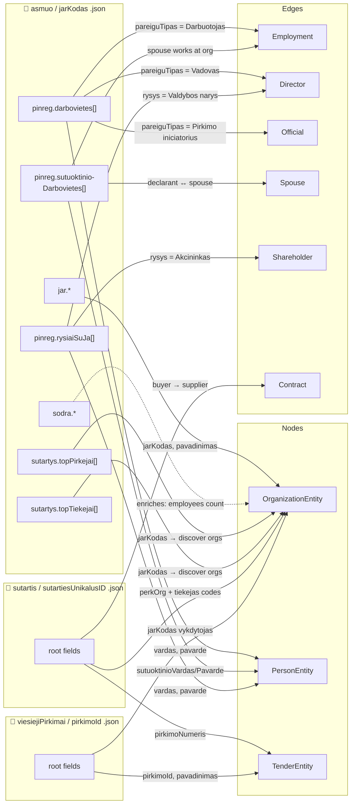
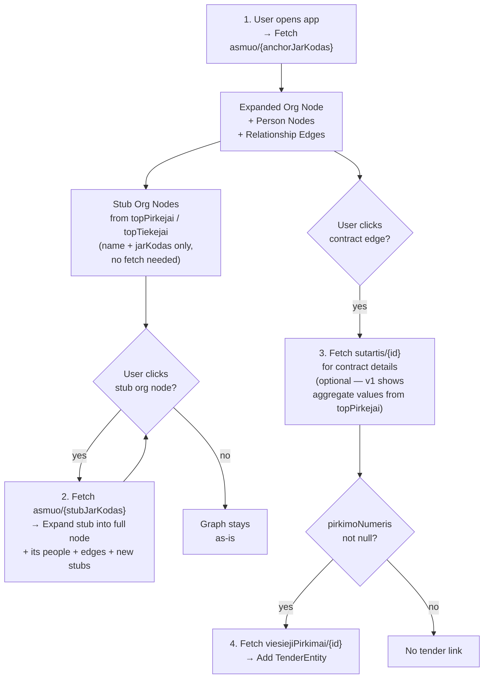
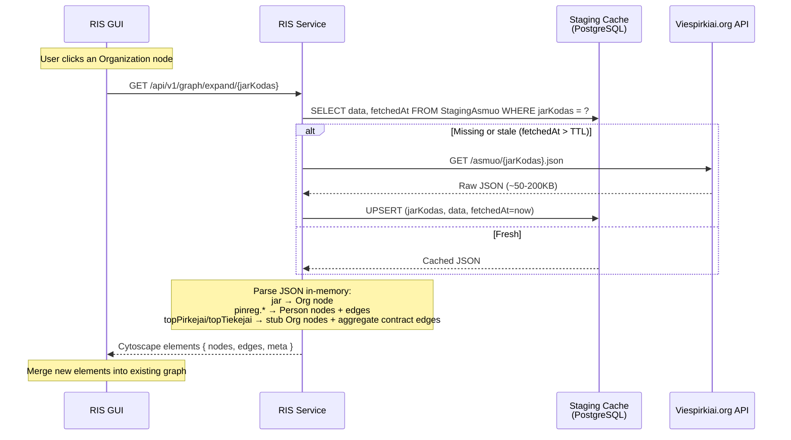

# Risk Intelligence System — System and Architecture Design Document

## Table of Contents

## Executive Summary

This document describes the architecture of a **Risk Intelligence system** (RIS) that provides relationship diagrams
between public companies, public company employees including their family members and public procurement contracts in
Lithuania.

As the main source of data, RIS will use [viespirkiai.org](https://viespirkiai.org).

**Graph-First UX Paradigm:** The system features a graph-first user experience, employing Node-Link Diagrams to
visualize a "Biological Interaction Network." This approach treats the procurement ecosystem as an organic entity,
allowing investigators to intuitively spot structural anomalies (dense "inflamed" clusters). The front page immediately
immerses the user in the graph canvas, beginning with the critical anchor node "
geležinkeliai" (https://viespirkiai.org/asmuo/110053842.json) and its relationships, inviting exploration.

**360 Degree Entity View:** Clicking on any node (company, person, contract) opens a comprehensive profile view.
This includes all relevant metadata, risk scores (in the future), and a mini graph of immediate relationships.
Data fetched from viespirkiai.org is cached in **staging tables** (raw JSON) and parsed **on-the-fly** into
Cytoscape.js graph elements. No separate entity/relationship tables are needed for v1 — the cached JSON IS the
data model.

## Main Use Cases

- Graph browser using **Cytoscape.js** to visualize relationships between companies, individuals as nodes and contracts
  as edges. Interactive filtering by contract timeframe and value.

- Nepotism detection — graph browser that helps visually identify if a company has a relationship with an employee
  family members of the contracting authority.

## Main Functionality

- **viespirkiai data** - Data scraping from viespirkiai.org (and other public sources in the future) for graph
  construction.

- Graph visualization using **Cytoscape.js** with interactive filters (year, contract value) and node/edge details on
  click.

## Future Use Cases (Beyond v1)

- **Bid rigging / cartel detection** — identifying artificial competition among suppliers
- **Shell company / money laundering detection** — identifying mismatches between contract value and company substance
- **PEP exposure / conflict of interest** — linking procurement decision-makers to winning suppliers
- **Subcontractor laundering paths** — tracing money flows from prime contractors to subcontractors
- **EU fund double-dipping** — cross-referencing procurement contracts with EU fund projects for the same activity

---

## Technology Stack

1. **Frontend:** Next.js 16 (Hash Based Routing) + React 19, with Cytoscape.js for graph visualization. Layout engine: **fCoSE** (`cytoscape-fcose`) — fast compound spring embedder that prevents node/label overlap in star and mixed topologies.
2. **Design System:** Material UI for consistent styling and responsive design.
3. **Midlayer:** TanStack React Query for data fetching and caching, ensuring efficient API interactions. React
   useContext for global state management.
4. **Database:** PostgreSQL within Docker for development; Supabase Postgres in production for managed hosting.
5. **ORM:** Prisma for type-safe database access and migrations.
6. **Testing:** Jest for unit tests **and** API integration tests (real PostgreSQL test database, viespirkiai HTTP
   client mocked); Cypress for end-to-end testing of the UI.
7. **Hosting:** Vercel for production deployment of the Next.js application; GitHub Actions for CI/CD pipelines.
8. **Data Ingestion:** On-demand via API route handlers — viespirkiai.org data is fetched and cached when users
   expand graph nodes. No batch ETL in v1.

### Constraints

1. Vercel deployment must be supported
2. No Server Side Rendering (SSR) for UI components
3. Single-page application with hash-based routing

---

## Basic Data Structures

### Entity ID Convention

Entity IDs use a **namespace prefix** to prevent collisions between entity types:

| Entity Type  | ID Format              | Example                                       |
|--------------|------------------------|-----------------------------------------------|
| Organization | `org:{jarKodas}`       | `org:110053842`                               |
| Person       | `person:{deklaracija}` | `person:026a8bda-cae8-49a8-b812-e1a1b88827d7` |
| Tender       | `tender:{pirkimoId}`   | `tender:7346201`                              |

```typescript

interface TemporalEntity {
    id: string;        // namespaced ID (see convention above)
    name: string;
    fromDate: Date;
    tillDate: Date | null; // null means "present"
}

/**
 * CompanyEntity represents a legal entity (company) in the graph.
 * id - "org:" + jarKodas
 * name - pavadinimas
 * fromDate - registravimoData
 *
 * @example https://viespirkiai.org/asmuo/307562016.json
 */
interface OrganizationEntity extends TemporalEntity {
    type: 'PrivateCompany' | 'PublicCompany' | 'Institution';
    expanded: boolean;  // false = stub node (only jarKodas + name known), true = full data loaded
}

/**
 * PersonEntity represents an individual (natural person) in the graph.
 * id - "person:" + pinreg.darbovietes[].deklaracija (declaration UUID, unique per person-org pair)
 * name - pinreg.darbovietes[].vardas + " " + pavarde
 * fromDate - pinreg.darbovietes[].rysioPradzia (start of relationship with organization)
 *
 * Note: Same physical person across multiple orgs will have different deklaracija UUIDs.
 * This is a known limitation of the viespirkiai data model. Cross-org person deduplication
 * (by name + context matching) is a v2 concern.
 *
 * @example: https://viespirkiai.org/asmuo/110053842.json
 * @example: [110053842.json](examples/asmuo/110053842.json)
 */
interface PersonEntity extends TemporalEntity {
    data: Record<string, any> // pinreg.darbovietes[].*
}

/**
 * TenderEntity represents a procurement tender or competition.
 * id - "tender:" + pirkimoNumeris
 * name - pavadinimas
 *
 * @example https://viespirkiai.org/viesiejiPirkimai/7346201.json
 * @example [7346201.json](examples/viesiejiPirkimai/7346201.json)
 */
interface TenderEntity extends TemporalEntity {
}

/**
 * Relationship represents a directed edge between two entities.
 * Not an entity itself — identified by (source, target, type, fromDate).
 *
 * @example:
 *  type: 'Contract', label: '1200 EUR', fromDate: paskelbimoData, tillDate: galiojimoData
 *  type: 'Director', label: 'Korporatyvinių reikalų direktorius', fromDate: rysioPradzia
 */
interface Relationship {
    type: 'Contract' | 'Employment' | 'Spouse' | 'Official' | 'Shareholder' | 'Director';
    source: string; // entity id (namespaced)
    target: string; // entity id (namespaced)
    label?: string; // display text (role name, contract value, etc.)
    fromDate?: Date;
    tillDate?: Date;
    data?: Record<string, any>; // extra metadata (verte, pareigos, etc.)
}

```

## Data Sources and API Contract

**Sutartys (Contracts)**

- https://viespirkiai.org/sutartis/{sutartiesUnikalusID}.json
- for scraping GUI: https://viespirkiai.org/?search=paslaugos (for example "paslaugos" is a keyword)

**Asmuo (Company)**

- https://viespirkiai.org/asmuo/{jarKodas}.json
- for scraping GUI: https://viespirkiai.org/juridiniai?search=paslaugos (for example "paslaugos" is a keyword)

**Pirkimas, konkursas (Tender)**

- https://viespirkiai.org/viesiejiPirkimai/{pirkimoId}.json
- for scraping GUI: https://viespirkiai.org/viesiejiPirkimai?search=paslaugos&sort=paskelbimoData (for example "
  paslaugos" is a keyword)

## Data-to-Entity Mapping

This section documents how graph entities and relationships are derived from viespirkiai.org API responses.

### Mapping Overview



### asmuo/{jarKodas}.json → Entities

The `asmuo` endpoint is the **richest source** for graph construction. A single fetch yields the organization itself,
all declared employees, their spouses, board members, and summary of contract partners.

**@example:** [110053842.json](examples/asmuo/110053842.json) (AB "Lietuvos geležinkeliai" — trimmed)

| API Section                       | Produces                        | Entity/Edge Type                             | Key Fields                                                                                                |
|-----------------------------------|---------------------------------|----------------------------------------------|-----------------------------------------------------------------------------------------------------------|
| `jar`                             | **OrganizationEntity**          | PrivateCompany / PublicCompany / Institution | `jarKodas` → id, `pavadinimas` → name, `registravimoData` → fromDate, `formosKodas` → type classification |
| `sodra`                           | enriches **OrganizationEntity** | —                                            | `bendrasDraustujuSkaicius` → employee count, `bendrasVidutinisAtlyginimas` → avg salary                   |
| `pinreg.darbovietes[]`            | **PersonEntity**                | Person                                       | `deklaracija` → id, `vardas + pavarde` → name, `rysioPradzia` → fromDate                                  |
| `pinreg.darbovietes[]`            | **Relationship**                | Employment / Director / Official             | `pareiguTipasPavadinimas` determines type (see mapping below), source=Person, target=Organization         |
| `pinreg.sutuoktinioDarbovietes[]` | **PersonEntity** × 2            | Person (declarant + spouse)                  | Declarant: `deklaruojancioVardas/Pavarde`, Spouse: `sutuoktinioVardas/Pavarde`                            |
| `pinreg.sutuoktinioDarbovietes[]` | **Relationship**                | Spouse                                       | source=declarant Person, target=spouse Person                                                             |
| `pinreg.sutuoktinioDarbovietes[]` | **Relationship**                | Employment                                   | source=spouse Person, target=Organization                                                                 |
| `pinreg.rysiaiSuJa[]`             | **PersonEntity**                | Person                                       | `deklaracija` → id, `vardas + pavarde` → name, `rysioPradzia` → fromDate                                  |
| `pinreg.rysiaiSuJa[]`             | **Relationship**                | Director / Shareholder / Official            | `rysioPobudzioPavadinimas` determines type (see mapping below), source=Person, target=Organization        |
| `sutartys.topPirkejai[]`          | **OrganizationEntity** (ref)    | discovered via jarKodas                      | `jarKodas`, `pavadinimas` — organizations that buy from this one                                          |
| `sutartys.topTiekejai[]`          | **OrganizationEntity** (ref)    | discovered via jarKodas                      | `jarKodas`, `pavadinimas` — organizations that supply to this one                                         |

#### pareiguTipasPavadinimas → Relationship Type

| pareiguTipasPavadinimas      | → Relationship Type | Notes                                                |
|------------------------------|---------------------|------------------------------------------------------|
| `Vadovas ar jo pavaduotojas` | **Director**        | CEO / Deputy — high risk for nepotism                |
| `Darbuotojas`                | **Employment**      | Regular employee                                     |
| `Pirkimo iniciatorius`       | **Official**        | Procurement initiator — key for conflict of interest |
| `Ekspertas`                  | **Official**        | Expert role in procurement                           |
| _other_                      | **Official**        | Default for unrecognized role types                  |

#### rysioPobudzioPavadinimas → Relationship Type

| rysioPobudzioPavadinimas  | → Relationship Type | Notes                                     |
|---------------------------|---------------------|-------------------------------------------|
| `Valdybos narys`          | **Director**        | Board member                              |
| `Akcininkas`              | **Shareholder**     | Shareholder                               |
| `Stebėtojų tarybos narys` | **Director**        | Supervisory board member                  |
| _other_                   | **Official**        | Default for unrecognized governance roles |

### sutartis/{sutartiesUnikalusID}.json → Entities

The `sutartis` endpoint provides individual contract details — the primary source for **Contract** edges.

**@example:** [2008059225.json](examples/sutartis/2008059225.json)

| API Field                                                     | Produces                                         | Entity/Edge Type             | Mapping                                                                                                                               |
|---------------------------------------------------------------|--------------------------------------------------|------------------------------|---------------------------------------------------------------------------------------------------------------------------------------|
| `perkanciosiosOrganizacijosKodas` + `perkanciojiOrganizacija` | **OrganizationEntity** (buyer)                   | Institution or PublicCompany | `kodas` → id, `pavadinimas` → name                                                                                                    |
| `tiekejoKodas` + `tiekejas`                                   | **OrganizationEntity** (supplier)                | PrivateCompany               | `kodas` → id, `pavadinimas` → name                                                                                                    |
| root                                                          | **Relationship** (type=Contract)                 | Contract                     | `sutartiesUnikalusID` → edge id, `pavadinimas` → label, `paskelbimoData` → fromDate, `galiojimoData` → tillDate, `verte` → data.verte |
| `pirkimoNumeris`                                              | **TenderEntity** (ref)                           | links Contract → Tender      | may be `null` for MVP contracts                                                                                                       |
| `papildomiTiekejai[]` / `papildomiTiekejaiKodai[]`            | additional **OrganizationEntity** + **Contract** | CoBidder                     | joint bids (v2)                                                                                                                       |

**Contract edge direction:** source = buyer (perkančioji organizacija), target = supplier (tiekėjas).

### viesiejiPirkimai/{pirkimoId}.json → Entities

The `viesiejiPirkimai` endpoint provides tender/competition details. Tenders group related contracts.

**@example:** [7346201.json](examples/viesiejiPirkimai/7346201.json)

| API Field                                         | Produces                                  | Entity/Edge Type         | Mapping                                                                                                      |
|---------------------------------------------------|-------------------------------------------|--------------------------|--------------------------------------------------------------------------------------------------------------|
| root                                              | **TenderEntity**                          | Tender                   | `pirkimoId` → id, `pavadinimas` → name, `paskelbimoData` → fromDate, `pasiulymuPateikimoTerminas` → tillDate |
| `jarKodas` + `vykdytojoPavadinimas`               | **OrganizationEntity** (procuring entity) | Institution              | `jarKodas` → id, `pavadinimas` → name                                                                        |
| `sutartys[]`                                      | **Relationship** (type=Contract, ref)     | links Tender → Contracts | contract IDs under this tender                                                                               |
| `numatomaBendraPirkimoVerte` / `numatomaVerteEUR` | enriches **TenderEntity**                 | —                        | estimated total value                                                                                        |

### Entity Discovery Chain

The graph is populated **lazily** through user interaction. Each node-click triggers at most **one** viespirkiai
fetch. Partner organizations appear as unexpanded stub nodes until the user clicks them.



This approach guarantees **O(1) viespirkiai fetches per user click** — predictable latency regardless of graph size.

## Staging Storage

Staging tables are an **HTTP response cache** for viespirkiai.org API calls. They store raw JSON blobs keyed by
natural identifiers. The service reads from staging and parses **on-the-fly** into Cytoscape elements — there are
no intermediate Entity/Relationship database tables in v1.

### Staging Storage Population Flow



**Key design decision:** The expand endpoint performs at most **one** external fetch per call. Partner
organizations from `topPirkejai`/`topTiekejai` appear as **stub nodes** (jarKodas + name + aggregate contract value)
without triggering additional fetches. Stubs are expanded when the user clicks them.

#### Freshness TTL Strategy

| Staging Table     | TTL      | Rationale                                                |
|-------------------|----------|----------------------------------------------------------|
| `StagingAsmuo`    | 24 hours | Employee/governance data changes infrequently            |
| `StagingSutartis` | 7 days   | Contract data is essentially immutable after publication |
| `StagingPirkimas` | 24 hours | Active tenders may update (new bids, status changes)     |

### Staging Storage Schema

```prisma
model StagingAsmuo {
  jarKodas  String   @id
  data      Json     
  fetchedAt DateTime @default(now())
}

model StagingSutartis {
  sutartiesUnikalusID String   @id
  data                Json     
  fetchedAt           DateTime @default(now())
}

model StagingPirkimas {
  pirkimoId String   @id
  data      Json     
  fetchedAt DateTime @default(now())
}
```

### v2: Graph Store (Future)

When cross-entity queries, person deduplication, aggregate analytics, or batch risk scoring are needed,
add normalized `Entity` + `Relationship` tables populated by a background ETL job reading from staging —
not on the API request path. Until then, staging + in-memory parsing is sufficient.

### Test Database

`docker-compose.yml` includes a `postgres-test` service on host port `5433` (separate from the dev
database on `5432`). The test container uses `tmpfs` for storage — it is wiped clean each time it
starts. `.env.test` points `DATABASE_URL` at this container. `bin/run-api-tests.sh` manages its
lifecycle automatically.

## Components

### Graph Component

**Nodes:**

| Entity             | Node/Entity Type | Node Label  | Node Size  | Node Color (TBC)    | Node Icon        |
|--------------------|------------------|-------------|------------|---------------------|------------------|
| OrganizationEntity | PrivateCompany   | pavadinimas | log(verte) | risk score gradient | `Business`       |
| OrganizationEntity | PublicCompany    | pavadinimas | log(verte) | risk score gradient | `DomainAdd`      |
| OrganizationEntity | Institution      | pavadinimas | fixed size | fixed color         | `AccountBalance` |
| PersonEntity       | Person           | name        | fixed size | risk score gradient | `Person`         |
| TenderEntity       | Tender           | pavadinimas | log(verte) | risk score gradient | `Assignment`     |

**Edges:**

| Entity                  | Relationship Type | Edge Label | Edge Width  | Edge Color (TBC)    | Edge Style |
|-------------------------|-------------------|------------|-------------|---------------------|------------|
| Relationship (Contract) | Contract          | verte      | log(verte)  | risk score gradient | solid      |
| Relationship            | (others)          | role       | fixed width | risk score gradient | dashed     |

**Graph Data Model:**

The graph is built from Cytoscape.js elements returned by `/api/v1/graph/expand/{jarKodas}`. Each call returns
elements for one expanded org + its neighbours. The client **merges** new elements into the existing graph
(Cytoscape's `cy.add()` is idempotent for same-ID elements).

**Layout Engine: fCoSE**

The layout uses **fCoSE** (`cytoscape-fcose`) registered once at module level. Key parameters for RIS star topologies:
`nodeRepulsion: 6000` (separates leaf nodes), `idealEdgeLength: 120` (label breathing room), `gravity: 0.15`
(prevents tight-ball compaction), `nodeDimensionsIncludeLabels: true` (physical label bounding boxes — no overlap).
Initial load uses `incremental: false`; node expansion uses `incremental: true` to preserve existing positions.

**Edge Types:**

| Edge Type   | Source → Target             | v1 Data Source                                               | Style        |
|-------------|-----------------------------|--------------------------------------------------------------|--------------|
| Employment  | Person → Organization       | `pinreg.darbovietes[]`                                       | dashed       |
| Director    | Person → Organization       | `pinreg.darbovietes[]` or `pinreg.rysiaiSuJa[]`              | dashed, bold |
| Official    | Person → Organization       | `pinreg.darbovietes[]` or `pinreg.rysiaiSuJa[]`              | dashed       |
| Shareholder | Person → Organization       | `pinreg.rysiaiSuJa[]`                                        | dashed       |
| Spouse      | Person → Person             | `pinreg.sutuoktinioDarbovietes[]`                            | dotted       |
| Contract    | Organization → Organization | `sutartys.topPirkejai[]` / `topTiekejai[]` (aggregate in v1) | solid        |

### Filter Component (`GraphToolbar`)

MUI `AppBar` + `Toolbar` pinned to the top of the graph canvas. Contains:

- **Search** `Autocomplete` — scans in-memory graph nodes by label; selecting a result centres +
  highlights the node on the canvas. `placeholder="Search Company or Person..."`
- **Year-from / Year-to** `Select` dropdowns — options 2010 → current year.
  `data-testid="filter-year-from"` / `data-testid="filter-year-to"`.
- **Min contract value** `TextField` (number, EUR). `data-testid="filter-min-value"`.
- **Apply** `Button` (`data-testid="filter-apply"`) — encodes active filter state in the URL hash
  query string and re-fetches the current anchor with the new filters.
- **Reset** `Button` (`data-testid="filter-reset"`) — only visible when non-default filters are
  active. Clears state and removes itself.

Filter state is encoded in the hash fragment: `#/?yearFrom=2022&yearTo=2022&minContractValue=100000`.

### Node Details Component (`NodeSidebar`)

MUI `Drawer` (`anchor="right"`, `variant="persistent"`, width 300px) that slides in when a node
is clicked. Sections:

- **Header:** entity label, type badge `Chip`, close icon button
  (`data-testid="close-sidebar"`). Section heading `"Node Details"`.
- **Metadata:** table of all available `nodeData` fields — `type`, `expanded`, `employees`,
  `avgSalary`, `contractTotal`, `contractCount`, dates.
- **Risk Profile:** placeholder section (heading `"Risk Profile"`) reserved for future risk
  scoring. Shows `"—"` for all scores in v1.
- **"View Full Profile"** `Button` — navigates to `#/entities/{entityId}` where the full
  360° entity profile is rendered.

### Edge Details Component

In v1, clicking a Contract edge displays a lightweight tooltip (MUI `Popover`) containing:

- Edge type badge
- Source → Target org names
- Total value + contract count
- Date range (`fromDate` – `tillDate`)

Selecting a Contract edge does **not** open the sidebar — the sidebar is node-only in v1.
Edge popover is dismissed by clicking elsewhere on the canvas.

---

## Repository Structure (Single-Root Decoupled)

The following tree defines the mandatory structure to maintain logical separation while using a single `package.json`.

```text
risk-intelligence/
├── .github/
│   └── workflows/
│       └── ci.yml                # CI: lint, test, build
├── bin/
│   ├── run-cypress-tests.sh      # E2E test runner (starts Next.js dev server)
│   └── run-api-tests.sh          # API integration test runner (starts test DB, runs Jest)
├── cypress/                      # E2E & GUI Testing (Specs, Screenshots, Videos)
├── prisma/
│   ├── schema.prisma             # StagingAsmuo, StagingSutartis, StagingPirkimas models
│   └── migrations/               # Generated migration files
├── public/                       # Static Assets
├── src/
│   ├── app/                      # App Router (Next.js Entry)
│   │   ├── api/
│   │   │   └── v1/
│   │   │       ├── graph/
│   │   │       │   └── expand/
│   │   │       │       └── [jarKodas]/
│   │   │       │           └── route.ts     # GET — delegates to lib/graph/expand
│   │   │       └── entity/
│   │   │           └── [entityId]/
│   │   │               └── route.ts         # GET — delegates to lib/graph/entity
│   │   ├── layout.tsx            # Global Shell & Theme Provider
│   │   ├── page.tsx              # SINGLE UI ENTRY POINT — manages hash routing
│   │   └── globals.css           # Global Styles
│   ├── components/               # Modular Client UI Components ('use client')
│   │   ├── Providers.tsx         # ThemeProvider + QueryClientProvider (client shell)
│   │   ├── graph/                # Cytoscape.js rendering + graph-level state
│   │   │   ├── types.ts          # GraphState, FilterState
│   │   │   ├── GraphView.tsx     # Root graph page: toolbar + canvas + sidebar
│   │   │   ├── CytoscapeCanvas.tsx   # Cytoscape.js mount (SSR-safe, dynamic import)
│   │   │   ├── NodeSidebar.tsx   # Right panel shown on node click
│   │   │   ├── toolbar/
│   │   │   │   └── GraphToolbar.tsx  # Search autocomplete + filter inputs + apply/reset
│   │   │   └── __tests__/
│   │   ├── entity/               # Full 360° entity profile page
│   │   │   ├── types.ts          # EntityDetailViewProps
│   │   │   ├── EntityDetailView.tsx
│   │   │   └── __tests__/
│   │   └── services/             # React Query hooks — browser → backend REST API
│   │       ├── useExpandOrg.ts   # useQuery for GET /api/v1/graph/expand/{jarKodas}
│   │       ├── useEntityDetail.ts# useQuery for GET /api/v1/entity/{entityId}
│   │       └── __tests__/
│   ├── hooks/
│   │   ├── useHashRouter.ts      # SSR-safe hash routing hook (read/write)
│   │   └── __tests__/
│   ├── lib/                      # React and Front-end free plain Business Logic
│   │   │
│   │   │   # Convention: every module owns types.ts + __tests__/
│   │   │
│   │   ├── db.ts                 # Prisma singleton (reused across hot-reloads in dev)
│   │   │
│   │   ├── viespirkiai/          # Raw HTTP layer — viespirkiai.org API
│   │   │   ├── types.ts          # AsmuoRaw, SutartisRaw, PirkamasRaw, ViespirkiaiError
│   │   │   ├── client.ts         # fetchAsmuo / fetchSutartis / fetchPirkimas
│   │   │   └── __tests__/
│   │   │       └── client.test.ts
│   │   ├── staging/              # PostgreSQL cache — stores raw API responses with TTL
│   │   │   ├── types.ts          # CacheEntry<T>, isFresh(entry, ttlHours): bool
│   │   │   ├── ...
│   │   │   └── __tests__/
│   │   │       ├── asmuo.test.ts
│   │   │       ├── ...
│   │   ├── parsers/              # Pure functions: raw JSON → Cytoscape elements (no I/O)
│   │   │   ├── types.ts          # CytoscapeNode, CytoscapeEdge, CytoscapeElements, FilterParams
│   │   │   ├── ...
│   │   │   └── __tests__/
│   │   │       ├── asmuo.test.ts
│   │   │       ├── ...
│   │   └── graph/                # Orchestration — ties staging + viespirkiai + parsers
│   │       ├── types.ts          # ExpandResult, EntityDetailResult, GraphFilters
│   │       ├── ...
│   │       └── __tests__/
│   │           ├── expand.test.ts
│   │
│   └── types/
│       └── graph.ts              # Shared interfaces: TemporalEntity, OrganizationEntity,
│                                 # PersonEntity, TenderEntity, Relationship, CytoscapeResponse
├── docker-compose.yml            # Dev DB (port 5432) + Test DB (port 5433, tmpfs)
├── .env                          # Dev environment variables (not committed)
├── .env.test                     # Test environment variables (not committed)
├── package.json                  # SINGLE ROOT PACKAGE
├── tsconfig.json
└── ARCHITECTURE.md
```

---

## API Design

> API will be implemented using Next.js API `import type { NextApiRequest, NextApiResponse } from 'next';` route
> handlers.

> API's will be tested using Jest integration tests that require a running PostgreSQL test database.
> The viespirkiai.org HTTP client is **mocked** in tests — `docs/examples/` JSON fixtures are used
> as mock responses so tests never hit the live API. The server is started with `.env.test` config.
> Run `./bin/run-api-tests.sh` to execute: start test DB → migrate → run Jest → stop DB.

### Core Endpoints

#### `GET /api/v1/graph/expand/{jarKodas}`

**Purpose:** Expand the graph around an organization. This is the primary endpoint powering both the initial page load
and every subsequent node-click expansion.

**Behaviour:**

1. Check staging cache for `jarKodas` (fetch from viespirkiai if stale/missing)
2. Parse cached asmuo JSON **in-memory** → Cytoscape nodes + edges
3. Apply filters (yearFrom/yearTo, minValue on aggregate contract edges)
4. Return Cytoscape.js-compatible response

**No database writes to Entity/Relationship tables.** The parse is stateless and deterministic — given the same
staging JSON, the same Cytoscape output is produced every time.

**Parameters:**

| Param      | Type  | Default  | Description                                               |
|------------|-------|----------|-----------------------------------------------------------|
| `jarKodas` | path  | required | Organization code (company registry number)               |
| `yearFrom` | query | —        | Filter relationships starting from this year              |
| `yearTo`   | query | —        | Filter relationships ending before this year              |
| `minValue` | query | —        | Minimum aggregate contract value (EUR) for contract edges |

**Initial page load:** `GET /api/v1/graph/expand/110053842`

**Error responses:**

| Status | Condition                                       |
|--------|-------------------------------------------------|
| `400`  | `jarKodas` missing or non-numeric               |
| `502`  | viespirkiai.org unreachable or returned non-2xx |
| `500`  | Unexpected parse or database error              |

#### `GET /api/v1/entity/{entityId}`

**Purpose:** Return the full 360-degree detail view for a single entity (metadata, all relationships, summary stats).
Used when the user clicks a node to see its detail panel. Reads from staging cache — no additional external fetch.

**Error responses:**

| Status | Condition                                                          |
|--------|--------------------------------------------------------------------|
| `400`  | `entityId` has no recognised prefix (`org:`, `person:`, `tender:`) |
| `404`  | Entity not found in staging cache (not yet expanded)               |
| `500`  | Unexpected error                                                   |

### Graph Response Format (Cytoscape.js-compatible)

```json
{
  "elements": {
    "nodes": [
      {
        "data": {
          "id": "org:110053842",
          "label": "AB Lietuvos geležinkeliai",
          "type": "PublicCompany",
          "expanded": true,
          "employees": 122,
          "avgSalary": 5023.51
        }
      },
      {
        "data": {
          "id": "person:026a8bda-cae8-49a8-b812-e1a1b88827d7",
          "label": "ALEKSANDRAS ZUBRIAKOVAS",
          "type": "Person",
          "role": "Korporatyvinių reikalų direktorius"
        }
      },
      {
        "data": {
          "id": "org:304977594",
          "label": "AB \"LTG Cargo\"",
          "type": "PrivateCompany",
          "expanded": false,
          "contractTotal": 432081948.06,
          "contractCount": 79
        }
      }
    ],
    "edges": [
      {
        "data": {
          "id": "edge:person:026a8bda-org:110053842-Director",
          "source": "person:026a8bda-cae8-49a8-b812-e1a1b88827d7",
          "target": "org:110053842",
          "type": "Director",
          "label": "Korporatyvinių reikalų direktorius",
          "fromDate": "2023-09-25"
        }
      },
      {
        "data": {
          "id": "edge:org:110053842-org:304977594-Contract",
          "source": "org:110053842",
          "target": "org:304977594",
          "type": "Contract",
          "label": "432.1M EUR (79 contracts)",
          "totalValue": 432081948.06,
          "count": 79
        }
      }
    ]
  },
  "meta": {
    "anchorId": "org:110053842",
    "totalNodes": 3,
    "totalEdges": 2,
    "generatedAt": "2026-04-13T12:00:00Z"
  }
}
```

**Node types in response:**

| `expanded` | Meaning                                                       | User action                         |
|------------|---------------------------------------------------------------|-------------------------------------|
| `true`     | Full data loaded (people + edges visible)                     | Click → show detail panel           |
| `false`    | Stub node (only jarKodas + name + aggregate contract summary) | Click → triggers new `/expand` call |

---

## Delivery Stories

| Story                                                              | Status       | Description                                               |
|--------------------------------------------------------------------|--------------|-----------------------------------------------------------|
| [`BACKEND_REST_API_STORY.md`](./BACKEND_REST_API_STORY.md)        | ✅ Complete  | Prisma schema, staging cache, parsers, REST API, tests    |
| [`GRAPH_VISUALIZATION_STORY.md`](./GRAPH_VISUALIZATION_STORY.md)  | ⏳ Next      | Frontend: Cytoscape graph, hash routing, filters, Cypress |