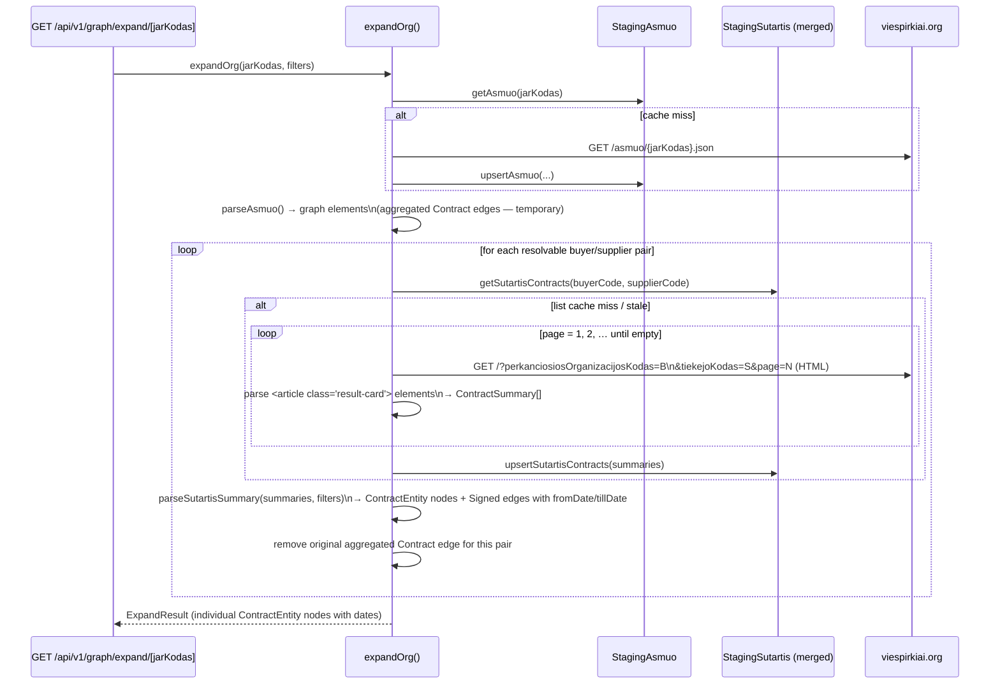
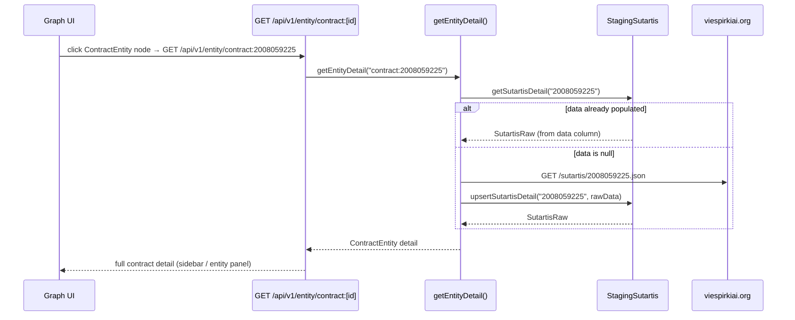

# Contract Date Enrichment Story

## Summary

The graph currently shows **aggregated contract edges** (`org:buyer → org:anchor`) derived from `topPirkejai` /
`topTiekejai` arrays in the `/asmuo/{jarKodas}.json` response. These edges carry only a total value (`totalValue`) and
**no date information** — making timeline filtering impossible and the table view useless for temporal risk analysis.

The `Contract` table is also missing `fromDate` and `tillDate` columns even though this data is available in the source.

### Graph model — ContractEntity nodes (hub-and-spoke)

Contracts are painted as **`ContractEntity` nodes** rather than direct org→org edges. One contract node sits between the
buyer org and the supplier org, connected by `Signed` edges:

```
org:buyer  ──(Signed/Buyer)──▶  contract:X  ◀──(Signed/Supplier)──  org:supplier
```

`Relationship.type = 'Contract'` (a direct org→org edge) is **reserved for future use** and must not be painted in the
current implementation. The graph type system (`src/types/graph.ts`) defines both `ContractEntity` and `Relationship`
with the `'Contract'` type.

### The Key Insight — Scrape HTML, Not JSON

The contract list HTML page for any buyer+supplier pair:

```
https://viespirkiai.org/?perkanciosiosOrganizacijosKodas=<buyer>&tiekejoKodas=<supplier>
```

already contains **everything we need** inside server-rendered `<article class="result-card …">` elements — no
individual `/sutartis/{id}.json` fetches are needed for graph painting:

| Field                 | Source in HTML                                                                          |
|-----------------------|-----------------------------------------------------------------------------------------|
| `sutartiesUnikalusID` | `href="/sutartis/{id}"`                                                                 |
| `name`                | text after `<span class="amount">` inside `<h3>`                                        |
| `fromDate`            | first `<time datetime="…">` inside the _Sutarties galiojimas_ `<dd>`                    |
| `tillDate`            | second `<time datetime="…">` inside the same `<dd>` (`null` when only one date present) |
| `value`               | `<span class="amount">` (numeric, needs cleaning of `&nbsp;` and `€`)                   |

Individual contract JSONs (`/sutartis/{id}.json`) are **not fetched during graph expansion**. They can be lazily fetched
when a user opens a contract detail panel (existing `fetchSutartis` is already there for that).

### Pagination — walk all pages

- Each page returns **up to 50 articles** (server-rendered).
- Paginate with `?page=N&perkanciosiosOrganizacijosKodas=X&tiekejoKodas=Y` starting at `page=1`.
- **Stop when a page returns 0 articles.**
- For the default anchor (`110053842`), the largest pair produces ~2 pages (97 contracts). Most pairs fit on 1 page.

### Default Date Filter

When a node is first opened (no filter set), default to **last 12 months** of contracts:

- `dateFrom = January 1st of (currentYear - 1)` — e.g. `"2025-01-01"`
- `dateTill = December 31st of currentYear` — e.g. `"2026-12-31"`

Dates are carried as **ISO date strings** (`YYYY-MM-DD`) through every layer (filter types, API
query params, parser). The UI year-picker converts to ISO: year `2025` as "from" → `"2025-01-01"`;
year `2026` as "till" → `"2026-12-31"`. This leaves room for future sub-year precision without any
further type changes.

---

## Technical Breakdown

### New Data Structure — `ContractSummary`

Added to `src/lib/parsers/types.ts` (parsed/cleaned data, not a raw wire shape):

```typescript
/** Scraped contract summary — no JSON blob needed for graph painting. */
interface ContractSummary {
    sutartiesUnikalusID: string;
    name: string;
    fromDate: string | null; // ISO date, e.g. "2025-07-22"
    tillDate: string | null; // ISO date, e.g. "2025-09-19"; null if single-day
    value: number | null;
}
```

### New Database Table — `StagingSutartis` (merged)

`StagingSutartis` is the single table for all contract data. It is normalised to **one row per contract**. The `data`
column is **nullable** — it is only populated the first time a user clicks a contract node (lazy JSON fetch). All
columns needed to paint a `ContractEntity` node come from HTML scraping and are always present.

`StagingSutartisList` is dropped entirely — its role is covered by querying `StagingSutartis` by `buyerCode` +
`supplierCode`.

```prisma
model StagingSutartis {
  sutartiesUnikalusID String    @id
  buyerCode           String
  supplierCode        String
  name                String
  fromDate            String?   // ISO date scraped from HTML (e.g. "2025-07-22")
  tillDate            String?   // ISO date scraped from HTML; null for single-day contracts
  value               Float?    // contract value in EUR, scraped from HTML
  fetchedAt           DateTime  // when this row was upserted from HTML scraping (TTL 24 h)
  data                Json?     // full JSON from /sutartis/{id}.json — null until user clicks contract node
  dataFetchedAt       DateTime? // when data was populated; null means not yet fetched

  @@index([buyerCode, supplierCode])
  @@map("staging_sutartis")
}
```

**TTL rules:**
- Scraped columns (`name`, `fromDate`, `tillDate`, `value`): stale after 24 h — checked via `fetchedAt`.
  To determine if a pair's list is stale, read `MAX(fetchedAt)` for `buyerCode+supplierCode`.
- `data` column: never expires once populated (contract JSON is immutable after publication).

**Staging module — `src/lib/staging/sutartis.ts`** replaces both old modules:

| Function | Description |
|---|---|
| `getSutartisContracts(buyerCode, supplierCode)` | Returns `ContractSummary[]` if fresh, `null` if stale/missing |
| `upsertSutartisContracts(summaries, buyerCode, supplierCode)` | Bulk upsert scraped rows (no `data`) |
| `getSutartisDetail(sutartiesUnikalusID)` | Returns `SutartisRaw` from `data` column if populated, else `null` |
| `upsertSutartisDetail(sutartiesUnikalusID, data)` | Fills `data` + `dataFetchedAt` column (on-demand fetch) |

### Structural Diagram

```mermaid
graph LR
subgraph New
A[fetchSutartisList\nclient.ts\nHTML scraper] -->|pages 1,2,…|B[viespirkiai.org\n/?buyer=X&supplier=Y]
C[staging/sutartis.ts\nStagingSutartis] -->|ContractSummary\ [\ ]|D
end

subgraph Existing
E[fetchAsmuo\nclient.ts] --> F[viespirkiai.org\n/asmuo/{id}.json]
G[StagingAsmuo] --> D[expandOrg\ngraph/expand.ts]
H[parseSutartisSummary\nparsers/sutartis.ts] --> D
end

D -->|for each resolvable pair|A
A --> C
C -->|summaries|H
```

### Behavioral Diagram — Graph Expansion



### Behavioral Diagram — Contract Detail (on click)



---

## Changes to Existing Components

| File                                       | Change                                                                                                                                                                          |
|--------------------------------------------|----------------------------------------------------------------------------------------------------------------------------------------------------------------------------------|
| `prisma/schema.prisma`                     | Merge `StagingSutartisList` into `StagingSutartis`: add `buyerCode`, `supplierCode`, `name`, `fromDate`, `tillDate`, `value`, `dataFetchedAt`; make `data` nullable; drop `StagingSutartisList` |
| `src/lib/staging/sutartis.ts`              | Replace with 4 functions: `getSutartisContracts`, `upsertSutartisContracts`, `getSutartisDetail`, `upsertSutartisDetail`; delete `src/lib/staging/sutartisList.ts`               |
| `src/lib/parsers/types.ts`                 | ✅ Add `ContractSummary` type; rename `year?: number` → `yearFrom?: string`, `yearTo?: string` (ISO dates) in `FilterParams`                                                    |
| `src/lib/viespirkiai/client.ts`            | ✅ Add `getHtml(path)` helper; add `fetchSutartisList(buyerCode, supplierCode): Promise<ContractSummary[]>` — HTML scraper with pagination                                       |
| `src/lib/staging/sutartisList.ts`          | ✅ Created (to be deleted in Phase 6 — replaced by `sutartis.ts`)                                                                                                                |
| `src/lib/parsers/sutartis.ts`              | ✅ Add `parseSutartisSummary(summaries, filters)` — converts `ContractSummary[]` to Cytoscape nodes+edges                                                                        |
| `src/lib/graph/expand.ts`                  | ✅ Post-parse enrichment: replace aggregated Contract edges with individual dated ContractEntity nodes/edges; update to call `getSutartisContracts` (Phase 6)                    |
| `src/lib/graph/types.ts`                   | ✅ `GraphFilters` mirrors `FilterParams` (`yearFrom?: string`, `yearTo?: string`)                                                                                                |
| `src/app/api/v1/graph/expand/[jarKodas]/route.ts` | ✅ Reads `yearFrom` and `yearTo` ISO date strings from query params                                                                                                      |
| `src/components/services/useExpandOrg.ts` | ✅ `ExpandOrgFilters` updated; URL builder updated                                                                                                                               |
| `src/components/graph/types.ts`            | ✅ `FilterState` uses `yearFrom?: string`, `yearTo?: string`                                                                                                                     |
| `src/components/graph/GraphView.tsx`       | ✅ Initial `FilterState` defaults to last 12 months                                                                                                                              |
| `src/components/graph/toolbar/GraphToolbar.tsx` | ✅ Year picker converts to ISO on emit; `isNonDefault` compares against defaults                                                                                            |
| `src/types/graph.ts`                       | ✅ Add `ContractEntity` interface extending `TemporalEntity`; note `Relationship.type='Contract'` reserved for future                                                            |
| `src/lib/graph/entity.ts`                  | Add `contract:` case to `getEntityDetail()`: call `getSutartisDetail` → if null, fetch JSON → `upsertSutartisDetail` → return full detail                                        |
| `src/components/graph/GraphNodesTable.tsx` | ✅ `From`/`Till` columns render correctly for ContractEntity nodes                                                                                                               |

---

## HTML Scraping Implementation Notes

### URL direction

| asmuo array                                  | URL                                                                |
|----------------------------------------------|--------------------------------------------------------------------|
| `topTiekejai` (anchor **buys from** partner) | `?perkanciosiosOrganizacijosKodas=<anchor>&tiekejoKodas=<partner>` |
| `topPirkejai` (partner **buys from** anchor) | `?perkanciosiosOrganizacijosKodas=<partner>&tiekejoKodas=<anchor>` |

### Parsing `<article>` elements

```typescript
// Pseudo-code for parsing one <article> block
const id = article.match(/href="\/sutartis\/(\d+)"/)?.[1];

// All <time> in the Sutarties galiojimas <dd>
const galiojimas = article.match(/Sutarties galiojimas[\s\S]*?<\/dd>/)?.[0] ?? '';
const times = [...galiojimas.matchAll(/<time datetime="([^"]+)"/g)].map((m) => m[1]);
const fromDate = times[0] ?? null;
const tillDate = times[1] ?? null; // null when single-day contract

// Value: strip &nbsp; and € then parse float
const rawValue = article.match(/<span class="amount[^"]*">\s*([^<]+)\s*<\/span>/)?.[1] ?? '';
const value = parseFloat(rawValue.replace(/[^\d,]/g, '').replace(',', '.')) || null;

// Title: text node after </span> in <h3>
const name = article.match(/<\/span>\s*([^\n<]+)\n/)?.[1]?.trim() ?? id;
```

### Pagination loop

```typescript
const MAX_PAGES = 20; // safety guard against infinite loops

async function fetchSutartisList(buyerCode: string, supplierCode: string): Promise<ContractSummary[]> {
    const summaries: ContractSummary[] = [];
    for (let page = 1; page <= MAX_PAGES; page++) {
        const html = await getHtml(
            `/?page=${page}&perkanciosiosOrganizacijosKodas=${buyerCode}&tiekejoKodas=${supplierCode}`,
        );
        const articles = parseArticles(html);
        if (articles.length === 0) break;
        summaries.push(...articles);
    }
    return summaries;
}
```

---

## Filter Compatibility

Date-range filters are carried as **ISO date strings** (`YYYY-MM-DD`) at every layer. Filters are
applied to individual contract nodes:

- If `filters.yearFrom` is set: exclude contracts where `fromDate < yearFrom` (string comparison on
  ISO dates is lexicographic and correct).
- If `filters.yearTo` is set: exclude contracts where `(tillDate ?? fromDate) > yearTo`.
- Contracts with **null dates are always included** (unknown date ≠ out of range).
- Org stub nodes that become disconnected after contract filtering are removed from elements.

The default filter applied when no explicit filter is set:

- `yearFrom = "${currentYear - 1}-01-01"` (e.g. `"2025-01-01"`)
- `yearTo   = "${currentYear}-12-31"`     (e.g. `"2026-12-31"`)

---

## Out of Scope

- Fetching all `/sutartis/{id}.json` blobs eagerly during graph expansion (lazy fetch on click only).
- Recursive expansion of supplier/buyer orgs through their own contract pairs.
- Rate limiting / back-off (pairs are fetched sequentially within expandOrg; HTTP timeout is 15 s).
- Contracts between two non-anchor orgs (only direct anchor pairs are enriched).

---

## Clarifications

- **No backwards compatibility required** — the system is not in production. All renames and type
  changes can be applied freely.
- **Year filter → ISO date strings** — `FilterParams.year: number` is renamed to
  `yearFrom: string` (`YYYY-MM-DD`) and `yearTo: string` (`YYYY-MM-DD`) across all layers. UI year
  pickers convert: "from year" → `YYYY-01-01`, "to year" → `YYYY-12-31`. Future sub-year precision
  requires no further type changes.
- **`ContractSummary` belongs in `src/lib/parsers/types.ts`** — it is parsed/cleaned data, not a
  raw wire shape. `viespirkiai/types.ts` stays strictly for raw API response types.
- **Pair fetching is sequential** — v1 simplicity; no risk of overwhelming the upstream server.
  Once the system has direct DB access (v2), scraping and its latency disappear entirely.

---

## Tasks

**Phase 1 — Database & staging layer** ✅

- [x] Ensure project compiles and all existing tests pass (`npm test`)
- [x] **Prerequisite — rename year filter to ISO date strings across all layers**:
  - `FilterParams` (`src/lib/parsers/types.ts`): `year?: number` → `yearFrom?: string`, add `yearTo?: string`
  - `GraphFilters` (`src/lib/graph/types.ts`): mirror the same change
  - API route (`src/app/api/v1/graph/expand/[jarKodas]/route.ts`): read `yearFrom` and `yearTo` as ISO date strings; remove legacy `year` integer param
  - `parseAsmuo` (`src/lib/parsers/asmuo.ts`): update person-relationship filter to compare against `yearFrom` ISO date
  - `ExpandOrgFilters` (`src/components/services/useExpandOrg.ts`): `year?: number` → `yearFrom?: string`, `yearTo?: string`; update URL builder
  - `FilterState` (`src/components/graph/types.ts`): same rename
  - `GraphToolbar`: year picker converts year number to ISO on emit (`yearFrom` → `"YYYY-01-01"`, `yearTo` → `"YYYY-12-31"`)
  - Update all existing tests that reference `filters.year`
- [x] Add `StagingSutartisList` model to `prisma/schema.prisma` (intermediate — replaced in Phase 6)
- [x] Add `ContractSummary` type to `src/lib/parsers/types.ts`
- [x] Create `src/lib/staging/sutartisList.ts` with `getSutartisList` / `upsertSutartisList` (intermediate — replaced in Phase 6)
- [x] Verify build and all tests pass

**Phase 2 — HTML scraper** ✅

- [x] Add `fetchSutartisList(buyerCode, supplierCode): Promise<ContractSummary[]>` to `src/lib/viespirkiai/client.ts`
- [x] Add `getHtml(path: string): Promise<string>` private helper
- [x] Parses `<article class="result-card …">` elements, extracts `sutartiesUnikalusID`, `name`, `fromDate`, `tillDate`, `value`
- [x] Paginates (`page=1, 2, …`, max 20 pages) until a page returns 0 articles
- [x] Unit tests: 2-article page, single-date article, empty page 2, HTTP error → empty array
- [x] Verify build and all tests pass

**Phase 3 — Parser and expandOrg enrichment** ✅

- [x] Add `parseSutartisSummary(summaries, anchorId, partnerId, isAnchorBuyer, filters?)` to `src/lib/parsers/sutartis.ts`
- [x] One `ContractEntity` node per summary + two `Signed` edges (Buyer / Supplier)
- [x] `isAnchorBuyer` resolves edge direction
- [x] Apply `yearFrom` / `yearTo` / `minContractValue` filters
- [x] Add `enrichContractEdges()` post-parse step in `src/lib/graph/expand.ts`
- [x] Unit tests: replaces aggregated edge, keeps edge when empty, yearFrom filter, skips unresolvable codes
- [x] Verify build and all tests pass

**Phase 4 — Default filter and table columns** ✅

- [x] Set initial `FilterState` in `GraphView.tsx`: `yearFrom = "${currentYear - 1}-01-01"`, `yearTo = "${currentYear}-12-31"`
- [x] `GraphNodesTable` `From`/`Till` columns render `fromDate`/`tillDate` for ContractEntity nodes
- [x] `isNonDefault` in `GraphToolbar` compares against computed defaults; `handleReset` restores defaults
- [x] Verify UI compiles and graph opens with 1-year default window

**Phase 5 — Cypress E2E tests & documentation** ✅

- [x] Cypress test: `"contract nodes have fromDate and tillDate in table"` — Contract row has non-empty `fromDate`
- [x] Cypress test: `"resetting filter re-fetches without year param"`
- [x] Add `ContractEntity` to `src/types/graph.ts`; update `ARCHITECTURE.md` entity types and edge tables
- [x] All 87 unit tests + 19 Cypress E2E tests pass

---

**Phase 6 — Merge `StagingSutartisList` into `StagingSutartis`**

Collapse the two separate staging tables into a single `StagingSutartis` with individual columns per contract and a
nullable `data` column.

- [ ] Update `prisma/schema.prisma`:
    - Add columns to `StagingSutartis`: `buyerCode String`, `supplierCode String`, `name String`,
      `fromDate String?`, `tillDate String?`, `value Float?`, `dataFetchedAt DateTime?`
    - Make `data Json` → `data Json?` (nullable)
    - Add `@@index([buyerCode, supplierCode])`
    - Drop `StagingSutartisList` model
- [ ] Run `npx prisma migrate dev --name merge-staging-sutartis`
- [ ] Rewrite `src/lib/staging/sutartis.ts` with 4 functions:
    - `getSutartisContracts(buyerCode, supplierCode): Promise<ContractSummary[] | null>` — reads rows for pair,
      returns `null` if `MAX(fetchedAt)` is stale (TTL 24 h) or no rows exist
    - `upsertSutartisContracts(summaries, buyerCode, supplierCode): Promise<void>` — bulk upsert scraped rows
      (does **not** touch `data` or `dataFetchedAt`)
    - `getSutartisDetail(sutartiesUnikalusID): Promise<SutartisRaw | null>` — returns `data` column if present,
      else `null`
    - `upsertSutartisDetail(sutartiesUnikalusID, data: SutartisRaw): Promise<void>` — fills `data` +
      `dataFetchedAt`; **only** called by the entity detail route on contract click
- [ ] Delete `src/lib/staging/sutartisList.ts`
- [ ] Update `src/lib/graph/expand.ts` → replace `getSutartisList` / `upsertSutartisList` calls with
  `getSutartisContracts` / `upsertSutartisContracts`
- [ ] Update all unit test mocks that reference `sutartisList.ts` or `StagingSutartisList`
- [ ] Verify `npm test` passes

**Phase 7 — On-demand contract JSON fetch on node click**

When a user clicks a `ContractEntity` node the sidebar calls `GET /api/v1/entity/contract:{id}`. This triggers a
lazy fetch of the full `/sutartis/{id}.json` blob and stores it in `StagingSutartis.data`.

- [ ] In `src/lib/graph/entity.ts`, add the `contract:` case to `getEntityDetail()`:
    1. Strip prefix → `sutartiesUnikalusID = entityId.replace('contract:', '')`
    2. Call `getSutartisDetail(id)` — if `data` is present, return it directly
    3. Else call `fetchSutartis(id)` (existing viespirkiai client function)
    4. Call `upsertSutartisDetail(id, raw)` to persist the JSON
    5. Return the full detail (mapped to entity shape)
- [ ] Add unit test: `"returns cached data when data column is populated"`, `"fetches and stores when data is null"`
- [ ] Verify `npm test` and `./bin/run-cypress-tests.sh` pass
