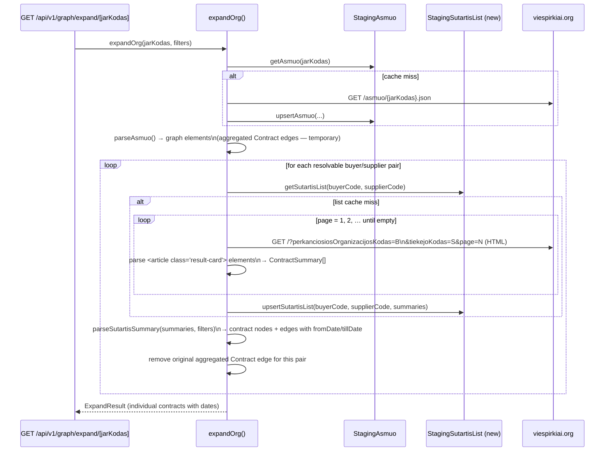

# Contract Date Enrichment Story

## Summary

The graph currently shows **aggregated contract edges** (`org:buyer → org:anchor`) derived from `topPirkejai` /
`topTiekejai` arrays in the `/asmuo/{jarKodas}.json` response. These edges carry only a total value (`totalValue`) and
**no date information** — making timeline filtering impossible and the table view useless for temporal risk analysis.

The `Contract` table is also missing `fromDate` and `tillDate` columns even though this data is available in the source.

### The Key Insight — Scrape HTML, Not JSON

The contract list HTML page for any buyer+supplier pair:

```
https://viespirkiai.org/?perkanciosiosOrganizacijosKodas=<buyer>&tiekejoKodas=<supplier>
```

already contains **everything we need** inside server-rendered `<article class="result-card …">` elements — no
individual `/sutartis/{id}.json` fetches are needed for graph painting:

| Field                 | Source in HTML                                                                          |
|-----------------------|-----------------------------------------------------------------------------------------|
| `sutartiesUnikalusID` | `href="/sutartis/{id}"`                                                                 |
| `name`                | text after `<span class="amount">` inside `<h3>`                                        |
| `fromDate`            | first `<time datetime="…">` inside the _Sutarties galiojimas_ `<dd>`                    |
| `tillDate`            | second `<time datetime="…">` inside the same `<dd>` (`null` when only one date present) |
| `value`               | `<span class="amount">` (numeric, needs cleaning of `&nbsp;` and `€`)                   |

Individual contract JSONs (`/sutartis/{id}.json`) are **not fetched during graph expansion**. They can be lazily fetched
when a user opens a contract detail panel (existing `fetchSutartis` is already there for that).

### Pagination — walk all pages

- Each page returns **up to 50 articles** (server-rendered).
- Paginate with `?page=N&perkanciosiosOrganizacijosKodas=X&tiekejoKodas=Y` starting at `page=1`.
- **Stop when a page returns 0 articles.**
- For the default anchor (`110053842`), the largest pair produces ~2 pages (97 contracts). Most pairs fit on 1 page.

### Default Date Filter

When a node is first opened (no filter set), default to **last 12 months** of contracts:

- `dateFrom = January 1st of (currentYear - 1)` — e.g. `"2025-01-01"`
- `dateTill = December 31st of currentYear` — e.g. `"2026-12-31"`

Dates are carried as **ISO date strings** (`YYYY-MM-DD`) through every layer (filter types, API
query params, parser). The UI year-picker converts to ISO: year `2025` as "from" → `"2025-01-01"`;
year `2026` as "till" → `"2026-12-31"`. This leaves room for future sub-year precision without any
further type changes.

---

## Technical Breakdown

### New Data Structure — `ContractSummary`

Added to `src/lib/parsers/types.ts` (parsed/cleaned data, not a raw wire shape):

```typescript
/** Scraped contract summary — no JSON blob needed for graph painting. */
interface ContractSummary {
    sutartiesUnikalusID: string;
    name: string;
    fromDate: string | null; // ISO date, e.g. "2025-07-22"
    tillDate: string | null; // ISO date, e.g. "2025-09-19"; null if single-day
    value: number | null;
}
```

### New Database Table — `StagingSutartisList`

Caches the scraped `ContractSummary[]` per buyer+supplier pair (TTL: 24 h).

```prisma
model StagingSutartisList {
  id           String   @id @default(cuid())
  buyerCode    String   
  supplierCode String   
  contracts    Json     // ContractSummary[]
  fetchedAt    DateTime 

  @@unique([buyerCode, supplierCode])
  @@map("staging_sutartis_list")
}
```

### Structural Diagram

```mermaid
graph LR
subgraph New
A[fetchSutartisList\nclient.ts\nHTML scraper] -->|pages 1,2,…|B[viespirkiai.org\n/?buyer=X&supplier=Y]
C[staging/sutartisList.ts\nStagingSutartisList] -->|ContractSummary\ [\ ]|D
end

subgraph Existing
E[fetchAsmuo\nclient.ts] --> F[viespirkiai.org\n/asmuo/{id}.json]
G[StagingAsmuo] --> D[expandOrg\ngraph/expand.ts]
H[parseSutartisSummary\nparsers/sutartis.ts] --> D
end

D -->|for each resolvable pair|A
A --> C
C -->|summaries|H
```

### Behavioral Diagram



---

## Changes to Existing Components

| File                                       | Change                                                                                                                                                                          |
|--------------------------------------------|----------------------------------------------------------------------------------------------------------------------------------------------------------------------------------|
| `prisma/schema.prisma`                     | Add `StagingSutartisList` model                                                                                                                                                  |
| `src/lib/parsers/types.ts`                 | Add `ContractSummary` type; rename `year?: number` → `yearFrom?: string` and `yearTo?: number` → `yearTo?: string` (ISO dates) in `FilterParams`                                |
| `src/lib/viespirkiai/client.ts`            | Add `getHtml(path)` private helper (returns raw `string`, `responseType: 'text'`); add `fetchSutartisList(buyerCode, supplierCode): Promise<ContractSummary[]>` — HTML scraper with pagination |
| `src/lib/staging/sutartisList.ts`          | New: `getSutartisList` / `upsertSutartisList`                                                                                                                                    |
| `src/lib/parsers/sutartis.ts`              | Add `parseSutartisSummary(summaries, filters)` — converts `ContractSummary[]` to Cytoscape nodes+edges                                                                           |
| `src/lib/graph/expand.ts`                  | Post-parse enrichment: replace aggregated Contract edges with individual dated contract nodes/edges                                                                              |
| `src/lib/graph/types.ts`                   | Update `GraphFilters` to mirror new `FilterParams` (`yearFrom?: string`, `yearTo?: string`)                                                                                      |
| `src/app/api/v1/graph/expand/[jarKodas]/route.ts` | Read `yearFrom` and `yearTo` ISO date strings from query params (remove legacy `year` integer param)                                                                    |
| `src/components/services/useExpandOrg.ts` | Update `ExpandOrgFilters`: `year?: number` → `yearFrom?: string`, `yearTo?: string`; update `fetchExpandOrg` URL builder accordingly                                             |
| `src/components/graph/types.ts`            | Update `FilterState`: `year?: number` → `yearFrom?: string`, `yearTo?: string`                                                                                                   |
| `src/components/graph/GraphView.tsx`       | Set initial `FilterState` with `dateFrom`/`dateTill` defaults (last 12 months); update `handleApplyFilters` to pass ISO strings                                                  |
| `src/components/graph/toolbar/GraphToolbar.tsx` | Year picker converts selected year to ISO: `yearFrom` year → `"YYYY-01-01"`, `yearTo` year → `"YYYY-12-31"`                                                               |
| `src/components/graph/GraphNodesTable.tsx` | Verify `From`/`Till` columns render correctly for Contract nodes (columns already exist)                                                                                         |

---

## HTML Scraping Implementation Notes

### URL direction

| asmuo array                                  | URL                                                                |
|----------------------------------------------|--------------------------------------------------------------------|
| `topTiekejai` (anchor **buys from** partner) | `?perkanciosiosOrganizacijosKodas=<anchor>&tiekejoKodas=<partner>` |
| `topPirkejai` (partner **buys from** anchor) | `?perkanciosiosOrganizacijosKodas=<partner>&tiekejoKodas=<anchor>` |

### Parsing `<article>` elements

```typescript
// Pseudo-code for parsing one <article> block
const id = article.match(/href="\/sutartis\/(\d+)"/)?.[1];

// All <time> in the Sutarties galiojimas <dd>
const galiojimas = article.match(/Sutarties galiojimas[\s\S]*?<\/dd>/)?.[0] ?? '';
const times = [...galiojimas.matchAll(/<time datetime="([^"]+)"/g)].map((m) => m[1]);
const fromDate = times[0] ?? null;
const tillDate = times[1] ?? null; // null when single-day contract

// Value: strip &nbsp; and € then parse float
const rawValue = article.match(/<span class="amount[^"]*">\s*([^<]+)\s*<\/span>/)?.[1] ?? '';
const value = parseFloat(rawValue.replace(/[^\d,]/g, '').replace(',', '.')) || null;

// Title: text node after </span> in <h3>
const name = article.match(/<\/span>\s*([^\n<]+)\n/)?.[1]?.trim() ?? id;
```

### Pagination loop

```typescript
const MAX_PAGES = 20; // safety guard against infinite loops

async function fetchSutartisList(buyerCode: string, supplierCode: string): Promise<ContractSummary[]> {
    const summaries: ContractSummary[] = [];
    for (let page = 1; page <= MAX_PAGES; page++) {
        const html = await getHtml(
            `/?page=${page}&perkanciosiosOrganizacijosKodas=${buyerCode}&tiekejoKodas=${supplierCode}`,
        );
        const articles = parseArticles(html);
        if (articles.length === 0) break;
        summaries.push(...articles);
    }
    return summaries;
}
```

---

## Filter Compatibility

Date-range filters are carried as **ISO date strings** (`YYYY-MM-DD`) at every layer. Filters are
applied to individual contract nodes:

- If `filters.yearFrom` is set: exclude contracts where `fromDate < yearFrom` (string comparison on
  ISO dates is lexicographic and correct).
- If `filters.yearTo` is set: exclude contracts where `(tillDate ?? fromDate) > yearTo`.
- Contracts with **null dates are always included** (unknown date ≠ out of range).
- Org stub nodes that become disconnected after contract filtering are removed from elements.

The default filter applied when no explicit filter is set:

- `yearFrom = "${currentYear - 1}-01-01"` (e.g. `"2025-01-01"`)
- `yearTo   = "${currentYear}-12-31"`     (e.g. `"2026-12-31"`)

---

## Out of Scope

- Fetching individual `/sutartis/{id}.json` blobs during graph expansion (lazy, on detail click).
- Recursive expansion of supplier/buyer orgs through their own contract pairs.
- Rate limiting / back-off (pairs are fetched sequentially within expandOrg; HTTP timeout is 15 s).
- Contracts between two non-anchor orgs (only direct anchor pairs are enriched).

---

## Clarifications

- **No backwards compatibility required** — the system is not in production. All renames and type
  changes can be applied freely.
- **Year filter → ISO date strings** — `FilterParams.year: number` is renamed to
  `yearFrom: string` (`YYYY-MM-DD`) and `yearTo: string` (`YYYY-MM-DD`) across all layers. UI year
  pickers convert: "from year" → `YYYY-01-01`, "to year" → `YYYY-12-31`. Future sub-year precision
  requires no further type changes.
- **`ContractSummary` belongs in `src/lib/parsers/types.ts`** — it is parsed/cleaned data, not a
  raw wire shape. `viespirkiai/types.ts` stays strictly for raw API response types.
- **Pair fetching is sequential** — v1 simplicity; no risk of overwhelming the upstream server.
  Once the system has direct DB access (v2), scraping and its latency disappear entirely.

---

## Tasks

**Phase 1 — Database & staging layer**

- [ ] Ensure project compiles and all existing tests pass (`npm test`)
- [ ] **Prerequisite — rename year filter to ISO date strings across all layers**:
  - `FilterParams` (`src/lib/parsers/types.ts`): `year?: number` → `yearFrom?: string`, add `yearTo?: string`
  - `GraphFilters` (`src/lib/graph/types.ts`): mirror the same change
  - API route (`src/app/api/v1/graph/expand/[jarKodas]/route.ts`): read `yearFrom` and `yearTo` as ISO date strings; remove legacy `year` integer param
  - `parseAsmuo` (`src/lib/parsers/asmuo.ts`): update person-relationship filter to compare against `yearFrom` ISO date
  - `ExpandOrgFilters` (`src/components/services/useExpandOrg.ts`): `year?: number` → `yearFrom?: string`, `yearTo?: string`; update URL builder
  - `FilterState` (`src/components/graph/types.ts`): same rename
  - `GraphToolbar`: year picker converts year number to ISO on emit (`yearFrom` → `"YYYY-01-01"`, `yearTo` → `"YYYY-12-31"`)
  - Update all existing tests that reference `filters.year`
- [ ] Add `StagingSutartisList` model to `prisma/schema.prisma` (see schema above)
- [ ] Run `npx prisma migrate dev --name add-staging-sutartis-list`
- [ ] Add `ContractSummary` type to `src/lib/parsers/types.ts`
- [ ] Create `src/lib/staging/sutartisList.ts` with `getSutartisList` / `upsertSutartisList` (follow same pattern as
  `staging/sutartis.ts`; TTL 24 h via `STAGING_TTL_SUTARTIS_LIST_HOURS` env var)
- [ ] Add unit tests for staging helpers (mock `db`)
- [ ] Verify build and all tests pass
- [ ] Mark all checkboxes as done in this document once verified

**Phase 2 — HTML scraper**

- [ ] Add `fetchSutartisList(buyerCode, supplierCode): Promise<ContractSummary[]>` to `src/lib/viespirkiai/client.ts`:
    - Add `getHtml(path: string): Promise<string>` private helper (reuse the same axios instance but return
      `res.data as string` without JSON parsing; set `responseType: 'text'`)
    - Fetches HTML pages, parses `<article class="result-card …">` elements
    - Extracts `sutartiesUnikalusID`, `name`, `fromDate`, `tillDate`, `value`
    - Paginates (`page=1, 2, …`, max 20 pages) until a page returns 0 articles
    - Returns deduplicated `ContractSummary[]`
- [ ] Add unit tests:
    - mock HTML with 2 articles → correct `ContractSummary[]` returned
    - single-date article → `fromDate` set, `tillDate` null
    - page 2 returns empty → loop stops, returns only page 1 results
    - HTTP error → returns empty array (non-throwing)
- [ ] Verify build and all tests pass
- [ ] Mark all checkboxes as done in this document once verified

**Phase 3 — Parser and expandOrg enrichment**

- [ ] Add
  `parseSutartisSummary(summaries: ContractSummary[], anchorId: string, partnerId: string, isAnchorBuyer: boolean, filters?: GraphFilters): CytoscapeElements`
  to `src/lib/parsers/sutartis.ts`:
    - One contract node per summary (type `'Contract'`)
    - Two edges per contract pointing TO the contract node (same pattern as `parseSutartis`):
      `{ source: buyerOrgId, target: contractId, label: 'Buyer' }` and
      `{ source: supplierOrgId, target: contractId, label: 'Supplier' }`
    - `isAnchorBuyer` resolves which of `anchorId`/`partnerId` is buyer/supplier
    - Apply year/value filters (see Filter Compatibility section)
- [ ] In `src/lib/graph/expand.ts`, add `enrichContractEdges()` post-parse step:
    - Identify all `Contract`-type edges in elements
    - Determine buyer/supplier: if `edge.data.source === anchorId` then anchor is buyer (topTiekejai); if
      `edge.data.target === anchorId` then partner is buyer (topPirkejai)
    - Extract `jarKodas` from the non-anchor org ID (`id.replace('org:', '')`)
    - Skip pairs where partner `jarKodas` is not resolvable via `isResolvableJarKodas()`
    - Fetch `ContractSummary[]` from staging (cache) or `fetchSutartisList` (scrape)
    - Call `parseSutartisSummary` with correct `isAnchorBuyer` flag for each pair
    - Remove the original aggregated edge for any pair that produced ≥ 1 contract node
    - Add individual contract nodes/edges to elements
- [ ] Add unit tests:
    - `"replaces aggregated edge with individual contract nodes"` — mock summaries
    - `"keeps aggregated edge when scrape returns empty"` — mock empty list
    - `"applies yearFrom filter"` — filters out contract outside date range
    - `"skips unresolvable codes (0, 803)"`
- [ ] Verify build and all tests pass
- [ ] Mark all checkboxes as done in this document once verified

**Phase 4 — Default filter and table columns**

- [ ] In `src/components/graph/GraphView.tsx`, set initial `FilterState`:
  `yearFrom = "${currentYear - 1}-01-01"`, `yearTo = "${currentYear}-12-31"`
- [ ] Verify `GraphNodesTable` `From`/`Till` columns display `fromDate`/`tillDate` correctly for Contract nodes —
  columns already exist, but confirm `data-testid="node-from"` and `data-testid="node-till"` render real dates (not
  `—`) once enrichment is in place
- [ ] Verify UI compiles and graph opens with 1-year default window
- [ ] Mark all checkboxes as done in this document once verified

**Phase 5 — Cypress E2E tests & documentation**

- [ ] Add Cypress test in `cypress/e2e/graph-data-table.cy.ts`:
    - `"contract nodes have fromDate and tillDate in table"` — assert at least one Contract row has non-empty `fromDate`
      cell
    - `"default date filter shows only last-12-month contracts"` — verify table contains contracts from the expected
      year range on first load
- [ ] Update `docs/ARCHITECTURE.md`:
    - Add `StagingSutartisList` to the data-flow sequence diagram
    - Mention `fetchSutartisList` HTML scraper in the viespirkiai client section
- [ ] Run `npm run lint` — fix any issues
- [ ] Run `npm test` and `./bin/run-cypress-tests.sh` — all must pass
- [ ] Review implementation against this story
- [ ] Mark all checkboxes as done in this document once verified
