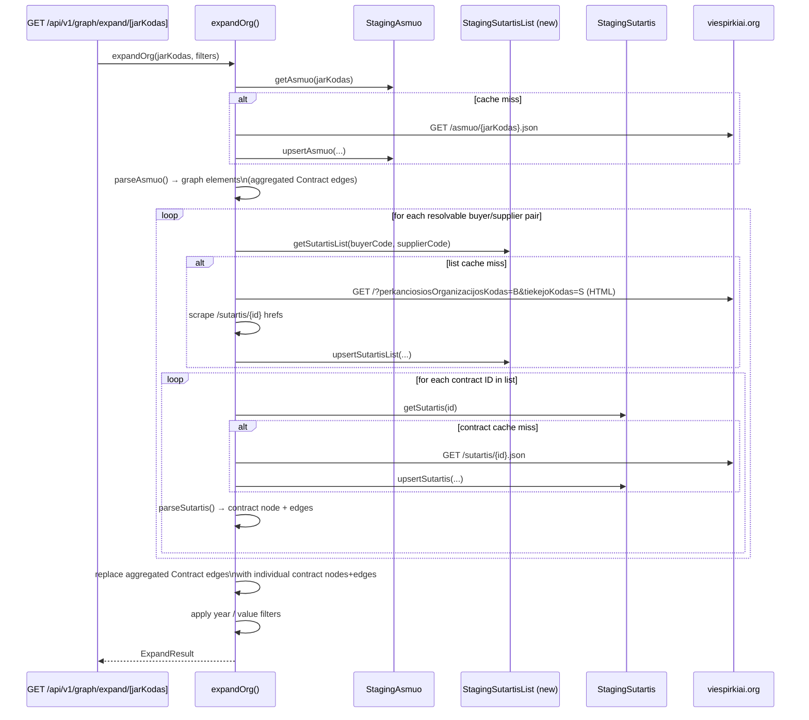

# Contract Date Enrichment Story

## Summary

Currently the graph shows aggregated contract edges between organisations (e.g.
`org:buyer → org:anchor`) derived from `topPirkejai` / `topTiekejai` arrays inside the
`/asmuo/{jarKodas}.json` response. These aggregate edges carry only a total contract value
(`totalValue`) and no date information — making timeline filtering impossible and the table
view useless for temporal risk analysis.

Every pair in `topPirkejai` / `topTiekejai` has a corresponding contract-list HTML page at:

```
https://viespirkiai.org/?perkanciosiosOrganizacijosKodas=<buyer>&tiekejoKodas=<supplier>
```

That page (server-rendered, all results on one HTML response — no JS pagination required)
contains `href="/sutartis/{sutartiesUnikalusID}"` links for every real contract. Each contract
has a JSON endpoint:

```
https://viespirkiai.org/sutartis/{sutartiesUnikalusID}.json
```

which supplies `sudarymoData`, `paskelbimoData`, `galiojimoData`, `faktineIvykdimoData`, plus
buyer/supplier codes and contract value.

**Goal:** replace each aggregated `Contract` edge with individual contract nodes and dated
edges — exactly as `parseSutartis` already does — so that year-range filtering works and the
table shows real contract metadata.

---

## Technical Breakdown

### Investigation findings

| Finding                                     | Detail                                                                                |
|---------------------------------------------|---------------------------------------------------------------------------------------|
| HTML page renders synchronously             | All contracts appear on page 1 — `/?perkanciosiosOrganizacijosKodas=X&tiekejoKodas=Y` |
| Pagination links (page=2+) return "Nerasta" | Server renders all records on one page; pagination links are decorative JS artefacts  |
| `count` field in asmuo JSON may undercount  | Actual HTML scrape often returns more IDs than the `count` field suggests             |
| Individual contract JSON exists             | `GET /sutartis/{id}.json` — already supported by `fetchSutartis()` in the client      |
| Scale for anchor `110053842`                | ~7 resolvable topTiekejai + ~9 resolvable topPirkejai; 2–83 contracts per pair        |
| Invalid/synthetic codes                     | `"0"`, `"803"` — `isResolvableJarKodas()` already filters these out                   |

### URL direction

| Pair type                              | URL                                                                |
|----------------------------------------|--------------------------------------------------------------------|
| topTiekejai (anchor buys from partner) | `?perkanciosiosOrganizacijosKodas=<anchor>&tiekejoKodas=<partner>` |
| topPirkejai (partner buys from anchor) | `?perkanciosiosOrganizacijosKodas=<partner>&tiekejoKodas=<anchor>` |

### Structural Diagram

```mermaid
graph LR
    subgraph New Components
        A[fetchSutartisList\nviespirkiai/client.ts] -->|HTML scrape| B[viespirkiai.org\n/?buyer=X&supplier=Y]
        C[StagingSutartisList\nstaging/sutartisList.ts] -->|cache hit| D[expandOrg]
        A -->|IDs| C
    end

subgraph Existing Components
E[fetchSutartis\nviespirkiai/client.ts] -->|/sutartis/ {id } . json|F[viespirkiai.org]
G[StagingSutartis\nstaging/sutartis.ts]
H[parseSutartis\nparsers/sutartis.ts]
D[expandOrg\ngraph/expand.ts]
end

D -->|for each resolvable pair|A
D -->|for each contract ID|E
E --> G
G -->|raw|H
H -->|nodes+edges|D
```

### Behavioral Diagram



---

## New Database Table

A new Prisma model is required to cache the scraped contract-ID lists:

```prisma
model StagingSutartisList {
  id           String   @id @default(cuid())
  buyerCode    String   
  supplierCode String   
  contractIds  String[] // array of sutartiesUnikalusID strings
  fetchedAt    DateTime 

  @@unique([buyerCode, supplierCode])
  @@map("staging_sutartis_list")
}
```

TTL: **24 hours** (same as `StagingAsmuo`).

---

## Changes to Existing Files

| File                                 | Change                                                                              |
|--------------------------------------|-------------------------------------------------------------------------------------|
| `prisma/schema.prisma`               | Add `StagingSutartisList` model                                                     |
| `src/lib/viespirkiai/client.ts`      | Add `fetchSutartisList(buyerCode, supplierCode): Promise<string[]>`                 |
| `src/lib/staging/sutartisList.ts`    | New: `getSutartisList` / `upsertSutartisList` (same pattern as staging/sutartis.ts) |
| `src/lib/graph/expand.ts`            | Post-parse enrichment: scrape list → fetch each contract → replace aggregated edges |
| `src/lib/graph/expand.test.ts`       | Unit tests for contract enrichment (mock fetchSutartisList + fetchSutartis)         |
| `cypress/e2e/graph-data-table.cy.ts` | E2E test: contract nodes have fromDate in table                                     |

---

## Filter Compatibility

Year-range filtering already works at parse time in `parseAsmuo` (not yet on individual
contracts). With this story, `expandOrg` will apply a post-parse year filter on individual
contract nodes using their `fromDate` field:

- If `filters.yearFrom` is set, exclude contract nodes whose `fromDate` year < `yearFrom`.
- If `filters.yearTo` is set, exclude contract nodes whose `tillDate` year > `yearTo`.
- When `fromDate` is null, the contract is included (unknown date = not filtered out).
- Remove org stub nodes that become disconnected after contract filtering.

---

## Out of Scope

- Recursive expansion of supplier/buyer orgs through their contract lists (v2).
- Deduplicating contract IDs that appear in both topTiekejai and topPirkejai pairs.
- Rate limiting / back-off for large organisations with hundreds of contracts.
- Contracts between two non-anchor orgs (only direct anchor pairs are enriched).

---

## Open Questions

1. **Graph size**: For anchor org `110053842`, enrichment could fetch ~500+ individual contracts
   total. Should we cap individual contracts per pair (e.g., 50 most recent)? — _Recommendation:
   no cap in v1; the year-range filter controls what is shown._

That is absolutely correct, and we cannot stress that: 500 requests for single expand is too much!
Fix the algorythm:

1. When opening a node, find all top buyers and suppliers.
2. Collect all mutual contracts by fetching HTML data such
   as (https://viespirkiai.org/?tiekejoKodas=304971164&perkanciosiosOrganizacijosKodas=305674949)
   As you see, this page already contains what we need:

```text
MVP
Kategorija
Prekės
Sutarties galiojimas
Sut. 2025-07-22 – 2025-09-19
Dokumentai
3 dok.
12 110,89 €
Kompiuterinė technika (EKVI)
...
```

within `result-card card-clickable` `<article>` elements, so we can scrape all contract names, values and even date
ranges! Basically all we need for `Contract` table to be populated. Also, that is a mistake that `Contract` table does
not have `fromDate` and `tillDate` fields, because they are available in scrapped data - add those columns!
What we really miss is the `StagingSutartis` JSON blob to be inserted, but that is fine if it is missing for Graph,
because we can fetch `sutartis` when we review companies.

When Painting Graph ensure that we paint only filtered contracts by date, and se date from now - 1 year as a default,
till now.

- when scraping data, ensure you will walk all pages!

2. **Aggregated edge retention**: Should the aggregated `Contract` edge be removed once
   individual contracts are available, or kept as a fallback (e.g., for pairs where the HTML
   scrape fails)? — _Recommendation: remove the aggregated edge when at least one individual
   contract was fetched for that pair; keep it otherwise._

3. **StagingSutartisList invalidation**: The list of contract IDs for a pair can grow over time
   (new contracts awarded). 24-hour TTL seems appropriate — same as StagingAsmuo.

---

## Tasks

**Phase 1 — Database & staging layer**

- [ ] Ensure project compiles and all existing tests pass
- [ ] Add `StagingSutartisList` model to `prisma/schema.prisma`
- [ ] Run `npx prisma migrate dev --name add-staging-sutartis-list`
- [ ] Create `src/lib/staging/sutartisList.ts` with `getSutartisList` / `upsertSutartisList`
- [ ] Add unit tests for the staging helpers (mock `db` client)
- [ ] Verify build and tests still pass
- [ ] Mark all checkboxes as done in this document once verified

**Phase 2 — viespirkiai HTML scraper**

- [ ] Add `fetchSutartisList(buyerCode: string, supplierCode: string): Promise<string[]>` to
  `src/lib/viespirkiai/client.ts`
    - Fetches `/?perkanciosiosOrganizacijosKodas={buyerCode}&tiekejoKodas={supplierCode}`
    - Parses `href="/sutartis/([0-9]+)"` from response HTML
    - Returns unique contract IDs
- [ ] Add unit tests: mock axios; assert correct URL constructed; assert deduplication; assert
  empty array on HTTP error (non-throwing)
- [ ] Verify build and tests pass
- [ ] Mark all checkboxes as done in this document once verified

**Phase 3 — expandOrg enrichment**

- [ ] In `src/lib/graph/expand.ts`, add `enrichContractEdges(elements, anchorJarKodas, filters)`:
    - Identify all `Contract`-type edges in elements
    - For each edge, determine buyer/supplier codes from source/target org IDs
    - Skip pairs where either code is not resolvable via `isResolvableJarKodas()`
    - Fetch contract-ID list (staging → HTML scrape fallback)
    - Fetch each contract JSON (staging → viespirkiai fallback); run in parallel per pair
    - Call `parseSutartis(raw)` for each contract and collect nodes/edges
    - Apply year/value filters on resulting contract nodes
    - Remove the original aggregated `Contract` edge for any pair that produced ≥ 1 individual contract
    - Add individual contract nodes/edges to elements
- [ ] Add unit tests:
    - `"replaces aggregated Contract edge with individual contract nodes"` — mock list + contract JSON
    - `"keeps aggregated edge when scrape returns empty list"` — mock empty list
    - `"applies yearFrom filter on individual contracts"` — filters out contract with old fromDate
    - `"skips pairs with unresolvable jarKodas (0, 803)"` — asserts no fetch for those
- [ ] Verify build and tests pass
- [ ] Mark all checkboxes as done in this document once verified

**Phase 4 — Cypress E2E tests & documentation**

- [ ] Add Cypress test in `cypress/e2e/graph-data-table.cy.ts`:
    - `"contract nodes have fromDate populated"` — find rows where node type is Contract; assert
      `[data-testid="node-from-date"]` is not empty for at least one row
- [ ] Update `docs/ARCHITECTURE.md`:
    - Add `StagingSutartisList` to the staging tables section
    - Update the data-flow description to include HTML scraping step
    - Add `fetchSutartisList` to the viespirkiai client section
- [ ] Perform linting: `npm run lint`
- [ ] Run full test suite: `npm test` + `./bin/run-cypress-tests.sh`
- [ ] Review implementation against this story
- [ ] Mark all checkboxes as done in this document once verified
