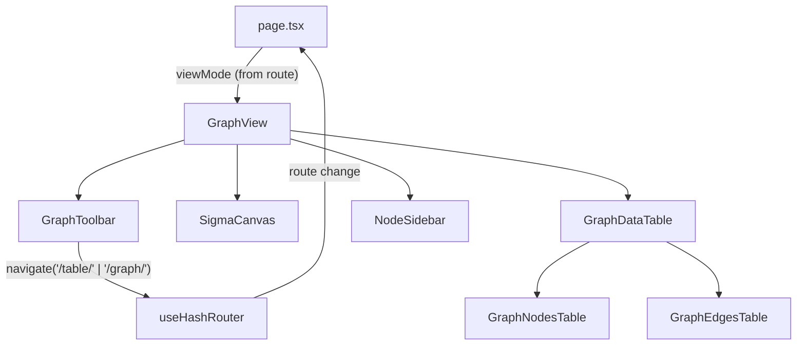
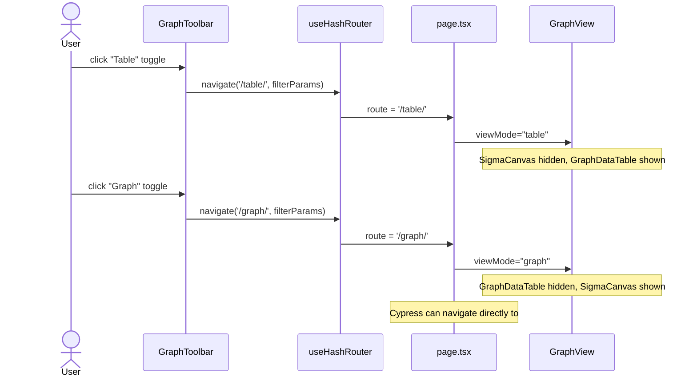

# Graph Data Table

## Summary

`SigmaCanvas` renders a WebGL graph that is opaque to automated tests and difficult for humans to read in plain text
form. Introduce a **table view** that exposes the same in-memory graph data as two simple MUI tables — one for nodes,
one for edges — and a **toggle button** in `GraphToolbar` to switch between the two views. The table view is the primary
surface for Cypress assertions and human inspection; the canvas remains the default view.

## Technical Breakdown

### New Components

| Component         | Location                                   | Description                                                                   |
| ----------------- | ------------------------------------------ | ----------------------------------------------------------------------------- |
| `GraphNodesTable` | `src/components/graph/GraphNodesTable.tsx` | MUI `Table` listing all graph nodes, no pagination                            |
| `GraphEdgesTable` | `src/components/graph/GraphEdgesTable.tsx` | MUI `Table` listing all graph edges, no pagination                            |
| `GraphDataTable`  | `src/components/graph/GraphDataTable.tsx`  | Wrapper that stacks `GraphNodesTable` + `GraphEdgesTable` in scrollable `Box` |

### GraphNodesTable — Column Definitions

| Column       | Source field         | Format                             | `data-testid` cell prefix |
| ------------ | -------------------- | ---------------------------------- | ------------------------- |
| **ID**       | `node.data.id`       | raw string                         | `node-id`                 |
| **Label**    | `node.data.label`    | raw string                         | `node-label`              |
| **Type**     | `node.data.type`     | raw string                         | `node-type`               |
| **Expanded** | `node.data.expanded` | `"yes"` / `"no"` / `"—"`           | `node-expanded`           |
| **From**     | `node.data.fromDate` | `YYYY-MM-DD` or `"—"`              | `node-from`               |
| **Till**     | `node.data.tillDate` | `YYYY-MM-DD` / `"present"` / `"—"` | `node-till`               |

Table `data-testid`: `"graph-nodes-table"`

### GraphEdgesTable — Column Definitions

| Column     | Source field         | Format                             | `data-testid` cell prefix |
| ---------- | -------------------- | ---------------------------------- | ------------------------- |
| **ID**     | `edge.data.id`       | raw string                         | `edge-id`                 |
| **Source** | `edge.data.source`   | raw string                         | `edge-source`             |
| **Target** | `edge.data.target`   | raw string                         | `edge-target`             |
| **Type**   | `edge.data.type`     | raw string                         | `edge-type`               |
| **Label**  | `edge.data.label`    | raw string or `"—"`                | `edge-label`              |
| **Value**  | `edge.data.value`    | `€X.XM` / `€X,XXX` / `"—"`         | `edge-value`              |
| **From**   | `edge.data.fromDate` | `YYYY-MM-DD` or `"—"`              | `edge-from`               |
| **Till**   | `edge.data.tillDate` | `YYYY-MM-DD` / `"present"` / `"—"` | `edge-till`               |

Table `data-testid`: `"graph-edges-table"`

### Toggle Control & URL-driven View Mode

A `ToggleButtonGroup` (MUI) is added to the right end of `GraphToolbar`:

```
[ 🕸 Graph ] [ 📋 Table ]
```

**View mode is encoded in the hash route**, making it bookmarkable and directly navigable by Cypress tests (no UI
interaction required to reach the table view):

| Hash route | View mode | Notes                         |
| ---------- | --------- | ----------------------------- |
| `#/`       | `graph`   | default                       |
| `#/graph/` | `graph`   | canonical graph URL           |
| `#/table/` | `table`   | table view; directly loadable |

Filter query params are preserved across mode switches: `#/table/?yearFrom=2022&minContractValue=100000`

**Routing flow:**

1. `page.tsx` reads `route` from `useHashRouter`. Routes starting with `/table` → passes `viewMode="table"` to
   `GraphView`; otherwise `viewMode="graph"`.
2. `GraphView` receives `viewMode` as a **prop** (not local state). It renders `SigmaCanvas` or `GraphDataTable`
   accordingly.
3. The toggle calls `navigate('/table/', currentFilterParams)` or `navigate('/graph/', currentFilterParams)` — the URL
   change drives the re-render through `page.tsx`.
4. `data-testid="view-mode-graph"` and `data-testid="view-mode-table"` on the two toggle buttons.

### Structural Diagram



### Behavioral Diagram



## Out of Scope

- Sorting or filtering within the table (no column sorting).
- Pagination (all rows displayed).
- Inline editing from the table.

## Tasks

**Phase 1 — GraphNodesTable & GraphEdgesTable**

- [x] Create `src/components/graph/GraphNodesTable.tsx` — renders MUI `Table` with columns defined above;
      `data-testid="graph-nodes-table"`; each data cell carries its `data-testid` attribute
- [x] Create `src/components/graph/GraphEdgesTable.tsx` — renders MUI `Table` with columns defined above;
      `data-testid="graph-edges-table"`; each data cell carries its `data-testid` attribute
- [x] Create `src/components/graph/GraphDataTable.tsx` — stacks the two tables inside a scrollable `Box`; accepts
      `elements: CytoscapeElements` prop
- [x] Add unit tests under `src/components/graph/__tests__/` for `GraphNodesTable` and `GraphEdgesTable` (render rows,
      format values)
- [x] Ensure project compiles and existing tests are passing
- [x] Mark all checkboxes as done in this document once verified

**Phase 2 — URL routing + Toggle in GraphToolbar & GraphView wiring**

- [x] Update `page.tsx`: map route `/table/` (and `/table`) → `viewMode="table"`; `/graph/` and `/` →
      `viewMode="graph"`; pass as prop to `GraphView`
- [x] Update `GraphView` to accept `viewMode: 'graph' | 'table'` prop; conditionally render `SigmaCanvas` vs
      `GraphDataTable`; pass `elements` to `GraphDataTable`
- [x] Add `viewMode` and `onViewModeChange` props to `GraphToolbar`; the handler calls
      `navigate('/table/', filterParams)` or `navigate('/graph/', filterParams)` preserving active filter query params
- [x] Add MUI `ToggleButtonGroup` to `GraphToolbar` right side with `data-testid="view-mode-graph"` and
      `data-testid="view-mode-table"`
- [x] Update `GraphToolbar` unit tests to cover new toggle props
- [x] Ensure project compiles and existing tests are passing
- [x] Mark all checkboxes as done in this document once verified

**Phase 3 — Cypress E2E coverage + cleanup**

- [x] Add Cypress test: navigate directly to `#/table/`, assert `graph-nodes-table` and `graph-edges-table` are visible
      and contain at least one row each
- [x] Add Cypress test: navigate directly to `#/graph/`, assert `graph-container` is visible and tables are absent
- [x] Add Cypress test: start on `#/`, click `view-mode-table` toggle, assert URL changes to `#/table/` and tables
      appear
- [x] Add Cypress test: filter params are preserved when switching view mode (e.g. `#/table/?yearFrom=2022` → toggle to
      graph → URL is `#/graph/?yearFrom=2022`)
- [x] Update required documentation after the implementation is complete
- [x] Perform linting and formatting to maintain code quality and consistency
- [x] Review the implementation to ensure it meets the requirements and follows best practices
- [x] Mark all checkboxes as done in this document once verified
