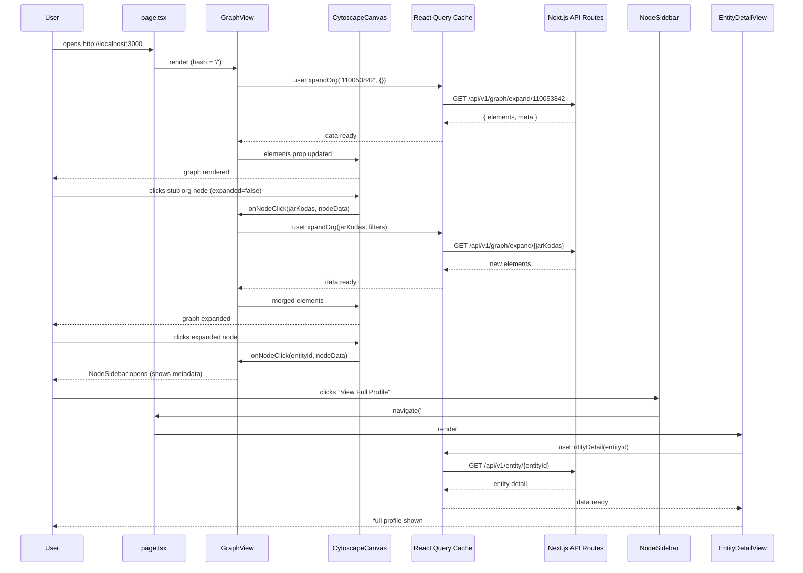

Ï# Story: Graph Visualisation Frontend

## Summary

Build the complete browser-side of the Risk Intelligence System: a single-page application that
renders an interactive Cytoscape.js graph, responds to node clicks by expanding organisations or
showing a detail sidebar, supports toolbar filters (year range + contract value), and navigates to
full entity profile pages via hash routing — all without server-side rendering.

The REST API is complete (`GET /api/v1/graph/expand/{jarKodas}` and `GET /api/v1/entity/{entityId}`).
This story wires the UI to those endpoints.

---

## Context

- **No SSR.** All graph components are React client components (`'use client'`).
- **Hash routing.** `#/` → GraphView, `#/entities/{entityId}` → EntityDetailView.  
  No `next/navigation` — a lightweight `useHashRouter` hook drives route changes.
- **TanStack React Query** caches API responses in-browser. A `QueryClientProvider` lives in
  `layout.tsx` and is available to every component.
- **MUI v5** (already installed) provides all UI primitives — no additional UI libraries.
- **Cytoscape.js 3** (already installed) renders the graph canvas.
- Backend API contract is defined in [`ARCHITECTURE.md`](./ARCHITECTURE.md) — Graph Response Format
  section.

---

## Acceptance Criteria

1. Opening `http://localhost:3000` loads the graph pre-seeded with the anchor organisation
   `110053842` (AB "Lietuvos geležinkeliai") by calling `GET /api/v1/graph/expand/110053842`.
2. Clicking a stub org node (where `expanded: false`) calls `GET /api/v1/graph/expand/{jarKodas}`
   and merges new elements into the existing graph.
3. Clicking any expanded node opens a right sidebar with its label, type badge, metadata, and a
   "View Full Profile" button.
4. "View Full Profile" navigates to `#/entities/{entityId}` and renders the entity detail view
   sourced from `GET /api/v1/entity/{entityId}`.
5. `#/entities/{entityId}` is directly deep-linkable — reloading the page renders the detail view.
6. "Back to Graph" returns to the graph canvas without a full page reload.
7. Toolbar Filter controls (year-from, year-to, min-contract-value) encode their state in the URL
   hash query string and pass as query params to subsequent expand calls.
8. "Apply Filters" re-fetches the current view with active filters. A "Reset" button appears when
   non-default filters are active.
9. All Cypress E2E tests in `cypress/e2e/` pass: `flow.cy.ts`, `entity-profile.cy.ts`,
   `toolbar-filters.cy.ts`.
10. `npm test` (Jest unit) and `./bin/run-api-tests.sh` continue to pass after frontend changes.

---

## Module Structure

```
src/
├── app/
│   ├── layout.tsx            # ThemeProvider + QueryClientProvider shell
│   ├── page.tsx              # Hash router entry — GraphView vs EntityDetailView
│   └── globals.css           # Global styles (canvas fills viewport)
│
├── components/
│   │
│   ├── graph/                # All Cytoscape rendering + graph-level state
│   │   ├── types.ts          # GraphState, FilterState
│   │   ├── GraphView.tsx     # Root graph page: toolbar + canvas + sidebar
│   │   ├── CytoscapeCanvas.tsx   # Cytoscape.js mount (SSR-safe dynamic import)
│   │   ├── NodeSidebar.tsx   # Right panel shown on node click
│   │   ├── toolbar/
│   │   │   └── GraphToolbar.tsx  # Search autocomplete + filter inputs + apply/reset
│   │   └── __tests__/
│   │       ├── GraphView.test.tsx
│   │       ├── CytoscapeCanvas.test.tsx
│   │       └── NodeSidebar.test.tsx
│   │
│   ├── entity/               # Full 360° entity profile page
│   │   ├── types.ts          # EntityDetailViewProps
│   │   ├── EntityDetailView.tsx  # Full profile: header + metadata + relationship list
│   │   └── __tests__/
│   │       └── EntityDetailView.test.tsx
│   │
│   └── services/             # React Query hooks — browser → backend
│       ├── useExpandOrg.ts   # useQuery wrapping GET /api/v1/graph/expand/{jarKodas}
│       ├── useEntityDetail.ts# useQuery wrapping GET /api/v1/entity/{entityId}
│       └── __tests__/
│           ├── useExpandOrg.test.ts
│           └── useEntityDetail.test.ts
│
└── hooks/
    ├── useHashRouter.ts      # SSR-safe hash URL read/write
    └── __tests__/
        └── useHashRouter.test.ts
```

---

## Technical Breakdown

### Phase 1 — Foundation: Layout, Routing, Providers

#### `src/app/layout.tsx`

Root shell. Must be a **server component** (no `'use client'`) — wraps children in:

- `MUI ThemeProvider` + `CssBaseline` with a dark-first palette tuned for a data-dense canvas
- `QueryClientProvider` from TanStack React Query

```tsx
// providers must be isolated in a separate client component
// (Next.js rule: QueryClientProvider requires 'use client')
// layout.tsx → <html><body><Providers>{children}</Providers></body></html>
```

Create a thin `src/components/Providers.tsx` (`'use client'`) that wraps `ThemeProvider` +
`QueryClientProvider` so `layout.tsx` stays a server component.

#### `src/hooks/useHashRouter.ts`

SSR-safe (no `window` access during SSR). Provides:

```ts
interface HashRouter {
    route: string;          // e.g. '/entities/org:110053842'
    params: URLSearchParams;// query string parsed from hash fragment
    navigate(path: string, params?: Record<string, string>): void;

    replace(path: string, params?: Record<string, string>): void;
}
```

- Reads `window.location.hash` on the client; returns `{ route: '/', params: new URLSearchParams() }` during SSR.
- Listens to `hashchange` events and re-renders.
- `navigate` sets `window.location.hash` (browser back-stack entry).
- `replace` uses `history.replaceState` (no back-stack entry — used for filter state sync).

#### `src/app/page.tsx`

```tsx
'use client';
export default function Home() {
    const {route} = useHashRouter();
    if (route.startsWith('/entities/')) {
        const entityId = route.replace('/entities/', '');
        return <EntityDetailView entityId={entityId}/>;
    }
    return <GraphView/>;
}
```

---

### Phase 2 — Services Layer

#### `src/components/services/useExpandOrg.ts`

```ts
function useExpandOrg(
    jarKodas: string,
    filters: FilterState,
): UseQueryResult<CytoscapeResponse>
```

- Calls `GET /api/v1/graph/expand/{jarKodas}?year=...&minContractValue=...`.
- `staleTime: 5 * 60 * 1000` (5 min).
- `enabled: !!jarKodas`.

#### `src/components/services/useEntityDetail.ts`

```ts
function useEntityDetail(entityId: string): UseQueryResult<EntityDetailResult>
```

- Calls `GET /api/v1/entity/{entityId}`.
- `staleTime: 5 * 60 * 1000`.
- `enabled: !!entityId`.

Both hooks must be tested with `renderHook` from `@testing-library/react` with a mocked `fetch`.

---

### Phase 3 — Graph Components

#### `src/components/graph/GraphView.tsx`

Root graph page component. Manages:

- **`graphElements`** state: accumulates Cytoscape nodes + edges from all expand calls.
- **`selectedNode`** state: the currently selected node ID (drives sidebar).
- **`filters`** state: `{ year?: number, minContractValue?: number }`.
- **`expandQueue`**: when a stub node is clicked, adds `jarKodas` to the queue. `useExpandOrg`
  fetches it; result is merged into `graphElements` via `cy.add()`.
- Hash-syncs active filters via `replace(...)`.

On initial mount: calls `useExpandOrg('110053842', {})` to seed the anchor org.

```
┌────────────────────────────────────────────────────────────┐
│  GraphToolbar (top, full-width)                            │
├────────────────────────────────────────────────────────────┤
│                              │                             │
│  CytoscapeCanvas             │  NodeSidebar               │
│  (flex-grow, fills height)   │  (300px, slides in/out)    │
│                              │                             │
└──────────────────────────────┴────────────────────────────-┘
```

#### `src/components/graph/CytoscapeCanvas.tsx`

`'use client'` — **dynamically imported** in `GraphView.tsx` with `ssr: false`:

```tsx
const CytoscapeCanvas = dynamic(
    () => import('./CytoscapeCanvas'),
    {ssr: false}
);
```

Props:

```ts
interface CytoscapeCanvasProps {
    elements: CytoscapeElements;
    onNodeClick: (nodeId: string, nodeData: CytoscapeNodeData) => void;
    onBackgroundClick: () => void;
}
```

Responsibilities:

- Mounts Cytoscape into a `<div data-testid="graph-container">` ref.
- Applies stylesheet — node colour/size driven by `type` and `expanded` data fields.
- On `cy.on('tap', 'node', ...)`: calls `onNodeClick`.
- When `elements` prop changes: calls `cy.add()` for new elements (idempotent — Cytoscape ignores
  duplicate IDs), then runs `cy.layout({ name: 'cose' })` to re-organise incrementally.
- Cleans up (`cy.destroy()`) on unmount.

**Node Stylesheet** (initial — can be refined):

| Selector                  | Color       | Shape   | Size | Notes                     |
|---------------------------|-------------|---------|------|---------------------------|
| `[type="PublicCompany"]`  | `#1976d2`   | ellipse | 60px | blue                      |
| `[type="PrivateCompany"]` | `#388e3c`   | ellipse | 50px | green                     |
| `[type="Institution"]`    | `#7b1fa2`   | hexagon | 70px | purple, fixed size        |
| `[type="Person"]`         | `#f57c00`   | ellipse | 35px | orange                    |
| `[type="Tender"]`         | `#0097a7`   | diamond | 45px | teal                      |
| `[expanded="false"]`      | opacity 0.6 | —       | —    | stub node — dimmed        |
| `:selected`               | `#ffeb3b`   | —       | —    | yellow highlight on click |

**Edge Stylesheet:**

| Edge `type`   | Style  | Width | Color     |
|---------------|--------|-------|-----------|
| `Contract`    | solid  | 3px   | `#ef5350` |
| `Employment`  | dashed | 1.5px | `#90a4ae` |
| `Director`    | dashed | 2.5px | `#f48fb1` |
| `Official`    | dashed | 1.5px | `#80cbc4` |
| `Shareholder` | dashed | 2px   | `#ce93d8` |
| `Spouse`      | dotted | 1px   | `#ffcc02` |

#### `src/components/graph/NodeSidebar.tsx`

Slide-in panel (MUI `Drawer`, `anchor="right"`, `variant="persistent"`).

Props:

```ts
interface NodeSidebarProps {
    nodeId: string | null;
    nodeData: CytoscapeNodeData | null;
    onClose: () => void;
    onViewFullProfile: (entityId: string) => void;
}
```

Content:

- Header: entity label + type badge chip + `data-testid="close-sidebar"` icon button.
- Metadata rows: `type`, `expanded`, `employees`, `avgSalary`, `contractTotal`, `contractCount` —
  whichever fields are present in `nodeData`.
- "View Full Profile" `Button` → calls `onViewFullProfile(nodeId)`.
- Shows `CircularProgress` while `useEntityDetail` is loading.
- Shows `"Node Details"` as panel heading (required by Cypress spec).

#### `src/components/graph/toolbar/GraphToolbar.tsx`

MUI `AppBar` + `Toolbar`. Contains:

| Control                        | `data-testid`      | Notes                                                                     |
|--------------------------------|--------------------|---------------------------------------------------------------------------|
| `Autocomplete` search          | (via placeholder)  | `placeholder="Search Company or Person..."` — searches loaded graph nodes |
| Year-from `Select`             | `filter-year-from` | Options 2010–current year                                                 |
| Year-to `Select`               | `filter-year-to`   | Options 2010–current year                                                 |
| Min-value `TextField` (number) | `filter-min-value` | EUR threshold                                                             |
| "Apply" `Button`               | `filter-apply`     | Calls `onApplyFilters`                                                    |
| "Reset" `Button`               | `filter-reset`     | Only shown when non-default filters active                                |

The search autocomplete scans in-memory `graphElements` nodes for label matches — no API call.
Selecting a result: calls a `cy.center()` + `cy.select()` to highlight the node (programmatic
interaction via a forwarded Cytoscape ref or event).

---

### Phase 4 — Entity Detail View

#### `src/components/entity/EntityDetailView.tsx`

Full 360° profile page. Uses `useEntityDetail(entityId)`.

Layout:

- Back button (`← Back to Graph`) → `navigate('/')`.
- Header card: entity label (large), type chip, "Risk Score" placeholder section.
- Metadata table: all `data` fields from the API response.
- Relationships list: each relationship as a MUI `Card` showing type, counterparty label, dates,
  value where applicable.
- Loading state: full-page `CircularProgress`.
- Error state: `Alert` with retry button.

Must show `"Risk Score"` text (required by Cypress spec).
Must show `"Back to Graph"` text (required by Cypress spec).

---

### Phase 5 — Cypress E2E

Three spec files already exist in `cypress/e2e/`. The frontend implementation must satisfy all
assertions defined in them.

#### `cypress/e2e/flow.cy.ts` — Basic Graph Flow

- Graph container visible on load.
- Search autocomplete returns results and clicking opens sidebar.
- Sidebar shows "Node Details", entity name, "Risk Profile" section.
- Close button hides sidebar.

> **Note:** "Risk Profile" section title expected by this test — include it in `NodeSidebar.tsx`.

#### `cypress/e2e/entity-profile.cy.ts` — Hash Navigation

- Direct URL `/#/entities/110053842` loads entity detail without page reload.
- Sidebar "View Full Profile" → navigates to `#/entities/...`.
- "Back to Graph" → returns to graph canvas.
- Legacy path `/entities/110053842` → redirects to hash URL.

> **Note for legacy redirect:** Handle in `src/app/entities/[entityId]/page.tsx` — a minimal
> server component that outputs a `<script>` to redirect to the hash URL on the client.

#### `cypress/e2e/toolbar-filters.cy.ts` — Filter Controls

- Filter inputs render with correct `data-testid` attributes.
- No reset button when defaults are active.
- Entering a non-default value + Apply → reset button appears.
- Reset clears inputs and hides reset button.
- Year range filters appear in URL hash query string.

---

## API Interaction Diagram



---

## State Management

No external state library is needed. State flows as follows:

```
page.tsx
  └── useHashRouter()          ← URL hash is the source of truth for routing + filters

GraphView.tsx
  ├── graphElements (useState) ← accumulated Cytoscape elements from all expand calls
  ├── selectedNode (useState)  ← currently selected node (drives sidebar open/closed)
  ├── filters (useState)       ← { year?, minContractValue? }
  ├── useExpandOrg(...)        ← React Query (auto-fetches; result merged into graphElements)
  └── CytoscapeRef (useRef)    ← direct Cytoscape instance access for programmatic ops
```

React Context is **not** required for v1 — all state is local to `GraphView` and passed down as
props. If the component tree grows, a `GraphContext` can be introduced in a future story.

---

## Next Steps

- [ ] Ensure project compiles and existing tests are passing
- [ ] Phase 1: Implement `layout.tsx`, `Providers.tsx`, `useHashRouter.ts`, `page.tsx`
- [ ] Phase 2: Implement `useExpandOrg.ts` and `useEntityDetail.ts` service hooks + unit tests
- [ ] Phase 3a: Implement `CytoscapeCanvas.tsx` with node/edge stylesheet
- [ ] Phase 3b: Implement `NodeSidebar.tsx` (metadata panel, "Node Details" heading, close button)
- [ ] Phase 3c: Implement `GraphToolbar.tsx` (search, year filters, min-value, apply/reset)
- [ ] Phase 3d: Implement `GraphView.tsx` tying canvas + sidebar + toolbar together
- [ ] Phase 4: Implement `EntityDetailView.tsx` with full profile layout
- [ ] Phase 4b: Implement legacy redirect at `src/app/entities/[entityId]/page.tsx`
- [ ] Phase 5: Run `./bin/run-cypress-tests.sh` — all three Cypress specs must pass
- [ ] Update required documentation after the implementation is complete
- [ ] Ensure new tests are added for the new feature and all tests are passing
- [ ] Perform linting and formatting to maintain code quality and consistency
- [ ] Review the implementation to ensure it meets the requirements and follows best practices
- [ ] Mark all checkboxes as done in this document once verified
