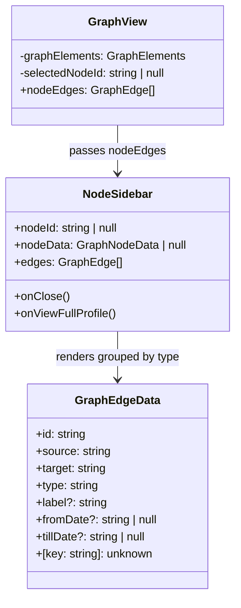
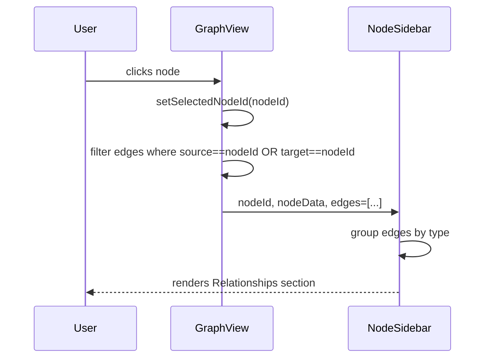

# Node Details — Edge List

## Summary

The current `NodeSidebar` displays a "Risk Profile" placeholder section that carries no real data in v1 and creates
a misleading UI affordance. This story replaces it with a meaningful **Relationships** section that lists all graph
edges connected to the selected node, grouped by relationship type. Each entry shows the relationship label,
`fromDate`, and `tillDate`.

A code-smell investigation is also included: the exported `Relationship` interface in `src/types/graph.ts` has zero
TypeScript usages while `GraphEdgeData` duplicates the same semantic fields with a looser `[key: string]: unknown`
index signature. This story resolves the inconsistency by making `GraphEdgeData` extend `Relationship` so the domain
semantics are enforced by the type system.

---

## Technical Breakdown

### Code Smell: `Relationship` vs `GraphEdgeData`

`src/types/graph.ts` exports two interfaces that describe the same concept:

| Interface       | Used in code? | Has typed fields?                                                     |
|-----------------|---------------|-----------------------------------------------------------------------|
| `Relationship`  | ❌ zero usages | ✅ `type`, `source`, `target`, `label`, `fromDate`, `tillDate`, `data` |
| `GraphEdgeData` | ✅ everywhere  | ⚠️ same fields but also `[key: string]: unknown` — no enforcement     |

**Root cause:** `GraphEdgeData` was likely introduced independently to match the Cytoscape/Sigma element shape and
was never wired to the domain `Relationship` type.

**Fix:** Remove the standalone `Relationship` interface. Promote its typed fields into `GraphEdgeData` directly so
every edge object is guaranteed to carry `type`, `source`, `target`, `label?`, `fromDate?`, `tillDate?`. The
`[key: string]: unknown` index remains to allow extra fields (e.g. `totalValue`, `synthesised`).

> **No parser changes required** — parsers already populate exactly these fields on `GraphEdge.data`.

### NodeSidebar Changes

| Before                             | After                                                           |
|------------------------------------|-----------------------------------------------------------------|
| "Risk Profile" placeholder section | "Relationships" section with edge list grouped by type          |
| `loading` prop (for spinner)       | Removed — not needed without Risk Profile                       |
| No edge data in `NodeSidebar`      | New `edges: GraphEdge[]` prop (filtered by node in `GraphView`) |

**Data flow:**

1. `GraphView` holds `graphElements.edges` (all current graph edges).
2. When a node is selected, `GraphView` computes `nodeEdges` =
   `graphElements.edges.filter(e => e.data.source === nodeId || e.data.target === nodeId)`.
3. `nodeEdges` is passed to `NodeSidebar` as the `edges` prop.
4. `NodeSidebar` groups them by `edge.data.type` and renders one section per group.

**Display per edge entry:**

| Field | Source               | Format                             |
|-------|----------------------|------------------------------------|
| Label | `edge.data.label`    | role name or edge type if absent   |
| From  | `edge.data.fromDate` | `YYYY-MM-DD` or `"—"` if absent    |
| Till  | `edge.data.tillDate` | `YYYY-MM-DD` / `"present"` / `"—"` |

### Structural Diagram

### Behavioral Diagram

---

## Out of Scope

- Risk scoring (removed from v1 entirely, not deferred to sidebar)
- Edge click / popover interactions — sidebar is node-only
- Cross-org person deduplication — each edge is shown as-is from graph state

---

## Tasks

**Phase 1: Type cleanup — eliminate `Relationship` dead code**

- [ ] Ensure project compiles and existing tests are passing (`npm test -- --no-coverage`)
- [ ] In `src/types/graph.ts`: remove `export interface Relationship { … }`; promote its explicitly-typed fields
  (`type`, `label`, `fromDate`, `tillDate`) as named (optional) properties on `GraphEdgeData` directly
- [ ] Verify `npm run build` and `npm test -- --no-coverage` still pass after the type change
- [ ] Update `ARCHITECTURE.md` — remove `Relationship` from the data structures section and note it was merged into
  `GraphEdgeData`
- [ ] Mark all checkboxes as done in this document once verified

**Phase 2: NodeSidebar — replace Risk Profile with Relationships list**

- [ ] Remove the `loading` prop from `NodeSidebarProps` (was only used for Risk Profile spinner)
- [ ] Add `edges: GraphEdge[]` prop to `NodeSidebarProps`
- [ ] Replace the "Risk Profile" `Box` section with a "Relationships" section that:
    - Groups edges by `edge.data.type`
    - Renders one `Typography` heading per group (e.g. `Employment (3)`)
    - Renders each edge as label + fromDate–tillDate row
    - Shows `"No relationships"` when `edges` is empty
- [ ] Update `GraphView` to derive `nodeEdges` from `graphElements.edges` and pass it to `<NodeSidebar>`
- [ ] Mark all checkboxes as done in this document once verified

**Phase 3: Tests, docs, and review**

- [ ] Update `NodeSidebar.test.tsx` — replace "Risk Profile" test with new Relationships tests:
    - renders "Relationships" heading when edges provided
    - groups edges by type with correct counts
    - shows "No relationships" when edges array is empty
    - renders fromDate and tillDate for each edge
- [ ] Update `ARCHITECTURE.md` — `NodeSidebar` section: remove Risk Profile, describe Relationships section
- [ ] Run `npm run lint` and fix any issues
- [ ] Run full test suite (`npm test -- --no-coverage`) and confirm all pass
- [ ] Review the implementation to ensure it meets the requirements and follows best practices
- [ ] Mark all checkboxes as done in this document once verified
