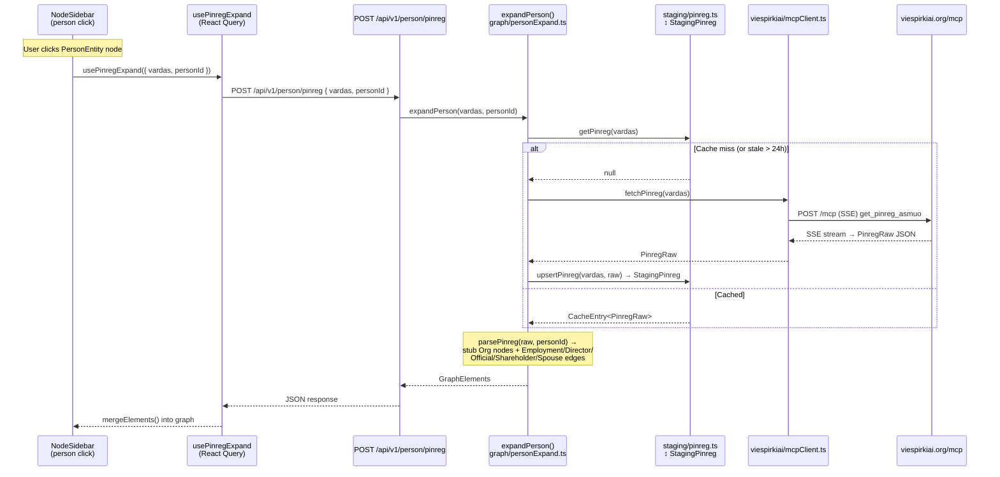

# PINREG Person Enrichment Story

## Summary

When a user clicks on a **PersonEntity** node in the graph, the system should enrich the person with **pinreg** data —
Lithuanian public-official interest-declaration records from `viespirkiai.org/mcp`. This data is fetched via MCP
(Model Context Protocol) HTTP POST using the person's full name (`VARDAS PAVARDĖ`) as the search key, cached in a new
`StagingPinreg` staging table, and then parsed into additional graph nodes and edges on-the-fly.

Pinreg data reveals three enriching sections:
- `darbovietes[]` — workplaces / employment relationships  
- `rysiaiSuJa[]` — governance ties (board membership, shareholder, committee member, etc.)
- `sutuoktinioDarbovietes[]` — spouse's workplaces (implies a spouse person node and spouse edge)

These relationships produce new **OrganizationEntity** stub nodes and new **Relationship** edges attached to the
`PersonEntity`, dramatically enriching the graph for conflict-of-interest and nepotism detection.

---

## Technical Breakdown

### Data Source: MCP `get_pinreg_asmuo`

The pinreg data is fetched via a `POST https://viespirkiai.org/mcp` request using the MCP `tools/call` protocol:

```json
{
  "jsonrpc": "2.0",
  "id": 1,
  "method": "tools/call",
  "params": {
    "name": "get_pinreg_asmuo",
    "arguments": {
      "vardas": "ROBERTAS VYŠNIAUSKAS",
      "limit": 20
    }
  }
}
```

The response is a Server-Sent Events (SSE) stream. The relevant payload is extracted from `data:` lines as:
`outer.result.content[0].text` → parsed as JSON → the actual `PinregRaw` object.

**Cache key:** `arguments.vardas` (uppercased full name, e.g. `"ROBERTAS VYŠNIAUSKAS"`).

### Example response structure (from `docs/examples/pinreg/mcp_pinreg.json`)

```json
{
  "darbovietes": [
    {
      "jarKodas": "302913276",
      "deklaracija": "9bf3bd8b-62ea-496b-a2ef-1d2409a97346",
      "vardas": "ROBERTAS",
      "pavarde": "VYŠNIAUSKAS",
      "pavadinimas": "Viešoji įstaiga CPO LT",
      "rysioPradzia": "2020-09-22",
      "darbovietesTipas": "EKSPERTO",
      "pareigos": null,
      "pareiguTipasPavadinimas": "Pirkimų procedūrose dalyvaujantys ekspertai"
    }
  ],
  "rysiaiSuJa": [
    {
      "jarKodas": "191691799",
      "deklaracija": "9bf3bd8b-62ea-496b-a2ef-1d2409a97346",
      "pavadinimas": "Lietuvos šaulių sąjunga",
      "rysioPradzia": "2021-07-06",
      "rysioPabaiga": null,
      "rysioPobudzioPavadinimas": "Narys",
      "vardas": "ROBERTAS",
      "pavarde": "VYŠNIAUSKAS"
    }
  ],
  "sutuoktinioDarbovietes": [],
  "counts": { "darbovietes": 5, "rysiaiSuJa": 7, "sutuoktiniuDarbovietes": 0 },
  "total": 12,
  "limit": 20
}
```

### Database Table: `StagingPinreg`

```prisma
model StagingPinreg {
  vardas    String   @id           // uppercased full name e.g. "ROBERTAS VYŠNIAUSKAS"
  data      Json                   // raw PinregRaw JSON (full MCP response payload)
  fetchedAt DateTime @default(now())
}
```

- **Business key:** `vardas` (the `arguments.vardas` value used in the MCP call)
- **TTL:** 24 hours (same as `StagingAsmuo`)
- **No secondary indexes needed** — lookups are always by exact name

### New Parsed Entities and Relationships

Pinreg produces entities and relationships beyond what `asmuo/{jarKodas}.json` currently provides for a person:

| Source Array               | Produces                       | Entity / Edge Type              | Key Fields                                                                        |
|---------------------------|--------------------------------|---------------------------------|-----------------------------------------------------------------------------------|
| `darbovietes[]`           | **OrganizationEntity** (stub)  | PrivateCompany / Institution    | `jarKodas` → `org:{jarKodas}`, `pavadinimas` → name                               |
| `darbovietes[]`           | **Relationship**               | Employment / Director / Official| `pareiguTipasPavadinimas` → type, person → org, `rysioPradzia` → fromDate         |
| `rysiaiSuJa[]`            | **OrganizationEntity** (stub)  | PrivateCompany / Institution    | `jarKodas` → `org:{jarKodas}`, `pavadinimas` → name                               |
| `rysiaiSuJa[]`            | **Relationship**               | Director / Shareholder / Official| `rysioPobudzioPavadinimas` → type, person → org, `rysioPradzia` → fromDate, `rysioPabaiga` → tillDate |
| `sutuoktinioDarbovietes[]`| **PersonEntity** (spouse stub) | Person                          | `sutuoktinioVardas + sutuoktinioPavarde` → name, `deklaracija` → id               |
| `sutuoktinioDarbovietes[]`| **Relationship**               | Spouse                          | declarant person → spouse person                                                  |
| `sutuoktinioDarbovietes[]`| **OrganizationEntity** (stub)  | PrivateCompany / Institution    | `jarKodas` → `org:{jarKodas}`, `pavadinimas` → name                               |
| `sutuoktinioDarbovietes[]`| **Relationship**               | Employment                      | spouse person → org                                                               |

> **Note:** `darbovietes[]` entries may contain duplicate `jarKodas` values (same org, different `deklaracija` or
> `darbovietesTipas`). Deduplication by `jarKodas` is required when building org stub nodes.

### `pareiguTipasPavadinimas` → Relationship Type (pinreg darbovietes)

Reuses the existing mapping already defined in ARCHITECTURE.md:

| pareiguTipasPavadinimas                         | → Relationship Type |
|-------------------------------------------------|---------------------|
| `Vadovas ar jo pavaduotojas`                    | **Director**        |
| `Darbuotojas`                                   | **Employment**      |
| `Pirkimo iniciatorius`                          | **Official**        |
| `Pirkimų procedūrose dalyvaujantys ekspertai`   | **Official**        |
| _other_                                         | **Official**        |

### `rysioPobudzioPavadinimas` → Relationship Type (pinreg rysiaiSuJa)

Reuses the existing mapping already defined in ARCHITECTURE.md:

| rysioPobudzioPavadinimas  | → Relationship Type |
|---------------------------|---------------------|
| `Valdybos narys`          | **Director**        |
| `Stebėtojų tarybos narys` | **Director**        |
| `Komiteto narys`          | **Director**        |
| `Akcininkas`              | **Shareholder**     |
| _other_                   | **Official**        |

### New API Route

```
POST /api/v1/person/pinreg
Body: { "vardas": "ROBERTAS VYŠNIAUSKAS" }
```

Returns `GraphElements` (same shape as expand endpoint) — new stub org nodes and new edges from the person node.
The route delegates to `lib/graph/personExpand.ts` → `staging/pinreg.ts` → `viespirkiai/mcpClient.ts`.

### New Source Files

```
src/
├── app/api/v1/person/pinreg/
│   └── route.ts                      # POST — delegates to lib/graph/personExpand
├── lib/
│   ├── viespirkiai/
│   │   └── mcpClient.ts              # fetchPinreg(vardas): PinregRaw — MCP POST + SSE parsing
│   ├── staging/
│   │   └── pinreg.ts                 # getPinreg / upsertPinreg (TTL 24h)
│   ├── parsers/
│   │   └── pinreg.ts                 # parsePinreg(raw, personId): GraphElements
│   └── graph/
│       └── personExpand.ts           # expandPerson(vardas, personId): GraphElements
└── components/services/
    └── usePinregExpand.ts            # useQuery: POST /api/v1/person/pinreg on person node click
```

### Behavioral Diagram



### Structural Diagram

```mermaid
graph TB
    subgraph Browser
        NS["NodeSidebar\n(person node selected)"]
        Hook["usePinregExpand\n(React Query)"]
    end

    subgraph NextJS["Next.js API"]
        Route["POST /api/v1/person/pinreg"]
    end

    subgraph Lib["src/lib"]
        PE["graph/personExpand.ts\nexpandPerson()"]
        StgP["staging/pinreg.ts\ngetPinreg / upsertPinreg"]
        MCP["viespirkiai/mcpClient.ts\nfetchPinreg()"]
        PAR["parsers/pinreg.ts\nparsePinreg()"]
    end

    subgraph PG["PostgreSQL"]
        SP[("StagingPinreg\nvardas · data · fetchedAt")]
    end

    subgraph Ext["viespirkiai.org"]
        EMCP["/mcp\n(SSE · get_pinreg_asmuo)"]
    end

    NS --> Hook
    Hook -->|"POST"| Route
    Route --> PE
    PE --> StgP
    PE --> MCP
    PE --> PAR
    StgP <-->|"Prisma"| SP
    MCP -->|"POST SSE"| EMCP
```



---

## Out of Scope

- Person deduplication across multiple organizations (same physical person appearing with different `deklaracija` UUIDs
  from different orgs). This is a v2 concern.
- Paginating pinreg results beyond the default `limit: 20`. In v1 the limit is fixed at 20, matching the API default.
- Displaying pinreg raw data in `NodeSidebar` metadata section (beyond graph elements). Visual enrichment only.
- Fetching pinreg automatically on initial graph load — only triggered by an explicit person node click.

---

## Tasks

**Phase 1 — Backend: MCP client, staging, parser, API route**

- [ ] Ensure project compiles and existing tests pass before starting
- [ ] Add `StagingPinreg` model to `prisma/schema.prisma` (columns: `vardas String @id`, `data Json`, `fetchedAt DateTime`)
- [ ] Run `npx prisma migrate dev --name add_staging_pinreg` to create migration
- [ ] Create `src/lib/viespirkiai/mcpClient.ts` — `fetchPinreg(vardas: string): Promise<PinregRaw>` that POSTs to `https://viespirkiai.org/mcp`, parses SSE stream, extracts `result.content[0].text`
- [ ] Add `PinregRaw` type to `src/lib/viespirkiai/types.ts`
- [ ] Create `src/lib/staging/pinreg.ts` — `getPinreg(vardas)` / `upsertPinreg(vardas, raw)` with 24h TTL
- [ ] Create `src/lib/parsers/pinreg.ts` — `parsePinreg(raw: PinregRaw, personId: string): GraphElements` (produces stub org nodes + typed edges from darbovietes, rysiaiSuJa, sutuoktinioDarbovietes)
- [ ] Create `src/lib/graph/personExpand.ts` — `expandPerson(vardas: string, personId: string): Promise<GraphElements>` orchestrating staging → MCP → parser
- [ ] Create `src/app/api/v1/person/pinreg/route.ts` — `POST` handler, validates `{ vardas, personId }` body, delegates to `expandPerson()`
- [ ] Add unit tests for `parsePinreg` using `docs/examples/pinreg/mcp_pinreg.json` fixture
- [ ] Add integration tests for the staging layer (`getPinreg` / `upsertPinreg`) and the API route
- [ ] Mark all checkboxes as done in this document once verified

**Phase 2 — Frontend: person click triggers pinreg expansion**

- [ ] Create `src/components/services/usePinregExpand.ts` — React Query `useMutation` or `useQuery` that POSTs to `/api/v1/person/pinreg` when called
- [ ] Update `NodeSidebar` (or `GraphView`) to detect when a clicked node is a `PersonEntity` and trigger `usePinregExpand({ vardas, personId })`; merge returned `GraphElements` into the graph state
- [ ] Show a loading indicator (spinner or node highlight) while pinreg fetch is in progress
- [ ] Ensure graph `mergeElements()` is idempotent — repeated clicks on the same person do not duplicate nodes/edges (already cached; React Query deduplicates)
- [ ] Add Cypress E2E test: click a person node → verify new org stub nodes and edges appear in the graph (use `GraphDataTable` for assertions)
- [ ] Mark all checkboxes as done in this document once verified

**Phase 3 — Finalise**

- [ ] Update required documentation after the implementation is complete
- [ ] Ensure new tests are added for the new feature and all tests are passing
- [ ] Perform linting and formatting to maintain code quality and consistency
- [ ] Review the implementation to ensure it meets the requirements and follows best practices
- [ ] Mark all checkboxes as done in this document once verified

---

## Open Questions

1. **Name ambiguity:** `get_pinreg_asmuo` searches by name string. If two different people share the same name
   (e.g. `JONAS JONAITIS`), the API may return declarations from multiple individuals mixed together. Should the parser
   use `deklaracija` UUID grouping to filter to only the most-recently-submitted declaration set, or include all?
   For v1, include all results (all declarations up to `limit: 20`).

2. **Trigger timing:** Should pinreg enrichment be triggered immediately when a person node is first rendered (proactive)
   or only when the user explicitly clicks on it (reactive)? The story specifies **on-click** (reactive) to avoid
   excessive MCP calls during large graph loads.

3. **`sutuoktinioDarbovietes[]` spouse identity:** The spouse appears only by name (first + last name fields vary by API
   version). The spouse person ID should be constructed as `person:spouse:{deklaracija}` to avoid colliding with a
   declarant person ID using the same `deklaracija` UUID. This needs confirmation during implementation.
