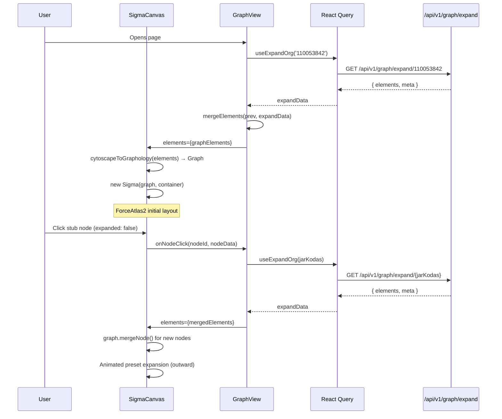

# Story: Replace Cytoscape.js with Sigma.js + Graphology

## Summary

Migrate the Risk Intelligence graph rendering layer from **Cytoscape.js 3** (`cytoscape` +
`cytoscape-fcose`) to **Sigma.js 3** (`sigma`) with **graphology** as the underlying graph data
structure. The API response format, parsers, toolbar, sidebar, hash routing, and Cypress E2E tests
remain functionally identical — this is a rendering-layer swap, not a product change.

Sigma.js renders via **WebGL** (vs Cytoscape's Canvas 2D), offering significantly better performance
for large graphs (1 000+ nodes). Graphology provides a battle-tested, feature-rich graph data
structure with a rich plugin ecosystem for layouts, metrics, and traversal.

---

## Context

- **Current stack:** `cytoscape@3.33.2` + `cytoscape-fcose@2.2.0` — Canvas 2D rendering, fCOSE
  force-directed layout, selector-based CSS styling, imperative `cy.add()` element merging.
- **Target stack:** `sigma@3` + `graphology` + `graphology-layout-forceatlas2` (or
  `graphology-layout-noverlap`) — WebGL rendering, graphology imperative graph API, attribute-based
  node/edge rendering via `NodeProgramBorder` / `EdgeArrowProgram`.
- **No SSR.** The `SigmaGraph` component (replacing `CytoscapeCanvas`) must be dynamically imported
  with `{ ssr: false }` — same as current Cytoscape pattern.
- **Hash routing, React Query, MUI, sidebar, toolbar** — all unchanged. Only the rendering canvas
  and its data model change.
- **API response format stays Cytoscape-compatible.** The `{ nodes: [{data}], edges: [{data}] }`
  JSON from `/api/v1/graph/expand/{jarKodas}` is the contract. A thin adapter converts this to
  graphology on the client side.

---

## Motivation

| Concern | Cytoscape.js | Sigma.js + Graphology |
|---------|-------------|----------------------|
| **Rendering** | Canvas 2D — 60 fps up to ~500 nodes | WebGL — 60 fps with 10 000+ nodes |
| **Bundle size** | `cytoscape` 380 KB + `cytoscape-fcose` 120 KB | `sigma` ~180 KB + `graphology` ~40 KB |
| **Layout engine** | fCOSE (built-in constraint solver hangs with >25 constraints) | ForceAtlas2 (Web Worker, non-blocking) |
| **Graph data model** | Internal, opaque — query via `cy.elements()` selectors | `graphology` Graph — standard, testable, composable |
| **Styling** | CSS-like selectors (vendor-specific DSL) | Attribute-based programs (standard WebGL) |
| **Animation** | `cy.animate()` per-element | Camera animation + `animateNodes` utility |
| **Ecosystem** | Mature but monolithic | Modular: metrics, community detection, shortest path |

---

## Acceptance Criteria

1. `npm ls sigma graphology` shows both packages installed; `cytoscape` and `cytoscape-fcose` are
   removed from `package.json`.
2. Opening `http://localhost:3000` loads the graph pre-seeded with anchor org `110053842` rendered
   by Sigma.js — the WebGL canvas is visible inside `[data-testid="graph-container"]`.
3. Clicking a stub org node (`expanded: false`) expands it — new nodes appear outward from the
   clicked node without overlapping existing nodes (same UX as current animated preset expansion).
4. Clicking any node opens the right sidebar with correct metadata (same `CytoscapeNodeData`
   interface reused as `GraphNodeData`).
5. Node visual types are preserved: PublicCompany (blue ellipse, large), PrivateCompany (green,
   small), Institution (purple, hexagon-like), Person (orange, small), Tender (teal, diamond).
6. Edge visual types are preserved: Contract (solid), Employment/Official (dashed),
   Director/Shareholder (dashed, red), Spouse (dotted, yellow).
7. The "Balance" toolbar button triggers a full ForceAtlas2 layout pass on all nodes.
8. Toolbar filters (year, min value), search autocomplete, and URL hash encoding work identically.
9. All Cypress E2E tests pass: `flow.cy.ts`, `entity-profile.cy.ts`, `toolbar-filters.cy.ts`.
10. `npm test` (Jest 47+ tests) and `./bin/run-api-tests.sh` continue to pass.
11. Production build (`npm run build`) succeeds with no TypeScript errors from changed files.

---

## Migration Scope

### Files to Create

| File | Purpose |
|------|---------|
| `src/components/graph/SigmaCanvas.tsx` | Sigma.js mount — replaces `CytoscapeCanvas.tsx` |
| `src/lib/graph/adapter.ts` | Converts `CytoscapeElements` → graphology `Graph` instance |
| `src/lib/graph/__tests__/adapter.test.ts` | Unit tests for the adapter |

### Files to Modify

| File | Change |
|------|--------|
| `src/components/graph/GraphView.tsx` | Import `SigmaCanvas` instead of `CytoscapeCanvas`; pass `balanceTrigger` |
| `src/types/graph.ts` | Remove `FcoseLayoutOptions` and fCOSE constraint types; add Sigma layout types |
| `src/components/graph/toolbar/GraphToolbar.tsx` | No change (already decoupled from Cytoscape) |
| `src/components/graph/NodeSidebar.tsx` | No change (receives plain `CytoscapeNodeData` → rename to `GraphNodeData`) |
| `src/components/graph/__tests__/GraphView.test.tsx` | Update mock from `CytoscapeCanvas` → `SigmaCanvas` |
| `package.json` | Remove `cytoscape`, `cytoscape-fcose`; add `sigma`, `graphology`, `graphology-layout-forceatlas2` |

### Files to Delete

| File | Reason |
|------|--------|
| `src/components/graph/CytoscapeCanvas.tsx` | Replaced by `SigmaCanvas.tsx` |

### Files Unchanged

- All parsers (`asmuo.ts`, `sutartis.ts`, `pirkimas.ts`) — output format stays the same
- All API routes — response format stays the same
- `NodeSidebar.tsx`, `useExpandOrg.ts`, `useEntityDetail.ts` — decoupled from renderer
- Cypress test specs — assert on `data-testid` attributes, not renderer internals

---

## Technical Breakdown

### Phase 1 — Install Dependencies & Clean Up

Remove Cytoscape packages and install Sigma.js + Graphology:

```bash
npm uninstall cytoscape cytoscape-fcose @types/cytoscape
npm install sigma graphology graphology-layout-forceatlas2 graphology-layout-noverlap
npm install --save-dev @types/graphology
```

### Phase 2 — Graph Adapter (`src/lib/graph/adapter.ts`)

Converts the existing `CytoscapeElements` format (returned by API) into a graphology `Graph`:

```typescript
import Graph from 'graphology';
import type { CytoscapeElements } from '@/types/graph';

export function cytoscapeToGraphology(elements: CytoscapeElements): Graph {
  const graph = new Graph({ multi: true, type: 'directed' });

  for (const node of elements.nodes) {
    if (!graph.hasNode(node.data.id)) {
      graph.addNode(node.data.id, {
        label: node.data.label,
        type: node.data.type,
        expanded: node.data.expanded,
        // Sigma rendering attributes
        size: nodeSizeForType(node.data.type),
        color: nodeColorForType(node.data.type),
        ...node.data,
      });
    }
  }

  for (const edge of elements.edges) {
    if (!graph.hasEdge(edge.data.id)) {
      graph.addEdgeWithKey(edge.data.id, edge.data.source, edge.data.target, {
        type: edge.data.type,
        label: edge.data.label,
        ...edge.data,
      });
    }
  }

  return graph;
}
```

This adapter is **pure** and **testable** — unit tests verify node/edge counts, attribute mapping,
and idempotency (adding same elements twice should not duplicate).

### Phase 3 — SigmaCanvas Component (`src/components/graph/SigmaCanvas.tsx`)

Replaces `CytoscapeCanvas.tsx`. Key differences:

| Aspect | Cytoscape (old) | Sigma (new) |
|--------|----------------|-------------|
| **Mount** | `cytoscape({ container, elements, style })` | `new Sigma(graph, container, settings)` |
| **Add elements** | `cy.add(nodes)` | `graph.addNode()` / `graph.mergeNode()` |
| **Styling** | Selector array in constructor | `nodeReducer` / `edgeReducer` functions in settings |
| **Events** | `cy.on('tap', 'node', cb)` | `sigma.on('clickNode', cb)` |
| **Layout** | `cy.layout({name: 'fcose'}).run()` | `import FA2 from 'graphology-layout-forceatlas2'` |
| **Animation** | `node.animate({ position })` | Set `x`, `y` attributes + `sigma.refresh()` |

**Node styling via `nodeReducer`:**

```typescript
const settings = {
  nodeReducer: (node, data) => {
    const res = { ...data };
    switch (data.type) {
      case 'PublicCompany':
        res.color = '#1976d2'; res.size = 16; break;
      case 'PrivateCompany':
        res.color = '#388e3c'; res.size = 8; break;
      case 'Institution':
        res.color = '#7b1fa2'; res.size = 18; break;
      case 'Person':
        res.color = '#f57c00'; res.size = 9; break;
      case 'Tender':
        res.color = '#0097a7'; res.size = 12; break;
    }
    if (data.expanded === false) res.color = adjustOpacity(res.color, 0.6);
    return res;
  },
  edgeReducer: (edge, data) => {
    const res = { ...data };
    switch (data.type) {
      case 'Contract': res.color = '#64b5f6'; res.size = 1.2; break;
      case 'Director': case 'Shareholder': res.color = '#ff1667'; break;
      case 'Spouse': res.color = '#ffcc02'; break;
      default: res.color = '#546e7a'; break;
    }
    return res;
  },
};
```

**Expansion layout (animated preset — no force layout):**

On subsequent expansions, new nodes are pre-positioned in semantic sectors around the anchor
(persons north, buyers left, suppliers right) with outward bias from graph centroid — same algorithm
as current `prePositionNewNodes()`. Positions are set as `x`, `y` attributes on the graphology node,
then `sigma.refresh()` renders them. Camera animates to fit all nodes.

**Balance layout (user-triggered):**

The "Balance" button runs ForceAtlas2 in a Web Worker (non-blocking — no UI freeze):

```typescript
import FA2Layout from 'graphology-layout-forceatlas2/worker';

const layout = new FA2Layout(graph, { settings: { gravity: 1, scalingRatio: 2 } });
layout.start();
setTimeout(() => layout.stop(), 3000); // run for 3 seconds
```

### Phase 4 — Wire Up GraphView

Replace the dynamic import:

```typescript
// Before:
const CytoscapeCanvas = dynamic(() => import('./CytoscapeCanvas'), { ssr: false });

// After:
const SigmaCanvas = dynamic(() => import('./SigmaCanvas'), { ssr: false });
```

Props interface stays identical — `elements`, `onNodeClick`, `onBackgroundClick`, `cyRef` →
`graphRef`, `balanceTrigger`.

### Phase 5 — Update Types

In `src/types/graph.ts`:

- Remove `FcoseLayoutOptions`, `FcoseFixedNodeConstraint`, `FcoseAlignmentConstraint`,
  `FcoseRelativePlacementConstraint` (fCOSE-specific)
- Optionally rename `CytoscapeNodeData` → `GraphNodeData`, `CytoscapeElements` → `GraphElements`
  (keep old names as type aliases for backwards compatibility during migration)
- Add FA2 settings type if needed

### Phase 6 — Update Tests & Cypress

- Update `GraphView.test.tsx` mock: `jest.mock('./SigmaCanvas', ...)` instead of
  `jest.mock('./CytoscapeCanvas', ...)`
- Cypress tests should pass without changes — they assert on `[data-testid="graph-container"]` and
  MUI elements, not on Cytoscape/Sigma internals
- Add unit tests for `adapter.ts` (conversion correctness)

---

## API Interaction Diagram

No change to the sequence — only the client rendering layer changes:



---

## Risk Assessment

| Risk | Severity | Mitigation |
|------|----------|------------|
| **ForceAtlas2 produces different topology than fCOSE** | Medium | Tune FA2 settings (gravity, scaling ratio); add Noverlap post-pass to prevent overlap |
| **Sigma.js node shapes limited** | Low | Sigma v3 supports custom node programs — implement hexagon/diamond via custom WebGL shaders or use `@sigma/node-border` |
| **No selector-based styling** | Low | Use `nodeReducer`/`edgeReducer` — more explicit, easier to test |
| **Edge labels less mature in Sigma** | Medium | Use `@sigma/edge-curve` for bezier edges with labels; may need custom edge renderer |
| **SSR guard different** | Low | Same `dynamic(() => import(...), { ssr: false })` pattern works |
| **Web Worker layout not available in Jest** | Low | Mock FA2 layout in unit tests; test adapter logic independently |

---

## Next Steps

- [ ] Ensure project compiles and existing tests are passing
- [ ] Phase 1: Install Sigma.js + Graphology dependencies, remove Cytoscape packages
- [ ] Phase 2: Implement `adapter.ts` — CytoscapeElements → graphology conversion + unit tests
- [ ] Phase 3: Implement `SigmaCanvas.tsx` — mount, styling, events, expansion animation, balance
- [ ] Phase 4: Wire `SigmaCanvas` into `GraphView.tsx`, update dynamic import
- [ ] Phase 5: Update `src/types/graph.ts` — remove fCOSE types, add Sigma/FA2 types
- [ ] Phase 6: Update `GraphView.test.tsx` mock, verify all Jest tests pass
- [ ] Phase 7: Run `./bin/run-cypress-tests.sh` — all Cypress E2E specs must pass
- [ ] Phase 8: Delete `CytoscapeCanvas.tsx` after all tests pass on `SigmaCanvas`
- [ ] Update required documentation after the implementation is complete
- [ ] Ensure new tests are added for the new feature and all tests are passing
- [ ] Perform linting and formatting to maintain code quality and consistency
- [ ] Review the implementation to ensure it meets the requirements and follows best practices
- [ ] Mark all checkboxes as done in this document once verified
